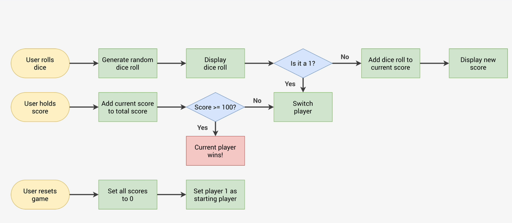

# Programming

# Program

A good program solve multiple situations without manual configuration.
A good program decides when to stop automatically

A `while` loop checks a logical condition to decide wether to repeat - it only repeats if its condition is true and stops when its condition is false.
It doesn't need a number of repetitions specified ahead of time.

# Debug

## Debug a Loop

To debug a loop picture what happens in the first repetition

# Understanding Functionality

It can super helpful to draw flowcharts of the logic and flow of your program.

