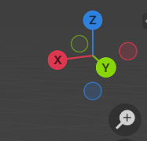
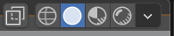
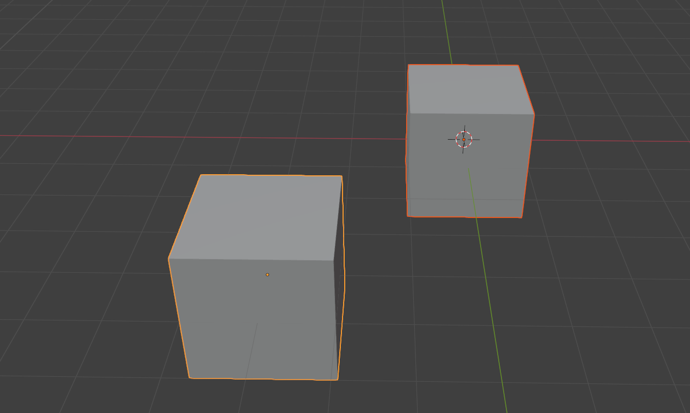
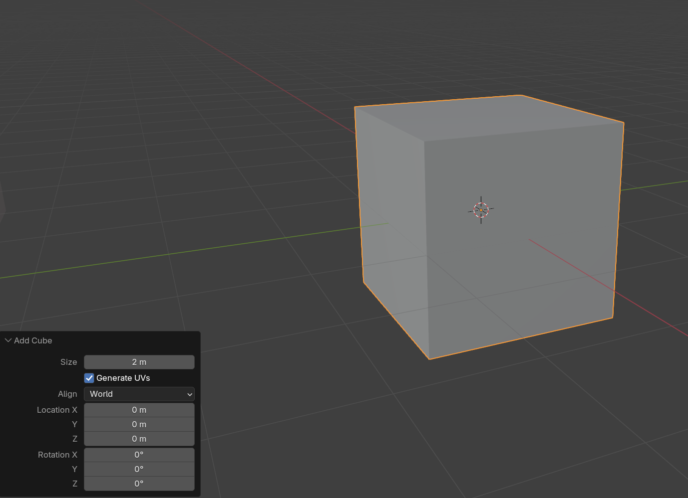
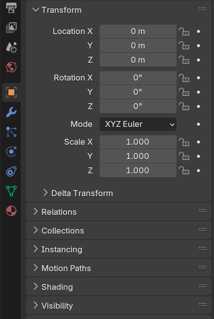
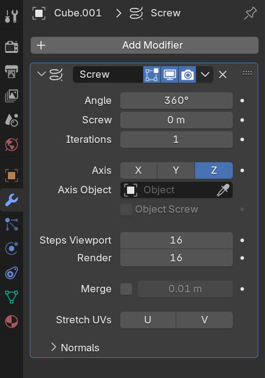
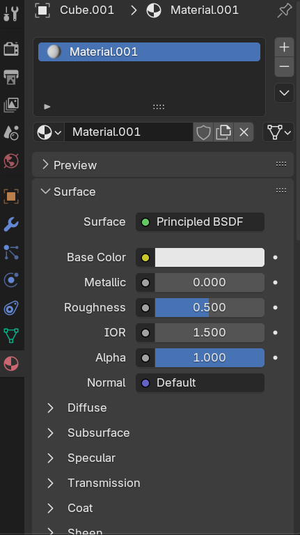
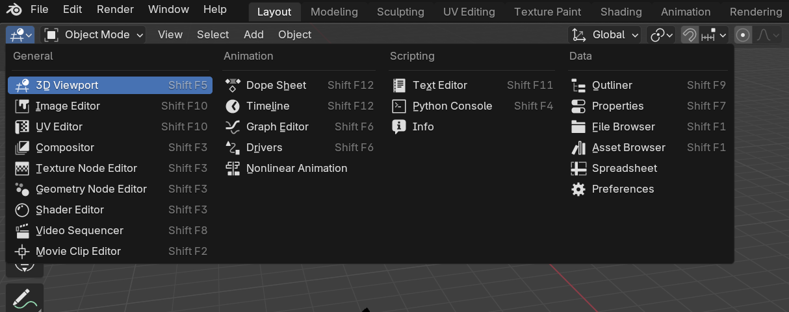

# Basics

## View

Rotate the view with the `middle mouse` and dragging or the gizmo on the top right corner.

To move left/right or up/down hold down `shift + middle mouse` and drag. Or click and drag the hand icon on the right.

To move forward and back war we can use `wheel`

To zoom in and out the can use the `shift + ctrl + wheel`

Toggle view between perspective and orthographic with `numpad 5` or the grid button on the right.

Align camera to axis:

- x: `numpad`
- y: `numpad`
- z: `numpad`
  With `ctrl` hold down you can position camera at the opposite side of the axis.

To get the camera viewpoint `numpad 0`

To focus back to the scene origin `shift + c`

To focus on a specific object click the object and use `numpad ,`

To hide everything and only focus on one object `numpad /`

### Shading mode of view

We can switch between different shading modes in the view with `z` or click on the modes in the top right corner.
Wireframe view - `shift + z`

`Solid` - all materials are shown with default gray material
`Material` - shows a preview of materials and textures
`Wireframe` - Wireframe view
`Renderer` - Low quality render

## Select

We can select objects with `left mouse` and multiple objects with `shift + left mouse`

When you select multiple objects you see that one has a brighter edge than the others. This on is the currently `active` selection.
To un select an object `shift+ left mouse` on the object you want to unselect - if the object is not the active one it will become the active one.
We can also undo a selection with `ctrl + z`
Select everything `a` and double `a` for unselecting.

## Create/Delete Objects

With `shift + a` we can open the menu to create shapes.

When you created an object a little menu for the properties appear on the bottom of the 3D viewport.

You loose that menu when you click somewhere else but not the menu but you can get it back with `F9`

To delete objects click the object and push `x`

We also can temporally hide object to clean up the viewport.
With `h` you hide the selected object and to show the hidden objects again with `alt + h `
To hide unselected objects `shift + h `

## Transforming objects

To move an object click an object and press `g`
To rotate an object click the object and press `r`
To scale an object click the object and press `s`

To force an object to apply these transformations along the axis you can press `x`,`y`,`z` after the transformation shortcut activation.

## Modes

Blender has different modes which allow different ways to edit our geometries.
With `ctrl + tab` we can switch modes via shortcut or we pick the modes on the top left corner.

In the `Object mode` we can transform, create and delete objects.

In the `Edit mode` we can edit the geometry and it's vertices, edges and faces.
Because it is so frequently used it has it's own shortcut with `tab`.
To switch between vertex `1`, edge `2` and face `2` selection mode

## Properties

### Object Properties

In the _Object properties_ we can change the properties with numerical values to be more accurate if necessary.

### Modifier Properties

In the _Modifier properties_ you can add non destructive modifiers to change your geometry.

### Material Properties

The _Material properties_ allow to create Materials and edit them. We also can select already created materials

### Render Properties

In the _Render properties_ we can pick which renderer we use for our blender scene. Blender has `EEVEE`,`Workbench` and `Cycles` as default renderer. We also can add our own renderer via plugins to Blender. The most used render engines are:

- `EEVEE` - GPU real-time renderer - performant but lacks realism
- `Cycles` - RayTracing engine - not performant but high realism

To render the current camera image `F12`

## Shortcuts

Shortcuts can have different actions depending on what's behind the cursor.

### LAYOUTS

`LEFT CLICK` select  
`RIGHT CLICK` context menu  
`N` toggle sidebar  
`T` toggle tools  
==`CTRL + SPACE` maximize area==  
`Q` favorites  
==`F3` search for any action (should switch to `SPACE`)==  
`CMD/CTRL + Z` undo (almost any changes, even selection)  
`CMD/CTRL + SHIFT + Z` redo (almost any changes, even selection)

### FIELDS

`CMD/CTRL + C` to copy (above field)  
`CMD/CTRL + V` to paste (above field)

### SCENE GRAPH

`C` new collection  
`M` move to collection

### VIEW

`MIDDLE WHEEL` rotate  
`SHIFT + MIDDLE WHEEL` truck and pedestal  
`CTRL + MIDDLE WHEEL` zoom  
`CTRL + SHIFT + MIDDLE WHEEL` dolly  
`.` or `,` focus section  
`5` toggle ortho/persp  
`1`, `3`, `7` position view on axis (`CMD/CTRL` to invert axis)  
`SHIFT + 7` position view in front of the selected face  
`0` position view on camera  
`CMD/CTRL + 0` position view on active camera and set as default camera  
`Z` show shadings wheel  
`ALT + Z` Toggle x-ray  
`SHIFT + S` change cursor position  
`SHIFT + C` focus on all scene  
`CTRL + ALT + Q` set quad view

### OBJECT

`SHIFT + A` create object  
`F9` to re-open creation options  
`X` delete  
`CTRL + A` apply transformations to the geometry  
`G` translate  
(`X`, `Y`, `Z` to force axis, `SHIFT` for precision, `CTRL` to round)  
`R` rotate  
(`X`, `Y`, `Z` to force axis, `SHIFT` for precision, `CTRL` to round)  
`S` scale  
(`X`, `Y`, `Z` to force axis, `SHIFT` for precision, `CTRL` to round)  
`S` normalized scale  
`ALT + G` reset position  
`ALT + R` reset rotation  
`ALT + S` reset scale  
`SHIFT + TAB` toggle snap  
`SHIFT + D` duplicate  
`ALT + D` link duplicate  
`H` hide selection  
`SHIFT + H` isolate  
`/` isolate and focus  
`ALT + H` unhide all  
`CMD/CTRL + J` merge  
`SHIFT + R` repeat last

### SELECTION

`A` select all  
`A, A` unselect all  
`B` border selection  
`C` circle selection (`WHEEL` to change size)  
`CTRL + I` invert selection  
`SHIFT + LEFT CLICK` add to/remove from selection

### MODES

`CTRL + TAB` change mode

#### EDITION

`TAB` toggle edition  
`1` vertex  
`2` edges  
`3` faces  
`ALT + LEFT CLICK` edge loop selection  
`CTRL + ALT + LEFT CLICK` parallel edge loop selection  
`G, G` translate on edge (`C` to go beyond the limit)  
`E` extrude (`ALT + E` extrude with options)  
`I` inset  
`I, I` individual inset  
`CTRL + B` bevel  
`CTRL + R` loop cut  
`J` connect vertices  
`K` knife cut (`Z` cut through)  
`P` separate  
`F` create edge or face  
`V` Rip  
`CTRL + T` triangulate  
`ALT + M` merge  
`CTRL + L` select island  
`SHIFT + E` change crease (for subdivision surface)  
`U` unwrap menu  
`M` merge

### CURVES

`C` toggle open  
`V` change handle type  
`ALT + S` change thickness of selected points

### PAINTING

`F` change brush size

### SCULPTING

`F` change brush size

### OUTLINER

`.` go to selected object

### RENDERING

`F12` render  
`CTRL + B` set render region  
`CTRL + ALT + B` reset render region

### TIMELINE

`ARROW RIGHT` Next frame  
`ARROW LEFT` Previous frame  
`ARROW UP` Next keyframe  
`ARROW DOWN` Previous keyframe  
`,` Focus selection  
`I` Insert keyframe  
`T` Choose interpolation  
`P` Define Range  
`ALT + P` Reset range  
`V` Change handle type

## Change UI

### Change Area

To change an area we can click on the top left button.

### Resize Area

To resize an area go with the mouse to the side of an area/between two areas and the drag it.

### Create a new Area

To create a new area go to one of the corners till we get a crosshair and then drag the mouse.
With `ESC` you can stop it.

### Remove an Area

The idea is to un-split two areas. For that you need to decide which of the areas is taking over the other that you want to get rid of. Then start in the corner from the area that you want to keep and drag into the other area till it gets a little bit brighter.

## Change Start File

To save your current UI setting as the startup setting you can go to `File->Defaults->Save Startup File`
