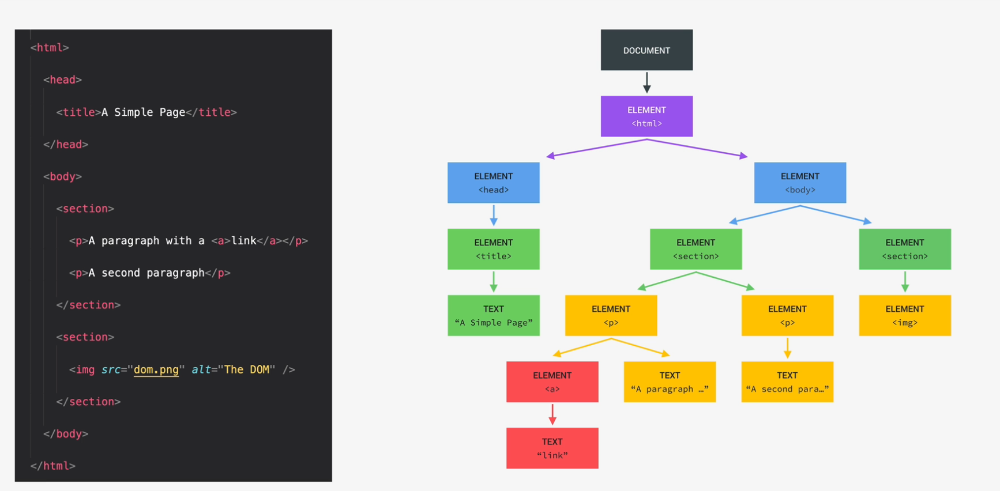

# Basics

_Runtime_: Where code gets executed for example Browser or on a Server thanks to Node.Js

JavaScript(JS) got invented to make websites interactive.

JavaScript is a programming language - you can execute it on the fly e.g. in your browser console.

In the relation to HTML,CSS and JS we can say:

- HTML is the content - NOUN
- CSS is the adjectives - How is something? - ADJECTIVE
- JS - dynamic and interactive elements - VERB

JS is interpreted line by line.

V8 is engine under the hood that let's run JS extremely fast.

To run JS on a webpage you need an html document with a `<script>...</script>` Tag to run your JS inside.
The advantage is that you don't have to load a seperate file. But it makes sense to seperate the website content from the javascript functionality
You can write directly inside the script tag or you reference an external file
`<script src = "app.js"></script>`
We usually reference the script at the end of the html file.

## Print out statements

If you want to show information in the console you can use
`console.log('hi momi')`
To print multiple information you can seperate it by a comma
`console.log(var1,var2,'Hallo')`

## Show Alert Popup in browser

`alert('string text')`

# Variables

A value is a piece of data - the smallest piece of information in our program.

A variable is like a box that contains objects. By assigning a value to a variable we define what the _box_ contains.

## Defining variables

There are several different ways to define/declare variables
`let luckyNumber = 23;`
`let luckyNumber;` <- undefined value (default value)

When we want to assign two variables we can also do it in one line
`let x,y`

If you want to assign a specific value to two values in one line you could write `x = y = 20*4` -> x =80 y=80

We use `let` for variables, that can change later.

JS is a dynamically typed language so no type assignment to variable is necessary.

To define an emtpy value
`let luckyNum = null;`

To define a variable that will not change in the future we use `const`.
`const` variable can't reassigned later.
`const birthYear = 1992;`

Because it can't be changed later we also can't declare empty constant variables.

So as a rule of thumb always declare your variables as `const` unless you are 100% your variable is gonna change later then use `let`

The third way is to use `var` but these just should be ignored or used if you really know why.
Under the surface `let` and `var` are really different although they look like the same.

## Naming variables

In JS a variable naming conventing is camel case. The first word is small and to seperate the second we start with a capital letter.
`let firstVariable`

We can't start variable names with a number.
`let 3years = 3` wouldn't work.

Variables only can contain letters,numbers,underscore or the dollar sign.

Don't start a variable with a capital letter because we use it for object oriented programming.

Variables written in uppercase are often reserved for constants that never change.
`let PI = 3.1415;`

Make your variable names descriptive.

`let myFirstJob = 'Programmer'`
`let currentJob = 'Teacher'`

instead of
`let job1 = 'Programmer'`
`let job2 = 'Teacher'`

## Datatypes

_Number_: Floating point numbers - used for decimals and integers
`let age = 23;`
`let weight = 22.23;`

### Strings

Strings are a sequence of characters
`const firstName = 'Jonas';`

To concatenate strings we can use the `+`
`const jonas = "I'm " + name + ' a ' + year`

For more complex string concatenation we can use template literals. We can write a string more normal and then insert the variables into the string. To write template literals we need backtics and then set the variables into `${variableName}`

```JS
const firstName = 'Jonas'
const jonasNew = `I'm ${firstName}`
```

We can write every expression inside the `{year - birthyear}`

We also can use backticks for all strings

```JS
console.log(`just a regular string`)
```

We also can use _template literals_ for multiline strings.

```JS
console.log(`String with \n\
multiple \n\
lines`)
```

_Bool_: Logical type that can be `true` or `false` - used for making decisions
`let goodWeather = true`

_Undefined_: Value taken by a variable that haven't been defined yet - "empty value"
`let children;`

_Null_: Also means empty value but gets used in other circumstances.

_Symbol_: Value that is unique and cannot be changed

_BigInt_: Larger integers than the Number type can hold

JS has dynamic typing which means you don't have to define the data types of the values that get stored. JS automatically stores it for you.
In JS the value stores the type not the variable.

To evaluate what datatype some value is we can use `typeof`

```JS
let jsIsFun = true
console.log(typeof jsIsFun)
```

There is a bug inside of JS when you do `typeof null`. It returns an `object` which is wrong. It should return `null`.

### Type-Conversion and -Coersion

In JS there is _Type-conversion_ and _Type-coersion_

- Type-conversion: When we manually convert from one type to another
- Type-coersion: When JS automatically converts types for us in the background

JS can only convert to string,number and boolean.

#### Convert a String into a Number

You can use the build-in `Number()` function.

```JS
const inputYear = '1991'
console.log(Number(inputYear))
```

Using the `Number()` function only gives a converted value. It doesn't automatically assign it to the input value.

If we try to convert something into a number that isn't JS returns `NaN` for _Not a Number/Invalid number_

#### Convert Number into String

You can use the build-in `String(23)` function.
or we can use
`const numberToString = num => num.toString();`

#### Coersion

Javascript is converting some types internally. That is called _Type-Coersion_
`console.log('I am' + 23 + 'years old')`
`console.log('1' + 1) => '11'`
If you use `-` or `*`, `/` it triggers the conversion from string to number
`console.log('23' - '10' -3) => 10`
`console.log('23' * '10') => 230`

### Truthy and Falsy

Falsy values are not exactly false but will become false when we convert them into boolean
`0,'',undefined,null,NaN` will become false when we convert them into boolean.
`console.log(Boolean(0))-> false`
`console.log(Boolean(undefinied))->`

```JS
const money = 0
if(money){
    console.log("Dont spend it all")
}else {
    console.log("You should get a job")
}
```

JS converts the number 0 into a falsy false Boolean.

Everything else will be _truthy_ values

## Variable scopes

Global scope - variable is available everywhere.

If we define a variable in a function, the variable is locally scoped - only available in that function and can't used outside of the function.

If you have statements in your code a variable also can just exist in that statement

```JS
let a = 'global'; //global scope

function fun (){
    let a = 'function'; //local scope

    if(true){
        let a = 'block'; // block scope
        //when you use a var variable in that statement the variable gets available in the whole function
        var b = 'hoisted';
    }
}
```

# Comments

We write comments inside our code with eather single line comments or multi line comments

```JS
//This is a simple line comment

/*
This is
a multi
line
comment
*/
```

# Operators

Operators allow us to transform or combine multiple values.

## Arithmetic operators

Add - `+`
Subtract - `-`
Multiply - `*`
Devide - `/`
Exponent - `**` 2 \*\* 3 means: 2 to the power of 3

We can use the `+` to join strings
`firstName + " " + lastName`

## Assignment operators

The most basic assignment operator is the `=` to assign values to a variable.

`x+=10` is a short version of `x = x +10`. The same works with the other basic arithmetic operators `-=, *= , /=,`

If you want to add or subtract just 1 there is another short version `x++` and `x--`

## Comparison operators

We use comparison operators to create boolean values.

`a>b` - a is greater than b
`a<b` - a is smaller than b
`a<=b` - a is smaller/equal to b
`a>=b` - a is greater/equal to b

We can also assign directly a value to a variable

`let isThisBigger = a>b`

## Operator precedence

The order operators get executed in JS.


The higher values get executed before lower values.

So usally all the math operators get executed before the comparison operators.

# Control structure - Conditionals

## If-else

To make decisions in our code we can use `if else` to decide what happens if something is true or false

```JS
const age = 19

if(age >= 18){
    console.log(`Sarah is start driving`)
} else {
    console.log(`She is not old enough`)
}
```

You don't have to use the `else` part if you don't want anything executed when the condition isn't met.

We can extend the `if-else` with an `else if` to ask for more conditions

```JS
const weather = 'hot'
if(weather === 'cold'){
    console.log("I'm so cold')
} else if (weather === 'mild'){
    console.log("I'm mild)
} else if(weather === 'hot'){
    console.log("uff so hot)
}else {
    console.log("no idea")
}

```

## Switch statement

The switch does a strict comparision of a variable and iterates through different cases.

```JS
const day = 'monday'

switch (day){
    case 'monday': // equal to day === 'monday' strict comparision
        console.log("do monday stuff")
        break;
    case 'tuesday':
        console.log("do tuesday stuff")
        break;
    case 'wednesday':
    case 'thursday'://If you do this with two cases it will be executed for both
        console.log("Write this")
        break;
    case 'friday':
        console.log("chill mate")
        break;
    case 'saturday':
    case 'sunday':
        console.log("Enjoy the weekend")
        break;

    default:
        console.log("WOW a new day that we havent seen before')

}
```

If we use a switch without break statement the code continues executing

```JS
const count = 0
swithc(count){
    case 0:
        count+=1
    case 1:
        count+=1
    case 2:
        count+=1
    case 3:
        break;
}
console.log(count)
```

## Ternary Operator

The _Ternary/conditional operator_ allows us to write something like an if-else structure in just one line.
`age >= ? console.log('I like to drink this') : console.log('I like to drink water')`

Operator always produce values - so they are expressions. So we can produce new values with the _Ternary Operator_.

```JS
const drink = age >=18 ? 'wine' : 'water'
console.log(`I'm allowed to drink ${drink}`)
```

So because the Ternary operator is an expression we actuall can insert the into string literals

```JS
const age = 15
console.log(`I'm gonna have a ${age>=18?'wine':'water'}`)
```

So we use _Ternary operators_ when we need to make a quick decision. We still need if-else for bigger parts of codes.

## Equality Operators

### Equal

JS has two equality operators which test if two values are equal.
`===` strict equality operator - does not perform type coersion - only returns true when both values are exactly the same.
`'18' === 18 -> false`

`==` loose equality operator - does type coersion.
`'18'==18 -> true`

```JS
const age = 18;
if(age===18) console.log("18 Years old")
```

It is suggested to always use `===` the strict one.

### Difference

To check if something is different from another value we can use `!==`

```JS
const age = 18;
if(age !== 16) console.log("You are not 16 years old")
```

## Boolean Logic

Boolean logic uses true and false values to solve complex logical problems.
In order to do that it combines several logical operators to combine true and false values.

### AND

`&&` AND operator - both needs to be true to return true.
`if A AND B are true -> returns true`

### OR

`||` OR operator - one needs to be true to return true
`if A OR B are true -> return true`

### NOT

`!` inverts a boolean value
`!true -> false`

```JS
const hasDriversLicence = true
const hasGoodVision = false

if(hasDriversLicence && hasGoodVision){
    console.log("You are able to drive")
} else {
    console.log("you shouldn't drive")
}
```

## Loops

Loops allow to execute repetitive tasks.

### For-loop

For loop keeps running while the condition is true.

```JS
for(let i= 0; i<=10;i++){
    console.log(`do something ${i}`)
}
```

#### Looping through arrays

```JS
const arrayNames = ['Jonas','Heinz','Reinhold']

for(let i = 0;i<arrayNames.Count;i++){
    console.log(`Name is:${arrayNames[i]}`)
}
```

#### Continue

With `continue` you exit the current iteration and move on to the next iteration.

```JS
for(let i= 0; i<=20;i++){
    if(i/2 !== 0){
        continue;
    } else {
        console.log(`${i} is an even number`)
    }
}
```

#### break

`break` is used to leave the whole loop.

```JS

for(let i=0;i<10;i++){
    if(i>4){
        break;
    }
    console.log(i);
}
```

#### Loop backwards

```JS
for(let i = arrayNames.length -1; i>=0,i--){
    console.log(arrayNames[i]);
}
```

### While-Loop

A while loop runs as long as the condition of the loop is true.

```JS
let rep = 1
while(rep<10){
    rep++;
}
```

For example when we don't know how many times the loop should run we can use a `while`-loop.
Role a dice till you get the value = 6

```JS
let dice = Math.trunc(Math.random()*6)+1;

while(dice!=6){
    console.log(`you rolled a ${dice}`)
    dice = Math.trunc(Math.random()*6)+1;
    if(dice=== 6) console.log('Loop is about to end...')
}
```

# Expressions vs Statement

_Expression_ is code that produces a value like `3+4`

_Statement_ is a bigger piece of code that doesn't produce a value

```JS
if(20>4){
    const str = "20 is bigger"
}
```

This doesn't really produces a value it just performes some actions.
So JS expect _Expressions_ and _Statements_ in differnt places.
In _Template Literals_ we can only insert expressions but not statements.

` console.log(``I'm ${2037-1991}``) `

# Functions

Functions are one of the main building blocks in JS. They work by taking an input, process the input and returning it. We can think of them like being machines that process input we give and return an output.

To write a function _declaration_ we write
`function name(parameters){...}`

To execute a function is also called _calling_/_running_ or _invoking_ a function. We then reference the function name and round brackets `name()`.

We can also pass values into a function to be processed in a function. These are called `Parameters`. Here in the example `a`and `b`.

```JS
//Function declaration
// input params
function add(a,b){

    // return a value
    return a +b;
}
//calling a function
add(4,5)
```

With functions we also can assign their return value directly to a variable
`let fruitMix = fruitMachine(apples,oranges);`

So when coding we should keep our code _dry_ which means we shouldn't repeat ourselves in our code. For that functions are super useful.

Functions are objects so they can be used as _expressions_(Function expression) allowing them be used as variables.
When we write function expressions we don't really define a name for the function so we create [anonymous functions](#anonymous-functions).

```JS
//Function expression
const add = function(a,b){
    return a +b;
}
```

Sometimes we need to write functions as expressions and sometimes as declarations.
So the difference between these two is that we can call the function declaration before they are defined.

```JS
const age = calculateAge(1982);

function calculateAge(birthYear){
    return 2025-birthYear;
}
```

We couldn't do that with _function expressions_.

It is personal preference to decide which way you use your functions.

### Anonymous functions

An _Arrow function_ is a shorter version to write a function expression.

```JS
//instead of
const calcAge = function(birthYear){
    return 2025-birthYear
}
// we can write
const calcAge = birthYear => 2025 - birthYear;
// To call the function
const age = calcAge(1991);

```

This works only if we just have a one line process in the function.

If we have multiple steps or multiple parameters we still need to go back to the brackets.

```JS
// one paremeter
const yearsTillRetirement = birthYear => {
    const age = 2025-birthYear;
    const retirement = 65-age;
    return retirement;
}
yearsTillRetirement(1990);
// multiple parameters for the function.
const yearsTillPayedDebt = (startYear,endYear) => {
    const yearsToPay = endYear - startYear;
    return `You have to pay ${yearsToPay} years.:(`
    }
yearsTillPayedDebt(2020,2099);
```

We also can construct higher-order functions where a function is used as an argument or a return value.

```js
function higherOrder(fun) {
  fun();
  return function () {
    //Do something
  };
}
```

Functions can also be nested to create _closure_, that incapsulates data and logic from the rest of the programm.

Normally when you call a function that has a variable with a primitive value `let a = 10;` it is stalled on the _call stack_ which is the browsers short term memory.
When you call a closure the inner function can still acccess variables in the outer function and even after the initival function call. That happens because JS automatically stores the data in the outer function and the heap memory, which persists after the function call.

```JS
function giveMeClosure(){
    let a = 10;
    return function () {
        a++:
        return a;

    }
}
```

JS functions can only return one thing.

# Arrays

_Arrays_ are a datastructure where we can collect different variables.
`const names = ['leon','ro','il'];`
another way is
`const years = new Array(1990,1991,1992);`

Arrays can hold any datatype that we want. We can add expressions into arrays and we can even put whole other arrays into an array.
Another possibility is to put function calls inside an array declaration.
`const ages = [calcAge(years[0]),calcAge(years[1]),calcAge(years[2]),calcAge(years[3])]`

To pick an element from an array we use square brackets `[]`
`const firstFriend = names[0];`.

To get the amount of elements in an array we use `.length`
`const len = name.length;`

To get the last element of your array.
`const lastElement = names[names.length-1];`

We can put any expression that we want inside of the square brackets to pick the element we want.

To change the data inside an array at a specific position.
`names[2] = 'Ju';`

Even though we defined an array as `const` we still can change its elements. But we can't exchange it with a whole new array.

### Array operations

#### Add Element to the end of the array

With `.push()` we can add an element to the end of the array.
`friends.push('me')`

`.push()` returns the length of the new array.
`const newLength = names.push('name')`

### Add Element to the beginning of array

The `.unshift()` method allows us to put an element to the beginning of an array.

`names.unshift('Heinz')`
As `.push()` the `.unshift()` method returns the length of the new array.

`.push()` adds an element to the end of the array.

We also can add multiple elements in push
`array.push('word1','word2','word3')`

### Remove last element of an array

To remove the last element of an array we use the `.pop()` methods
`names.pop()`

The `.pop()` method returns the removed element from the array.

### Remove first element from array

With `.shift()` we can remove the first element from an array.
`names.shift()`
The `.shift()` method returns the removed element from the array.

### Get position of element in array

To find out which position a certain element in the array has we can use `.indexOf('variableName')`
`names.indexOf('me')`
If the element is not in the array the function returns `-1`

A function from new JS version is `.includes('variableName')`.
It returns a boolean if the element is in the array.

### Merge two arrays

Wie can use the `.concat()` function to merge two arrays.

```JS
const array1 =
const array2 =

const array3 = array1.concat(array2);
["a","b","c","d","e","f"]

```

### Find biggest/smallest element in Array

```JS
let max = testArray[0];
let min = testArray[0];
for(let i= 0; i<testArray.Length;i++){
    const curTemp = testArray[i]
    if(curTemp>max) max = curTemp;
    if(curTemp<min) min = curTemp;
}
```

### Ignore elements that aren't the type you look for

```JS

for(let i = 0; i<array.Length;i++){
    if(typeof array[i] !== 'number') continue;
}
```

## Get Value from prompt

We can use the `prompt()` function to ask the user to input a value.
`const favNumber = prompt("What is your favorite number")`
It returns a string.

# this

`this` is a keyword that references an object based on how a function is called.
We called from the global scope it references the `window` object in the browser.

```JS
//global scope
function isThis(){
    console.log(this);
}
```

If that same function is attached to an object and is called by that object `this` references the object.

```JS
const person = {
    isThis: function () {
        console.log(this)
    }
}
```

You can manually bind a function to some other objects using `.bind()` method.

```JS
function isThis(){
    console.log(this);
}

const person = {};

const personFun = isThis.bind(person)
```

In modern JavaScript we can define functions with the arrow syntax `()=>`
Arrow functions don't have their own `this` value and they are always anonymous which makes them ideal for function expressions.

When passing arguments in functions a primitive like a number is passed by value which means a copy is created of the original variable.

If the argument is an object that means it is stored in the heap and it is passed by reference. That means multiple parts of the code is mutating the same object.

```JS
const num = 23;
//copy of num gets created
someFun(num);

const obj = new Object();
//
someFun(num,obj);
```

# Objects

An object contains a collection of _key:value_ pairs or properties and values.
A _key_ in the object is called _property_.
The order of the values in an object doesn't matter at all. We reference values by their _key_
The easiest way to define an object is with the object literal syntax using `const name = { }`:

```JS
const human = {
    dna: 'BAJCA',
    name: 'Jeff',
    born: Date.now(),
    walk() {
        console.log('walking')
    }
}
```

There is also an `Object()` Type that is created with a constructor.
`const human = new Object();`

Objects can inherit properties from each other with `human.__proto__.__proto__`
Every object has a private property that links to one prototype.

### Retrieve data from object

The first way to get a property from an object is the `.` notation:
`const humDNA = human.dna`
The other way is to use the `['keyName']` way
`const humDNA = human['keyName']`
The difference is that with the brackets way we can put any expression inbetween the brackets. So we can compute it from a calculation

### Add new property to the object

To set no properties to the object we again can use both ways
`human.eyeColor = 'blue'`
`human['eyeColor'] = 'blue'`

### Object methods

In JS functions are just like a value which means we can add functions to an _key:value_ pair in an object. Any function added to an object is called _method_.
We can reference the name of the function as a key and the value as an expression. In Objects we need a function expression instead of a definition.

```JS
const human = {
    ...,
    calcAge: function(birthYear){
        return 2037 - birthYeah;
    }
}

console.log(human.calcAge(2099))
console.log(human['calcAge'](2099))
```

If we want to access a inside the object a variable from within we can use the `this.` keyword. It is equal to the object calling the method.

```JS
const human = {
    birthYear:1991,
    calcAge:function(){
        return 2037 - this.birthYear
    }
}

```

To avoid multiple calculations we can calculate a value once then store it in the object and then can retrieve it later as a property from the object.

```JS
const human = {
    birthYear: 1991,
    calcAge: function(){
        this.age = 2037-this.birthYear;
        return this.age;
    }
}
```

# OOP

JavaScript supports object oriented programming with the `class` keyword.

```JS
class Human {
    constructor(name){
        this.dna = 'MMYYDD'
        this.name = name
    }

    get gender() {
        return this.gender;
    }

    set gender(){
        this.gender = val;
    }
}
```

But classes are syntactic sugar for prototype and inheritance and objects.

A class can define a constructor that is called when the object is first created.
The class also can have properties and getter and setter functions to access the properties.

Classes also encapsulate functions as methods on an objects instance. We also can make the methods global to the class name by defining it `static` method

```JS

class Human {
    constructor(name){
        this.dna = 'MMYYDD'
        this.name = name
    }

    get gender() {
        return this.gender;
    }

    set gender(){
        this.gender = val;
    }

    walk(){
        console.log('walking')
    }
    static isHuman(human){
        if(human.dna == 'AACTG'){
            return true;
        }
    }
}
```

# Other Datastructures

### Array

Hold dynamic collection of index items.
`const list = ['aa','bb','cc','cc']`

### Sets

Hold a collection of unique items
`const uniq = new Set(list)`

### Map

Hold key:value pairs and it is easier to loop over this data collection than objects.

```JS
const dict = new Map([
    ['doof',1],
    ['foof',2],
    ['cruuf',3]
])
```

### Garbage collection

JS is _garbage collected_ which means it will automatically deallocate objects from memory when they are no longer referenced in the code.

With Maps and Sets all your properties will always be referenced.
For optimisation there is `WeakMap()` and `WeakSet()` that contain properties that can garbage collected and the memory reduced.

# Non blocking event loop

Normally when you run your code in a script it gets executed synchronously line by line.
The next line can't start before the previous line finished.

With an event loop we can write asynchronous code in javascript which runs in a serparate thread pool while the rest of the application continues to execute. It allows multi task

We can writer async code with a `promise()`

```JS
const promise = new Promise(
    (resolve, reject) => {
        // Do something async here

        if(sucess){
            resolve('success');
        } else {
            reject('failure')
            //To raise an error
        }
    }
)
```

A promise is a wrapper for a value that is unknow right know but that will resolve to a value in the future. For example a call to a 3rd party api that resolves to some data.

The consumer of the promise can use methods `.then()` and `.catch()` to handle this outfcomes

```JS
promise
.then(success => {
    console.log('yay!',success);
})
.catch(err =>{
    console.log('oh no!',err)
})
```

You also can define an `async function` that automatically returns a promise

```JS
async function asyncFun(){
    //waits till the promise is resolved
    const result = await promise;
}
// To implement error handling you want to wrap it in a try catch block

async function asyncFun(){
    try{
        const result = await promise;
    } catch(error) {

    }
}
```

To keep bigger code more easy to read we can use modules which is code in an extra file for parts of the code.

By default all the code in a file is private just to that file.
In order to share code with other files we can make the code _default export_ by assigning `export default function name`.

Then we can import it in another file with
`import functionFun from './help.js';`

we also can export and import variables
`export const hallo = 344;`
`import {hallo} from '.help.js';`

# Node package manager

To use code from other developers we can use _npm_ javascript package manager
We can install packages with `npm install`. It downloads the code it in the `node_modules` folder. It also provides a `package.json` file that list out all the dependencies that you use in your project.

# Js in Browser

The browser is based on _document object model (DOM)_ where the UI is based on a structured tree of html elements.


It allows JS to access HTML elements and style to manipulate them

When JS interacts with an element from the website it is called _Dom manipulation_

A browser provides an api to interact with these elements with `window.document`.

The DOM methods and properties are part of the WEB APIs that browser implement.

## Grab element from html

The `document` allows us to grab an individual html element using the `.querySelector()`
it takes a css selector as an argument and will find the html elements that has the same classname`.className`, id `#idName` or tag name. It returns an instance of the element class.

We can grab multiple elements at the same time with `.querySelectorAll('.button')`

## Select and manipulate elements

`document.querySelector(.message).textContent = 'new Text'`

### Get and Set values Input field

`document.querySelector(.inputField).value` <- This returns a string
Converting into a number
`Number(document.querySelector(.inputField).value))`
Setting value of input field.
`document.querySelector(.inputField).value = 10`

## Grab text from element

`document.querySelector(.message).textContent`

## Handling Click Events

When we want our javascript to react to something that happens in the dom we need to listen to the
event that happen to the element. For example when a btn is clicked, we can assign a function that gets called when the button gets clicked.

```JS
const btn = document.getSelector(.btn);
const btn2 = document.getSelector(.btn2);
btn.addEventListener('click', () => {
    //Only gets called when the event happens
    console.log('clicked')
})

btn2.addEventListener('dblclick',function () {
    console.log("hallo")
})
```

# Math

## Cut of decimal part of number

We can call `Math.trunc()`
`Math.trunc(Math.random()*20)`

# Front-end frameworks

Many developers use front-end frameworks that produce declerative code where the UI is a function of its input data /states.

These frameworks encapsulate JS, HTML,CSS into components. Inside a components the data is reactive. It can be bound from js directly to html

# Bundle

Module bundler

# Network waterfall

# Dynamic imports

Only import bundle when it is needed

# Let JS reload automatically when code is changed

We can use the VSCode extension Live Server or we can set up our own node.js server

## Run Javascript on a server

With node.js is a javascript runtime. It allows us to run javascript outside of a browser and on a server.
with `node` command we can execute javascript.

### See if node is installed

`node -v`

### Install live server

`npm install live-server -g`

`-g` install globally

On mac you might need `sudo` in front of npm.

### Run live server

Call live server
`live-server`

# Strict Mode

Strict mode assures that we write secure JS code.
For that we just add `'use strict'` at the beginning of our code.
It needs to be the first line in the code.

Strict mode also blocks the usage of certain variable names that JS has blocked to use because it might use them in the future. Like `interface` or `private`

##

Electron node.js with the browser to create app
react native to build whole apps

typescripts

# DOM

Document Object Model
What every browser uses to model all the html elements on a webpage.


# Errors

### Unexpected token

You used a wrong variable name.

# How to Learn to Code

## What can you do wrong

- dont have clear goal
- just copy the code without thinking what the code means
- dont reinforce what you learned by doing small challenges
- dont practise coding
- dont create own project ideas
- quickyl become frustrated
- lose motivation because you think you never can know everything
- learn in isolation

## What do write

- write down your specific,measurable,realistic and time-based goal on a piece of paper. I want to become a web developer in 6 month.
- Always type the code
- Understand the code
- Use immediately what you learned.
- Take notes
- Challenge yourself
- practise coding on your own - come up with your own project ideas.
- dont be stuck in "tutorial" hell
- you will never know everything
- Even devs after 20 years struggle to get their code to work and it is a tedious slog.
- Never learn in isolation - explain new concepts to other people.
- Share your learning progress with web dev community #100DaysOfCode #CodeNewbie #webdev
- Keep challenging yourself, run into lots of problems and fix them

# How to think like a developer

How to solve problems in coding:

- stay calm and slow down - dont jump at a problem without a plan
- take a logical and rational approach
- Framework:

1. Take a step back and make sure you understand 100% the problem:

   - Ask right questions to get a clear picture of the problem
   - What does ... mean?
   - What should we do if something else happens?

2. Divide and conquer:

   - Break big problem into smaller sub-problems.

3. Do as much Research as possible

4. For bigger problem write pseudo code before writing actual code.

# See objects as a Table in Console

`console.table(object)`

# Debugger in Chrome

In the debugger under `Sources` we can set breakpoints to evaluate values at a certain stage.
You can find the debugger next to console under sources.

Don't forget to unselect the breakpoint at the end.

# Bundler

Bundler is a tool in which you send assets like JavaScript,Css,HTML,images, TypeScript. The bundler handles these assets, applies potential modifications and output a _bundle_ composed for web friendly files like HTML,CSS,images and JS. Like a pip in which you send non-web-friendly assets and at the end of the tube you get web-friendly assets back.

Bundler can do even more. You can use a bundler to create a local server, manage dependencies, improve compatibility, support modules, optimize images, deploy on a server, minify the code, etc.

# Webpack

Webpack is most popular bundler.
