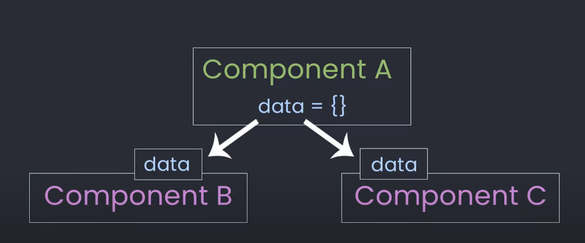
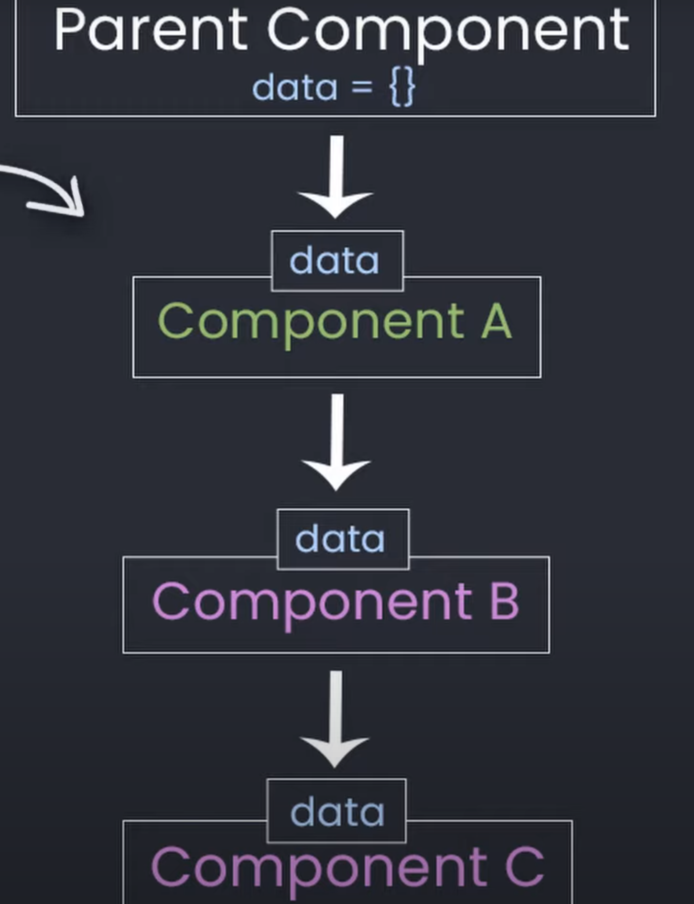

# Basics

React is a JavaScript library to build user interfaces.
React allows us to build the structure for our website.

With React it is really common to build single page applications. We have one site with one single template and update the components in the DOM that get shown.

## Components

Components are the building blocks of our application. Allow us to make the visual layer of our application.
They let us split up our UI in individual reusable pieces.
Each part of the UI gets build up as a seperate component and then get added to the parent component.

A component is a JS class or function that returns JSX, which is similar to html code.

```JS
function Profile(){
    return (
        <div>
        <p>Welcome!</p>
        </div>
    )
}
```

Components can be nested as deep as you want.

```JS
function Tweets(){
    return(
        <div>
        <Tweet/>
        </div>
    )
}

function Tweet(){
    return (
        <div>
        <Author/>
        <Content/>
        <Actions/>
        </div>
    )
}
```

Start with functional components and then later learn class based components.

## JSX

Javascript XML looks like HTML with some slight syntax differences and gives us some added functionality. You write it in a `camelCase` style.

The advantage of using React over HTML is that you can use dynamic JavaScript values in your JSX.

```JSX
function Profile({name}){
    return(
        <div className="profile-container">
        <h1>Hello, my name is {name}</h1>
        <button onClick={alert('hello')}></button>
        </div>
    )
}
```

We can use and display data in curly braces `{name}` to pass JS variables and logic directly into the html.
This makes our attributes dynamic depending on the variables in the brackets.

```JS
//dynamic attributes
const src = "/react.svg"


//dynamic styles with a JS object inside the {{}}
const background = 'red'
<div style={{background}}/>
```

JSX tags are similar to HTML tages.  
Differences:

- class declaration: `className=` instead of `class=`
- how events get handled.

Browser actually can't read JSX so the code gets run through a compiler and gets converted into HTML and JS once it is shown in the browser.

## Fragments

JS functions can only return one thing. In React you can only return one parent element from a component.

For example you CAN'T do this without getting the error `JSX expressions must have one parent element`.

```JS
function App(){
    return(
        <Header/>
        <Main/>
    )
}
//We could fix this by wrapping a component in a div

function App(){
    return(
        <div>
        <Header/>
        <Main/>
        </div>
    )
}

//To not add another element to your page you can use an emty component called Fragment
<>
    <Header/>
    <Main/>
</>

```

## Rendering

The way how and when to render our App React uses the _VirtualDOM_ or _VDOM_.


The React rendering steps are:

- Has the state of our React app changed? If Yes -> React updates the VDOM
- React uses 'diffing' process to compare the updated VDOM with a previous version to see what changed.
- Once it sees what is different React uses a process called 'Reconciliation' to update the real DOM with the updated changes.

## Event Handling

Handling the user interactions. _Event handling_ is how we take the user events and do something with them.

React has build-in events like:

- `onClick` - `<button> onClick={handleClick}/>`
- `onChange` - `<input> onChange={handleChange}/>`
- `onSubmit` - `<form> onSubmit={handleSubmit}/>`

### Alert user when button clicked

We would add the `onClick` event to the button and refer a function that shows the alert.

```JS
function redAlert(){
    const handleClick= ()=> {
        alert('RED')
    }

    return (
        <button onClick={handleClick}>Click me</button>
    )
}
```

## React Router

Using React Router we can have multiple pages in a singel page application. We handle URL routing with a `Router`that keeps our UI in sync with our URL.

```JS
import {BrowserRouter as Router, Route} from 'react-router-dom'
```

Because we are not actually changing pages, the router takes care of rendering our components into the dom based on the current url.

```JS
import{BrowserRouter as Router, Route} from 'react-router-dom'

function App(){
    return (
        <div className="App">
        <Router>
        <Route path='/' element = {<Home/>}/>
        <Route path='/profile' element = {<Profile/>}/>
        <Route path='/product' element = {<Product/>}/>
        </Router>
</div>
    );
}
```

## Props

When you need to pass data down from one compenent to another you can pass it down as a _prop_.

A prop can be passed down like a function parameter.

To _make a prop_ create a name on the component you want to pass data to and set it equal to some value.
`<Greeting text={'HI'}/>`
You then can _use that prop_ inside the component you past it too.

```JS
function Greeting(props){
    return <h1>{props.text}</h1>
}
```

`props` refers to properties of an object.

```JS
function Tweet(){
    let item = {
        'author':'Dennis',
        'tweet':'My first tweet'
    }

    return (
        <div>
        <Author/>
        <Content body={item.tweet}/>
        <Actions/>
        </div>
    )
}

function Content(props){
    return(
        <p>{props.body}</p>
    )
}
```

Once the prop is passed down into the component you can use that prop everywhere in your component.
Props can passed down multiple layers if needed. This get's called _Prop Drilling_.


You can pass anything as a prop even other components. The passed components are called children. You can access them with the `props.children`

```JS
<Parent/>
to
<Parent>
    <Child/>
</Parent>

function Parent(props){
    return <div>{props.children}</div>
}
```

This is great for compositions.

## Manage Data in app with State

`State` is like a snapshop from a camera - like a screenshot of our app at any given time. `State` is a JS object used to represent information in or about a component.

To manage state we can't use JS variables because they don't cause our App to re-render.

`useState` takes an argument that serves as a starting value of the state variable and returns and array which contains the state variable and a function to update that state.
`const [likes, setLikes] = useState(0)`

```JS
function Likes(){
    const [likes,setLikes] = useState(0)

    const handleClick = () => {
        setClicks(likes+1)
    }

    return(
        <button onClick={handleClick}>Likes{likes}!
        </button>
    )
}
```

```JS
myState = {
    name:'Me',
    isHuman:true,
    moreInfo:[],
};
```

In modern React we use _Hooks_ like `useState(starting value)` to create a component state.

```JS
function Notes(){
    let[notes,setNotes] = useState([])
}
```

For example a list of notes that we want to render in our app.

```JS
function Notes(){
    let [notes,setNotes] = useState([])

    return(
        <ul>
        {notes.map(note=> (
            <li>{note.title}</li>
        ))}
        </ul>
    )
}
```

### Update State

Set State as empty array then we request some data from our api and update that state with new data.

```JS
let [notes,setNotes] = useState([])

let getNotes = async () => {
    let response = await fetch('/notes')
    let data = await response.json()
    setNotes(data)
}
```

### Controlled components

Controlled components use _States_ to have more predictable behaviour.

```JS
function ControlledInput(){
    const [value,setValue] = useState('')


    return(
        <input
        value={value}
        onChange={(e)=>setValue(e.target.value)}
        />
    )
}
```

The value tiped into the input is being put into state and controlled by state variable value.
What is happening:

- User types and `setValue` puts what is tiped into State.
- The state `value` is updated
- Input uses the updated state as its value

Great pattern to use because we want to change the components behaviour we just need to change the state that controls it.

The state update will trigger component lifecycle effect.

## Component Lifecycle

A component in React has lifecycle that it goes through.
Three main phases:

- Mounting Phase - When it gets added to the DOM
- Updating Phase - When we are modifying something and that component needs to update.
- Unmoting Phase - When this component gets removed from the DOM.

### Class components

Methods to take care of Phases

```JS
componentDidMount(){
    //Component mounted
}

componentDidUpdate(){
    //Finished component updating
}

componentWillUnmount(){
    //Component is being removed from DOM
}
```

### Functional components

`useEffect()` method allows us to handle each of the components lifecycle

```JS
useEffect(()=> {
    //Manage lifecycles
},[Dependencies])
```

## Hooks

React _Hooks_ allow us to hook into features such as `useState` within function components.
Only apply to functional components.
_Hooks_ led us add State and other features without using class based components.
Before _Hooks_ functional components couldn't hold states.
Hooks are functions that allow us to hook into and manage States.

### State hooks

Help you manage state within react components.
`useState()` - Set & update states
`useReducer()`

### Context Hooks

Let you use data passed through React Context
`useContext()`

### Ref Hooks

Let's you reference things like HTML elements

`useRef()`

### Effect Hooks

Let's you connect with external systems like browser apis
`useEffect()` - Perform side effects in lifecycle

### Performance Hooks

Improve performance by preventing unnecessary work.
`useMemo()`
`useCallback()`

## Purity

Pure react components mean that the same input should always return the same output.
To keep a component pure they should _only return JSX_ and _Don't change objects or variables that existed before rendering_.

The `Cup` component is impure because it changes the variable inside of render. Which exists outside the component. This leads the JSX to have the wrong output when the component is used multiple times.

```JS
let count = 0
function Cup(){
    count = count+1
    return <h2>Cup {count}</h2>
}
```

To avoid these errors we can use something like _Strict_ mode. Strict Mode is a special component which tells us about our mistakes while we develop our app.
We just wrap it around our `<App/>` component.

```JS
import {StrictMode} from 'react'
...
<StrictMode>
<App/>
</StrictMode>
```

## Execute something outside our ReactApp

Talk to browser API or make a request to server we use _Effects_. It is code that reaches outside of our React app.
Usually effects also called _side effects_ can be done in event handlers.
For example make a HTTP Request when user submits a form.

```JS
function handleSubmit(e){
    e.preventDefault()
    post('api/register', {email,password})
}
```

If you can't run your side effect in a event handler you can use `useEffect()` hook.
For example fetch data when a component first loads.

```JS
useEffect(()=>{
    fetchData().then(data => {
        //use data here
    })
},[])
```

## Refs

To step outside of React and work directly with the DOM. To reference an actual DOM element you can use what is called `ref`.
You can create a `ref` with the `useRef()`hook and to get access to a DOM element use the `ref`prop on any React element.

```JS
const ref = useRef()

<input ref={ref}/>
```

For some tasks, such as fokusing an input, it is easier to reference the actual DOM element instead of doing it the React way.
`ref.current.focus()`

## Context

A way to pass prop data through apps components. Most of React Apps have a lot of nested components. To not need to pass props through every child component, that not even need the data, just to get the data in the n-th child we can use `Context`. It lets us jump to where the data is needed without making props.

To use `Context`

- 1. Create context in parent component: `const AppContext = createContext()`
- 2. Wrap component in special component called `.Provider`:

```JS
<AppContext.Provider>
    <App/>
</AppContext.Provider>
```

- 3. Put the data you want to pass down on a provider
     `<AppContext.Provider value="Hola">`
- 4. Access data within any child component with the `useContext()` hook.

```JS
function Title(){
    const text = useContext(AppContext)
    return <h1>{text}</h1>
}
```

## Portals

Are like Context but for components. They let you move React components into any HTML element that you select.
They are great for components that can't be displayed properly because of their parents components styles. For example for displaying _modals_, _dropdowns_ and _tooltips_.

To create a portal use `createPortal()` function, pass the component to it, and choose the html element where you like your React component to appear.

```JS
<div>
    <p> I'm in the parent div.</p>
    {createPortal(
        <p> I'm in the document body</p>,
        document.body
    )}
    </div>
```

## Suspense

Special component that helps you loading a component or its data.
Here show loading component while loading the component.

```JS
<Suspense fallback ={<Loading/>}>
<Component/>
</Suspense>
```

`Suspense` is helpful for components that need some time to fetch data.
Provides a better user experience.
It is also usefull if you _lazily_ load a component. _Lazily_ loading lets us load a component only when it is needed.

```JS
//For lazy-loading component

const Component = lazy(
    ()=>import('./Component')
)

<Suspense fallback={<Loading/>}>
<Component>
</Suspense>
```

## Error Boundaries

Error boundaries let you catch app-breaking errors and show a fallback component to tell the user what happened.

```JS
import {ErrorBoundary} from 'react-error-boundary'
function Fallback({error}){
    return(
        <div role="alert">
        <p> No user provided:</p>
        <pre>{error.message}</pre>
        </div>
    );
}

<ErrorBoundary FallbackComponent={Fallback}>
<App/>
</ErrorBoundary>
```

## State Managment

It makes sense to have _Component Sate_ for the single component and _Global State_ to manage multiple components.

We can use the build in _Context API_ or a third party package like _Redux_.

## Virtual DOM

React creates a _virtual DOM_ which is a virtual representation of the real DOM.
When we are updating our components we actually updating the virutal DOM not the real DOM.
This enables that React can figure out the most performant way to update only the elements that changed instead of updating the whole DOM.

## KeyProp

Key is a unique number or string to identify a component.
Each item in a dynamically rendered list needs a key prop or you get an error `Warning: Each child in an array or iterator should havd a unique "key" prop.

```JS
<ul>
    {notes.map(note => (
        <li key={note.id}>{note.title}</li>
    ))}
</ul>
```

If you don't have a unique value you can use the current index inside the map function.

```JS
{items.map((item,index) => (
    <div key={index}>{item}</div>
))}
```

## Event Listeners

Handling Events in React is similar to handle events in traditional JS with some differences.
`<li onClick={openNote}>`
There is no need for methods like `addEventListener('click',openNote)`

## Forms

Handling forms in React is differnt from the HTML way, because we want to hold our information in a State inside our component.
HTML elements like `<input>,<select>` normally maintain and update there state based on the user input.
With react we add event listeners to each field and update our component state whenever one of these imputs change.
`OnChange` or `submit` would directly update our state and controlled by our own function `handleSubmit` instead of letting the form handle it on its own.

```JS
<form onSubmit={handleSubmit}>
    <input type="text" onChange={updateNoteValue} value={note}/>
    <input type="submit">
</form>
```

## Conditional Rendering

When you want to render components depending of the state of other values inside your app.
For example `if user logged in show different icon than when user not logged in`.

A way to handling this are _Logical && Operator_.

```JS
return(
    <div>
    {userIsLoggedIn && <Span> Hello {user.name}</span>}
    </div>
)
```

or the inline if else conditional operator for some extra logic.

```JS
return(
    <div>
    {userIsLoggedIn ? (
        <span> Hi {user.name}</span>
    ):(
        <span> Please Login></span>

    )}
    </div>
)
```

## Commands

Create React app
`npx create-react-app <appName>`

Start development server
`npm start`

Create optimized build of app
`npm run build`

# Source

The information are from:
[Dennis Ivy Youtube](https://www.youtube.com/watch?v=s2skans2dP4&t=50s)
