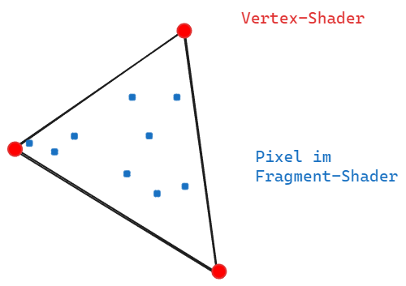
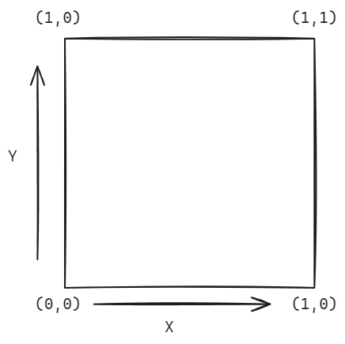

# Basic Intro

Fragment shader is code that get's executed for every single pixel of the canvas we draw on. It determines how each pixel should be colored.
The output of a shader is a color in rgba values from 0.0 to 1.0. *So we assign to every pixel on the canvas a rgb color value between 0.0 and 1.0.*

The code must behave differently depending on the position of the currently processed pixel on the canvas . 
For that the shader receives the position/coordinate of the respective pixel as an input and returns the color for the pixel as a result/output.

Every single pixel gets processed independently from the others. There is no before or after it is always just the current pixel the needs to calculated now.

With `gl_FragColor` the shader definies the final color value of the pixel that gets returned from the shader.
`gl_FragColor` is `vec4` - a Vector that contains 4 values - `vec4(r,g,b,a)`

# Thinking process for shaders
Position-Based Thinking:

Every shader starts by figuring out "where am I?" using the pixel coordinates.
We normalize these coordinates to make them easier to work with
All our shapes are defined relative to these coordinates

Distance-Based Thinking:

Most shapes are created by calculating the distance from the current pixel to some point or line
Circle: Check distance from center point
Rectangle: Check distance from edges
Complex shapes: Combine multiple distance calculations

Color-Based Thinking:

Colors are vectors of numbers (RGB)
Mixing colors is vector math
Changing Alpha values

Step-by-Step Approach:

Get pixel position
Convert to useful coordinate system
Calculate distance to shape
Convert distance to color
Output final color

Some intresting questions:
Position-Based Questions:

"Where is this pixel on the screen?"

What are its raw coordinates?
Is it in the top half or bottom half?
Is it left or right of center?

"What coordinate system makes most sense for what I'm drawing?"

Do I want (0,0) in the center or corner?
Should my coordinates go from -1 to 1, or 0 to 1?
Do I need to account for screen aspect ratio?

"How can I transform my coordinates to make the math easier?"

Would rotating help?
Should I scale the space?
Would offsetting the coordinates make the shape easier to draw?

Distance-Based Questions:

"What's the simplest way to describe this shape mathematically?"

Is it based on distance from a point? (like a circle)
Is it based on distance from a line? (like a rectangle)
Can I break it into simpler shapes?

"How do I know if a pixel is inside or outside my shape?"

What's the mathematical rule that defines the boundary?
What happens at the edges?
How can I make the edges smooth?

"How can I combine multiple shapes?"

Should they blend together?
Should one cut out from another?
Do I need smooth transitions between them?

Problem-Solving Pattern:

"What's the absolute simplest version of what I'm trying to draw?"

Can I start with just a dot or line?
What's the most basic math that could work?

"How can I test if my math is working?"

What color should I make successfully calculated areas?
Can I visualize the distance field using color?
What happens if I animate this value?

"How can I break this complex shape into simpler parts?"

Is it multiple circles?
Is it a combination of basic shapes?
Can I use boolean operations (AND, OR, NOT) with shapes?

Debugging Questions:

"Why isn't this pixel the color I expect?"

What are its exact coordinates?
What value is my distance function returning?
Are my numbers in the range I expect?

"How can I visualize what's happening?"

Can I show the raw distance value as a color?
What happens if I multiply/divide my values by 10?
What if I display different components in different color channels?

# Coordinates of the pixel
`gl_FragCoord` is the GLSL variable that provides the coordinates of the pixel currently being processed by the shader.

`gl_FragCoord` is a vec4 with the `vec4(x,y,z,w)` value.

The coordinate system of a shader is: 

Because the value range of a the final pixelcolor lies between 0.0 - 1.0 it makes sense to normalise the coordinates of the pixels in the screen. 

We can nomalise the these with by dividing the coordinates by the resolution.
`gl_FragCoord.xy/u_resolution`.

With that we can map the xy position of the pixel onto the value range from 0.0 - 1.0.

# Parallel Processing
The GPU of a computer enables that multiple small programms can be executed in parallel. It executes for each pixel the shader programm at the same time.

Shader programm doesn't know anything about the values of the other pixels when a pixel gets painted.

So every pixel and vertex is independent from the other.

