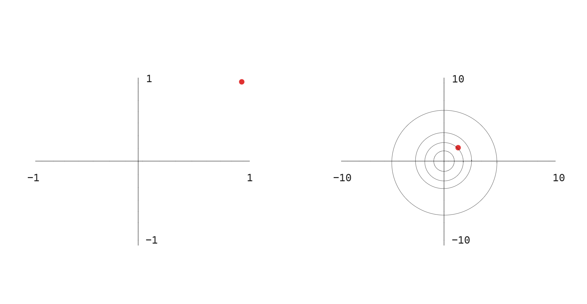
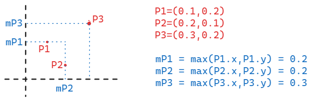
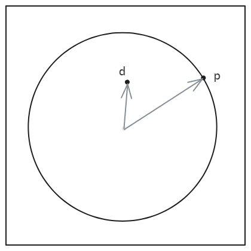
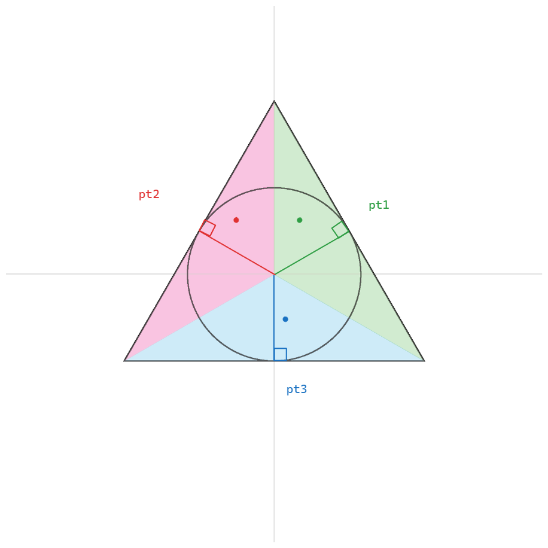

# Algorithmic Drawing

To draw intresting and complex graphics in GLSL it is _It is important to understand one-dimensional mathematical functions and especially their graph on the x-axis_ in order to be able to work better with them later.
==Learn and explain the behavior of mathematical functions.==
The behavior of math. functions can be used to draw shapes by changing the colors of the pixels.

# Mathematical Functions

GLSL provides mathematical functions to set or calculate values in the shader.

A basic questions to ask yourself when using these functions is: ==what shapes does the math. function create
when I insert values like the pixelposition==.

## Trigonomic Functions(Oscillation & Periodicity)

To animate graphics it's a good start to use the trigonimic functions Sine `sin()` and Cosine `cos()`.

<iframe src="https://thebookofshaders.com/05/sincos.gif" style="height:100%;width:100%"></iframe>

If you insert the the uv.x values into the sin function you get a gradient from left to right.

<iframe height="300" style="width: 100%;" scrolling="no" title="Simple Sin(uvx)" src="https://codepen.io/levoxtrip/embed/YPKeYKE?default-tab=html%2Cresult&editable=true" frameborder="no" loading="lazy" allowtransparency="true" allowfullscreen="true">
  See the Pen <a href="https://codepen.io/levoxtrip/pen/YPKeYKE">
  Simple Sin(uvx)</a> by levoxtrip (<a href="https://codepen.io/levoxtrip">@levoxtrip</a>)
  on <a href="https://codepen.io">CodePen</a>.
</iframe>
If you insert uv.y you get a gradient from top to buttom.

If you multiply the uv.x inside the `sin(uv.x*10.)` you can change the frequency of the sin function and
you get multiple peaks of the sin-wave.

If you multiply the `sin(uv)*2.0` outside the function you modify the amplitude of the sin function.

If you add/subtract values to the `uv` inside the function `sin(uv.x+time)` you move the graph along the x-axis.

If you add/subtract values outside the `sin(uv.x)+0.5` you move the graph along the y-axis.

## Basic Math Functions

<iframe src="https://thebookofshaders.com/glossary/?search=sin" allow="fullscreen" allowfullscreen="" style="height:100%;width:100%; aspect-ratio: 16 / 9; "></iframe>

With the `pow(base,n)` function we can calculate the power/exponentiation of a value, where we raise a base number to an exponent: baseⁿ.

The `exp(x)` computes `e` Eulers number raised to the given power eˣ.

<iframe src="https://thebookofshaders.com/glossary/?search=exp" allow="fullscreen" allowfullscreen="" style="height:100%;width:100%; aspect-ratio: 16 / 9; "></iframe>

The `abs(x)` returns the absolute value of the input. So if the input value is 0.2 `abs(-0.2)` the function return 0.2.

<iframe src="https://thebookofshaders.com/glossary/?search=abs" allow="fullscreen" allowfullscreen="" style="height:100%;width:100%; aspect-ratio: 16 / 9; "></iframe>

Try to insert `abs(sin(x))`.
`abs()` basically mirrors/reflects the values from the y-axis.

## Interpolation & Transitions

### step()

The `step()` function works as a binary threshold. You can use it to test if a value is smaller
or bigger then a threshold value. It works similar to an `if()` function.
`step(threshold,valueToTest)`
`If value > threshold -> return 1.0`
`If value < threshold -> return 0.0`

<iframe height="300" style="width: 100%;" scrolling="no" title="step(uv.x)" src="https://codepen.io/levoxtrip/embed/dPbebRg?default-tab=html%2Cresult&editable=true" frameborder="no" loading="lazy" allowtransparency="true" allowfullscreen="true">
  See the Pen <a href="https://codepen.io/levoxtrip/pen/dPbebRg">
  step(uv.x)</a> by levoxtrip (<a href="https://codepen.io/levoxtrip">@levoxtrip</a>)
  on <a href="https://codepen.io">CodePen</a>.
</iframe>

We use `step()` to create hard edges between colors for example when we want to mix to colors
based on a threshold value.

### smoothstep()

To create a smoother transition between two values we can use `smoothstep()`.
`smoothstep(edge1,edge2,value)`
`if value <edge1 -> return 0.0`
`if value >edge2 -> return 1.0`
`if value > edge1 and value < edge2 interpolate between edge1 and edge2 value`
Smoothstep linearly interpolates between the two edge values.

If we combine two smoothstep functions with each other we can create a smoothline.
Uncomment the second statement to see that.

<iframe height="300" style="width: 100%;" scrolling="no" title="smoothstep" src="https://codepen.io/levoxtrip/embed/jENxNYM?default-tab=html%2Cresult&editable=true" frameborder="no" loading="lazy" allowtransparency="true" allowfullscreen="true">
  See the Pen <a href="https://codepen.io/levoxtrip/pen/jENxNYM">
  smoothstep</a> by levoxtrip (<a href="https://codepen.io/levoxtrip">@levoxtrip</a>)
  on <a href="https://codepen.io">CodePen</a>.
</iframe>

### mix()

Another function to create a linear interpolation is the `mix()` function.

```
vec3 color1 = vec3(1.0,0.0,0.0);
vec3 color2 = vec3(0.0,0.0,1.0);
vec3 color = mix(color1,color2,uv.x);

for uv.x = 0.0 is the color of the pixel color1
for uv.x = 1.0 the color of the pixel color2
```

### fract()

The GLSL `fract()` function takes a decimal number as input and returns the decimal part.

```
fract(3.3) = 0.3
fract(1.5) = 0.5
```

<iframe src="https://thebookofshaders.com/glossary/?search=abs" allow="fullscreen" allowfullscreen="" style="height:100%;width:100%; aspect-ratio: 16 / 9; "></iframe>

So `fract()` wraps any number that goes above 1 back into the range 0.0 to 1.0 no matter how large the number is before applying it. This creates a repeating pattern because the values that fract() returns for the pixel coordinates of 0.2 , 1.2, 2.2 are the same.
So you break the range of uv (0 to 1) into smaller sections, repeatedly, based on the value of x.

mod() - modulo

## Clamping & Limiting

### clamp()

With the `clamp()` function we can restrain a value into a desired range.

```
clamp(val,min,max)
clamp(2.0,0.0,1.0) = 1.0
clamp(-0.5,0.0,1.0) = 0.0
clamp(0.5,0.0,1.0) = 0.5
clamp(uv.x,0.0,0.2) = 0.2 for all uv.x values > 0.2
```

<iframe src="https://thebookofshaders.com/glossary/?search=clamp" allow="fullscreen" allowfullscreen="" style="height:100%;width:100%; aspect-ratio: 16 / 9; "></iframe>

Using `clamp()` to our pixelcoords creates a `hold las pixel value` effect.

### min()

The `min(thresh,value)` compares similar to `step()` a theshold value and the input value.
`If value < thresh -> return value`
`If value > threh -> return thresh`
The value gets limitted at the thresh value. So we can use the `min()` to garanty that certain values never go over a desired threshold value.

<iframe src="https://thebookofshaders.com/glossary/?search=min" allow="fullscreen" allowfullscreen="" style="height:100%;width:100%; aspect-ratio: 16 / 9; "></iframe>

### max()

The `max(thresh,value)` is the opposite of the `min()` function.
`If value < thresh -> return threshold`
`If value > thresh -> return value`
With `max()` we assure that values never get lower then our threshold value

<iframe src="https://thebookofshaders.com/glossary/?search=max" allow="fullscreen" allowfullscreen="" style="width:100%; aspect-ratio: 16 / 9; "></iframe>

### floor()

The `floor(value)` function rounds up to the next integer value if the value is smaller/equal to `value`

<iframe src="https://thebookofshaders.com/glossary/?search=floor" allow="fullscreen" allowfullscreen="" style="width:100%; aspect-ratio: 16 / 9; "></iframe>

<iframe height="300" style="width: 100%;" scrolling="no" title="Fract(uv.x*multiple)" src="https://codepen.io/levoxtrip/embed/ZYzogNG?default-tab=html%2Cresult&editable=true" frameborder="no" loading="lazy" allowtransparency="true" allowfullscreen="true">
  See the Pen <a href="https://codepen.io/levoxtrip/pen/ZYzogNG">
  Fract(uv.x*multiple)</a> by levoxtrip (<a href="https://codepen.io/levoxtrip">@levoxtrip</a>)
  on <a href="https://codepen.io">CodePen</a>.
</iframe>

### ceil()

The `ceil(value)` function rounds up to the next integer value if the value is bigger/equal to `value`

<iframe src="https://thebookofshaders.com/glossary/?search=ceil" allow="fullscreen" allowfullscreen="" style="width:100%; aspect-ratio: 16 / 9; "></iframe>

sign() - returns -1, 0, or 1

### sign()

The `sign(value)` returns the sign of the `value`.
`if value < 0 -> return -1`
`if value == 0 -> return 0`
`if value > 0 -> return 1`

<iframe src="https://thebookofshaders.com/glossary/?search=sign" allow="fullscreen" allowfullscreen="" style="width:100%; aspect-ratio: 16 / 9; "></iframe>

## Vector Functions

### length()

The `length(value)` takes an input vector and calculate the length of the vector/ the distance between the vector and it's origin.

<iframe src="https://thebookofshaders.com/glossary/?search=length" allow="fullscreen" allowfullscreen="" style="width:100%; aspect-ratio: 16 / 9; "></iframe>

<iframe src="https://external-content.duckduckgo.com/iu/?u=https%3A%2F%2Ftse4.mm.bing.net%2Fth%3Fid%3DOIP.Jnq6yCe4W7PqgsH-X-ntIwHaEL%26pid%3DApi&f=1&ipt=ce07450787f75f2d029075752540d88dac418adf6c244a576510986f25ac1ed2&ipo=images"  style="width:100%;height:100%"></iframe>

# Colors

In GLSL colors get represented in `vec3(r,g,b)`.

To mix colors we can use the `mix(color1,color2,value)` function.
This function linearly interpolates between the two colors.

```
if a = 0.0 -> color1
if a = 1.0 -> color2
```

## Gradient

To draw a gradient between two colors we can use `mix()` functions and map the colors depending on an
interpolation value. For the interpolation value can for example use the pixel position on the screen.
`mix(color1,color2,st.x)`

<iframe height="300" style="width: 100%;" scrolling="no" title="Mixing Colors Gradient" src="https://codepen.io/levoxtrip/embed/ZYzRzQW?default-tab=html%2Cresult&editable=true" frameborder="no" loading="lazy" allowtransparency="true" allowfullscreen="true">
  See the Pen <a href="https://codepen.io/levoxtrip/pen/ZYzRzQW">
  Mixing Colors Gradient</a> by levoxtrip (<a href="https://codepen.io/levoxtrip">@levoxtrip</a>)
  on <a href="https://codepen.io">CodePen</a>.
</iframe>

==By manipulation the uv we can define show the colors are distributed==
`float uvs = abs(sin(u_time))`

We also can assing a vec3 for the interpolation value and manipulate the single channels.

```
vec3 pct = vec3(st.x);
pcr.r = smoothstep(0.1,0.9,st.x);
pcr.g = smoothstep(sin(st.x)*2.0);
pcr.b = pow(st.x,0.5);

color = mix(color1,color2,pcr);
```

# Inspiration Easing Functions

<iframe src="https://github.com/glslify/glsl-easings" allow="fullscreen" allowfullscreen="" style="width:100%; aspect-ratio: 16 / 9; "></iframe>

<iframe src="https://thebookofshaders.com/edit.php#06/easing.frag" allow="fullscreen" allowfullscreen="" style="width:100%; aspect-ratio: 16 / 9; "></iframe>

<iframe src="https://iquilezles.org/articles/palettes/" allow="fullscreen" allowfullscreen="" style="width:100%; aspect-ratio: 16 / 9; "></iframe>

<iframe src="http://dev.thi.ng/gradients/" allow="fullscreen" allowfullscreen="" style="width:100%; aspect-ratio: 16 / 9; "></iframe>

# Shaping Functions

By combining `step()` and `smoothstep()` with other mathematical functions we can draw shapes.

## Circle

To define a circle we need a `center` and a `radius`. Then we define the distance between the `center` of the circle and the position of the pixel. If the `distance` is bigger than the radius then the pixel is outside of the circle and the function should return 0. If the distance is smaller then the pixel is inside the circle and the function should return 1.

We can calculate the distance with the `float distance = length(uv)` function. It calculates the length of the pixel vector from it's origin.

A _vector_ doesn't represent a position in space but how you get from pos1 to pos2.


This visualises the distance of the pixel to the center of the canvas.

<iframe height="300" style="width: 100%;" scrolling="no" title="Drawing Circle" src="https://codepen.io/levoxtrip/embed/GgKBKNB?default-tab=html%2Cresult&editable=true" frameborder="no" loading="lazy" allowtransparency="true" allowfullscreen="true">
  See the Pen <a href="https://codepen.io/levoxtrip/pen/GgKBKNB">
  Drawing Circle</a> by levoxtrip (<a href="https://codepen.io/levoxtrip">@levoxtrip</a>)
  on <a href="https://codepen.io">CodePen</a>.
</iframe>

We now use a `step()` function to define if the distance of the pixelposition is bigger than the raidus or smaller.

`if pixelPositionDistance < radius -> inside return 1.0`
`if pixelPositionDistance > radius -> outside return 0.0`

`float circle = step(distance,radius);`

So as a function we have:

```
float circle(vec2 uv, float rad, vec2 center){
  vec2 pos = uv-center;
  float dist = length(pos);
  float color = step(dist,rad);
  return color;
}
```

To be able to calculate how far the currently calculted pixel is away from the circle center we first have to subtract the center position from the current pixel position. This gives us the relative distance from the current pixel to the center.


### Soft Circle

With `smoothstep` we also can create a circle with softer edges.

```
foat softCircle(vec2 uv, float r, vec2 center, bool soften){
  vec2 pos = uv-center;
  float d = length(pos);
  float edge = (soften) ? r*0.15 :0.0
  return smoothstep(r-edge,r+edge,d);
}
```

### Border Circle

To create a circle with a border and without a filling we test if the pixel lays on the radius plus and minus the width of half the line.

```
float borderCircle(vec2 uv, float rad, float lineWidth, vec2 center){
    vec2 pos = uv-center;
    float d = length(pos);
    float hLineWidth = lineWidth/2.0;
    float c = step(rad-hLineWidth,d)-step(rad+hLineWidth,d);
    return c;

}
```

So we test if the distance of the pixel is bigger than `radius-halfLineWidth` and smaller than `radius+halfLineWidth`.


#### Smooth border Circle

```
float circle(vec2 pt, float r, vec2 center, float lineWidth,bool soften){
    vec2 pos = pt -center;
    float d = length(pos);
    float edge = (soften) ? r*0.05 : 0.00;
    float hlw = lineWidth*0.5;
    float sh = smoothstep(r-hlw-edge,r-hlw,d)
			    - smoothstep(r+hlw,r+hlw+edge,d);

    return sh;
}
```

## Square

To draw a square we want to test if a pixel lies inside the outer edges of the rectangle or not.

First we subtract the center coord from the current uv coords. The resulting pos coords. This gives us values where all values to the left and below the center are negative, while all values to the right and above the center are positive.
A positive value for `pos.x` means taht the point is to the right of the center and negative value to the left.

At the end we test with `step` whether the pixel is inside or outside the rectangle.

<iframe height="300" style="width: 100%;" scrolling="no" title="drawing Rectangle" src="https://codepen.io/levoxtrip/embed/NPWWwRo?default-tab=html%2Cresult&editable=true" frameborder="no" loading="lazy" allowtransparency="true" allowfullscreen="true">
  See the Pen <a href="https://codepen.io/levoxtrip/pen/NPWWwRo">
  drawing Rectangle</a> by levoxtrip (<a href="https://codepen.io/levoxtrip">@levoxtrip</a>)
  on <a href="https://codepen.io">CodePen</a>.
</iframe>

```
float rect(vec2 uv, vec2 center, vec2 size){
    vec2 pos = uv-center;
    vec2 hSize = size*0.5;
    float hr = step(-hSize.x,pos.x) - step(hSize.x,pos.x);
    float vr = step(-hSize.y,pos.y) - step(hSize.y,pos.y);
    return vr*hr;
}
```

# Distance fields

We can think of distance fields like a height map - at every pixel we are calculating _How far are we(the pixel that currently gets calculated) from something_.

In distance fields, for every pixel(`st/uv`) on the canvas we calculate how far that pixel is from one or more reference points or shapes.

Then we use the distance value to decide what to draw.

```glsl
//Calculate the distance from current pixel to point (0.5,0.5)
float d = distance(st,vec2(0.5,0.5));
//Draw a circle by checking if distance is less than 0.3
float circle = step(d,0.3) // white if d<0.3, black otherwise
```

By combining different distance functions we can create intresting graphics.

`s = distance(st,vec2(0.4))+distance(st,vec2(0.6));`
So here we first calculate the distance from point (0.4,0.4) to all the pixels on the canvas and the distance from point(0.6,0.6) to all the pixels. We then add together the values from the single distance fields to a new pixel field.
So when the points are close to each other the addition of the distance of the two points is gonna be a small value so they both gonna be darker. Because the distance to the pixel around the reference points are low and the points are close to each other so their addition creates a low value.
If the points are further away you get higher values and the pixel colors are brighter because the distance from one reference point to the other is bigger so the addition of these are also bigger.

`s = distance(st,vec2(0.4))*distance(st,vec2(0.6));`
Multiplying distances creates a different effect. Areas that are close to either point will result in a small value while areas far from both will have larger values. This create intersection pattern.

`s = max(distance(st,vec2(0.4),distance(st,0.6));`
Here the `max()` function takes the larger value of the two distances. The result of the operation is a new distance field that represents the _intersection/union_ of the two original distance fields because the maximum distance at any point will be the distance to the closest surface of either object.


`s = min(distance(st,vec2(0.4)),distance(st,vec2(0.6)));`
Here the `min()`function takes the smallest distance from both distances which leads to the union of the two shapes.

`pct = pow(distance(st,vec2(0.4)),distance(st,vec2(0.6)));`

For optimising the performance we also can create circular distance fields with the `dot()` function. The `dot()` function calculates the skalarproduct.
`float pt = dot(st,st)*4.0`

With distance fields we can draw almost every shape we want.
We start by scaling the value range of the x and y coordinates to the range of -1 and 1
`st = st*2.-1.`.
This moves the base of the coordinate system from the lower left corner to the center of the canvas.

After that we can create a distance field with the `length()` function to calculate the distance of the pixel to the center of the canvas.

So if we for example do
`d = length(st-0.3)` we move the base of the coord system by (0.3,0.3) or in other words we calculate the distance from every pixel on the screen to the position(0.3,0.3). This creats the dark circle around the position (0.3,0.3).


By enclosing the current pixel position `st` with `abs()` we create a mirroring effect. Because we move the

## Mirroring values

By scaling the canvas with `st = st*2.-1` we changed the pixel coords from 0-1 to -1 to 1 with 0,0 in the center. That means that we have the same _absolute_ values left,right, up, down around the center. That allows us to mirror what we draw in between 0 -> 1 to all 4 quadrants. For that we need to take the absolute value of the pixel coord with the `abs()` function.

<iframe height="300" style="width: 100%;" scrolling="no" title="absValueCoords" src="https://codepen.io/levoxtrip/embed/GgRoEBr?default-tab=html%2Cresult&editable=true" frameborder="no" loading="lazy" allowtransparency="true" allowfullscreen="true">
  See the Pen <a href="https://codepen.io/levoxtrip/pen/GgRoEBr">
  absValueCoords</a> by levoxtrip (<a href="https://codepen.io/levoxtrip">@levoxtrip</a>)
  on <a href="https://codepen.io">CodePen</a>.
</iframe>

If we then want to create a ripple effect we scale up the value range by `scale` and then we can use `fract` to set the pixel color to values between 0-1 and not to values bigger than 1.0. `fract()` only returns the decimal values so we get gradients from 0-1 the amount of `scale` times.

By multiplying `d` with a `scale` value we scale the values of the pixelcoordinates.



```
void main() {
  vec2 uv = (gl_FragCoord.xy - (u_resolution.xy * 0.5)) / u_resolution.y;
  vec3 color;
  //Mirror values pixel coords
  uv = abs(uv)-0.2;
  float scale = 10.;
  //calculate distance
  float c = fract(length(uv)*scale);

  color = vec3(c);

    gl_FragColor = vec4(color, 1.0);
}
```

`min()` and `max()` functions allow us then to define in which areas we want to draw the distance field.
For example only show the distance field outside the value range 0.0.
Because we are calculating `-0.3` the values inside are smaller than 0.0 and get shown as black.

```
void main(){
  vec2 uv = gl_FragCoordy.xy;
  vec3 color;
  uv = abs(uv)-0.2;
  float scale = 4.0;
  float d = length(max(abs(uv)-0.3,0.0));
  color = vec3(d);
  gl_fragColor = vec4(color,1.0);

}
```

Only show the distance field between -0.3 and 0.0.
`d= length(min(abs(uv)-0.3,0.0))`

After that we can use `step()`or `smoothstep()` to decide how the distance field is gonna be drawn.
If you want do draw outlines you can multiply/substract two step functions.

<iframe height="300" style="width: 100%;" scrolling="no" title="Outlined Distancefield" src="https://codepen.io/levoxtrip/embed/pvoEaEY?default-tab=html%2Cresult&editable=true" frameborder="no" loading="lazy" allowtransparency="true" allowfullscreen="true">
  See the Pen <a href="https://codepen.io/levoxtrip/pen/pvoEaEY">
  Outlined Distancefield</a> by levoxtrip (<a href="https://codepen.io/levoxtrip">@levoxtrip</a>)
  on <a href="https://codepen.io">CodePen</a>.
</iframe>

# Polar-forms

Another way to draw shapes is to use polar-coordinates instead of cartesian coordinates.
For that we need to convert the coordinate system by calculating the current pixel color with the radius and the angle of every coordinate/pixel.

<iframe height="300" style="width: 100%;" scrolling="no" title="Polarshape - Cosine" src="https://codepen.io/levoxtrip/embed/MYWjQEg?default-tab=html%2Cresult&editable=true" frameborder="no" loading="lazy" allowtransparency="true" allowfullscreen="true">
  See the Pen <a href="https://codepen.io/levoxtrip/pen/MYWjQEg">
  Polarshape - Cosine</a> by levoxtrip (<a href="https://codepen.io/levoxtrip">@levoxtrip</a>)
  on <a href="https://codepen.io">CodePen</a>.
</iframe>

To draw different shapes we use shape-giving functions from above to manipulate the radius of a circle in relation it's angles.

So with the form giving functions we change the radius of a circle in relation to every angle.

So the angle gives the direction from the center to the pixel position.

To visualize it we can fold the coordinate system to a line.


To draw the shape we test if the distance of the currently calculated pixel at the angle is bigger or smaller than the radius at that position.

More information for the calculation [here](https://www.youtube.com/watch?v=xx4JN8x2E24)

## Squared Shapes

As we have seen above the `abs()` function converts negative numbers into positive. In our case it mirrors the values around the center (0.0,0.0) and we get a symmetric image from the origin because we get for the coordinates left, right,top,bottom, the same color values back.


With the `max()` function we can return the bigger value from two input values. This creates squared distance fields. This field returns the value of the distance of the currently calculated pixel to the next point on the next edge of a square.



<iframe height="300" style="width: 100%;" scrolling="no" title="Squared Polar Distance field" src="https://codepen.io/levoxtrip/embed/VYwmYqv?default-tab=html%2Cresult&editable=true" frameborder="no" loading="lazy" allowtransparency="true" allowfullscreen="true">
  See the Pen <a href="https://codepen.io/levoxtrip/pen/VYwmYqv">
  Squared Polar Distance field</a> by levoxtrip (<a href="https://codepen.io/levoxtrip">@levoxtrip</a>)
  on <a href="https://codepen.io">CodePen</a>.
</iframe>

With `step(d,0.2)` we then can draw a filled rectangle. By subtracting two step functions we also can create a border effect.
`float c = step(d,0.2)-step(d,0.18)`
or
`float c = step(0.5,d)*step(d,0.4)`

### Squared Shape with rounded corners

To draw a square with rounded corners we first mirror the pixel position values with `abs()` of `uv`.
To create the area inside of the square we subtract a value like 0.2 from `abs(pos)` so all the values inside the square are smaller than 0.0. The area in which the values are 0.0 is therefore increased by the value that is subtracted from abs.


```
//Example calculation
for pos = (0.2,0.2)
pos.x = 0.2 - 0.2 = 0.0
pos.y = 0.2 - 0.2 = 0.0
```

After that we take the `max()` value of `uv` and 0.0 and calculate the length of it.

## Draw a line

To draw a line we want to create a calculation that returns 1.0 when the pixel is on the line and 0.0 when the pixel is not.
The pixel is on the line if the pixel position is between `pos-lineWidth` and `pos+lineWidth`.
To create a smoother line we use a `smoothstep()` function and add `edgeThickness`

```
float line(float pt1, float pt2, float lineWidth, float edgeThickness){
	float hlw = lineWidth*0.5;
	return smoothstep(pt1-hlw-eT,pt1-hlw,pt2)-smoothstep(pt1+hlw,pt1+hlw+eT,pt2);
	}
```


### Drawing a line that rotate around the center

Again we want to test if the input pixel is laying on the line that is rotating.

So first we calculate the distance from the input pixel to the center.
`vec2 d = pt-center`

Then we calculate the angle.

`float theta = u_time*2.0` we use `u_time` so the line rotates. We also can use a specific angle.

Next we create a second vector `p` which represents a point on the edge of a circle or the vector that points
from the center to the edge of a circle.

`vec2 p = vec2(cos(theta),-sin(theta))*radius;`
`cos(theta)` gives us the x component and `sin(theta)` the y component of a unit vector.

We also use `-sin(theta)` to adapt the orientation of the coordinate system so the rotation gets reversed. With `sin(theta)` the vector rotates counter clockwise.
So `p` represents the direction of the rotating line.

[Example Angle](https://codepen.io/nik-lever/full/YBBjLo);


The next step is to find out if testpoint `d` is on the line or not. For that we need to find the
distance from `p` to `d`.
So we want the point on the line that is closest to point `d` - the point that has the smallest distance to `d`
So we need to find the length of the line `p` to `d`. For that we want to find the point that is closes to `d` that is on the line.

## Drawing a polygone

Useful tools to draw a polygone are
[Nik lever](https://codepen.io/nik-lever/pen/ZPKmmx)
[Math tools](https://math.tools/calculator/trignometry/atan)

To draw a polygone we need to:

- Calculate the angle of the currently processed pixel relative to the center of the shape.
- Define to which side the point belongs by defining in which subtriangle the point lies.
- Calculate the distance of the point to the next closes edge.
- Manipulate the distance with (cos)
- Does the currenly processed pixel lies inside the or not.


Move point to the center
`pt = pt - center;`

Calculate the angle of the current pixel
`float currPixelAngle = atan(pt.y,pt.x);`

Calculate angle size of each subtriangle
` float segmentAngle = 2.0 * PI / float(sides)`;



We devide the polygon into subtriangles and fokus on the single triangle.
Find the subtriangle in which the currently calculated point lies.

With `currPixelAngle/segmentAngle` we try to find the subtriangle. By adding 0.5 and rouding this value down with `floor()` we create a modulo value.

```
130/120 = 1.083
1.083 +0.5 = 1.583
floor(1.583) = 1

if currPixelAngle < segmentAngle -> first subtriangle
if currPixelAngle > segmentAngle && currPixelAngle < 2*segmentAngle -> second subtriangle
...
```

So we get the index of the subtriangle.

`float baseAngleSegment = floor(0.5 + currPixelAngle/segmentAngle) * segmentAngle;`

Manipulate the distance so it's not just a circle but it expands into cornes
`float distance = cos(baseAngle-angle) * length(pt);`

Test if currently calculated pixel lies inside or not
`return distance < radius ? 1.0 :0.0`

<iframe height="300" style="width: 100%;" scrolling="no" title="Untitled" src="https://codepen.io/levoxtrip/embed/MYWVjam?default-tab=html%2Cresult" frameborder="no" loading="lazy" allowtransparency="true" allowfullscreen="true">
  See the Pen <a href="https://codepen.io/levoxtrip/pen/MYWVjam">
  Untitled</a> by levoxtrip (<a href="https://codepen.io/levoxtrip">@levoxtrip</a>)
  on <a href="https://codepen.io">CodePen</a>.
</iframe>

# Combine elements

To combine elements we can add the color of an element to the already existing color value that we gonna return at the end.

```
vec3 color = vec3(0.0);
color += vec3(1.0,0.0,0.3)*rect(...);
color += vec3(0.5,0.8,1.0)*rect(...);
```
