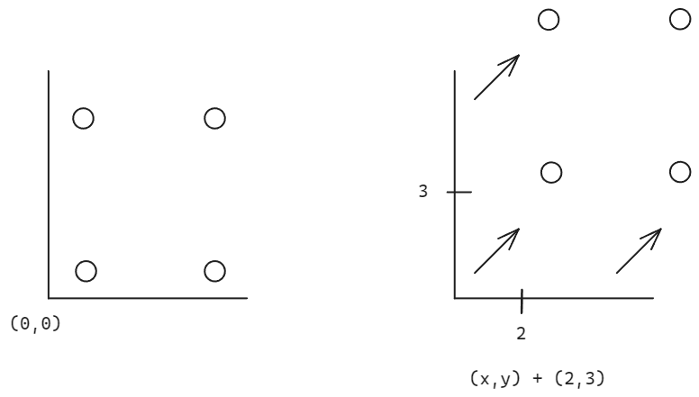
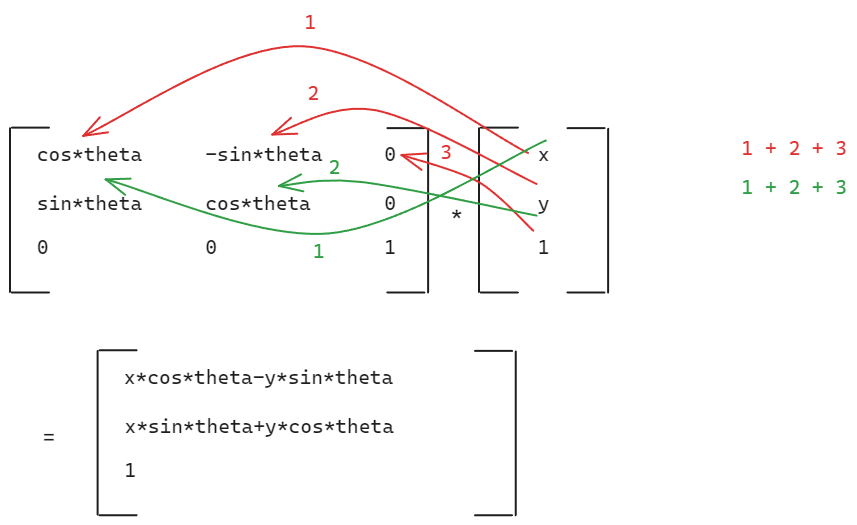
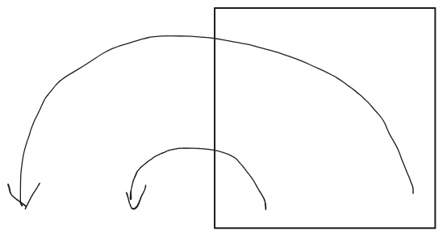
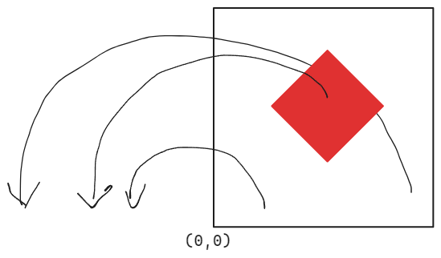
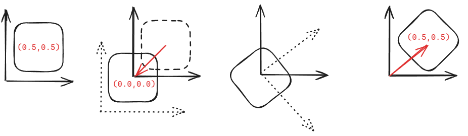
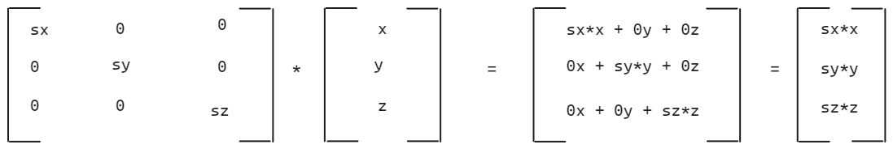
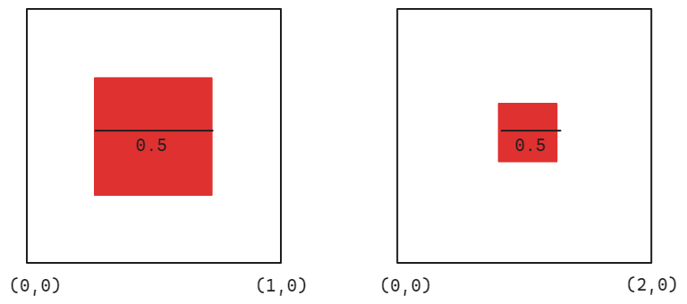

# Transformations

# Moving shapes / 2D Matrix

To move a shape on the canvas the trick is to translate the coordinate system underneath the shape.



To achieve that we add/subtract values to the `uv` variable.

<iframe height="300" style="width: 100%;" scrolling="no" title="GLSL - Moving Shape" src="https://codepen.io/levoxtrip/embed/EaxEgeO?default-tab=html%2Cresult" frameborder="no" loading="lazy" allowtransparency="true" allowfullscreen="true">
  See the Pen <a href="https://codepen.io/levoxtrip/pen/EaxEgeO">
  GLSL - Moving Shape</a> by levoxtrip (<a href="https://codepen.io/levoxtrip">@levoxtrip</a>)
  on <a href="https://codepen.io">CodePen</a>.
</iframe>

# Rotating Shapes

To rotate a shape around itself we need a `2D rotation matrix`.

It rotates the coordinate system around the point (0,0) and if we apply the rotation to the `uv` the whole canvas gets rotated.

```
mat2 rotate2D(float theta) {
    float s = sin(theta);
    float c = cos(theta);
    return mat2(c,-s,s,c);
}

//directly in the return
mat2 rotate2D(float theta){
    return mat2(cos(theta),-sin(theta),sin(theta),cos(theta))
}

[c -s]
[s  c]
```






Is the the center of the shape on (0,0) does appear to rotate around itself. But if the shape has its center somewhere else the shape is rotation relative to (0,0).

To fix that and let the shape always rotate around its own center no matter where the shape is
we have to move the shape from its center to 0.0, execute the rotation, and then move it back to its center.



<iframe height="300" style="width: 100%;" scrolling="no" title="GLSL-RotatingShapes" src="https://codepen.io/levoxtrip/embed/wBvmoMq?default-tab=html%2Cresult" frameborder="no" loading="lazy" allowtransparency="true" allowfullscreen="true">
  See the Pen <a href="https://codepen.io/levoxtrip/pen/wBvmoMq">
  GLSL-RotatingShapes</a> by levoxtrip (<a href="https://codepen.io/levoxtrip">@levoxtrip</a>)
  on <a href="https://codepen.io">CodePen</a>.
</iframe>

To change the anchor of the rotation we would have to change the
center value by manipulating the `pos` inside the shape function.

```
vec2 pos = pt-center
pos -= vec2(radius,0);//this is gonna be the new center of the shape
```

# Scaling Shapes

As for Rotation we also need a 2D Matrix for scaling our canvas.


```glsl
mat2 scaleEqual2D(float scale){
  return mat2(scale.x,0,0,scale.y);
}
mat2 scaleIndiv2D(vec2 scale){
  return mat2(scale.x,0.0,0.0,scale.y);
}

[scale.x  0]
[0  scale.y]

void main(){
  ...

uv-= vec2(0.5)
uv *= scaleIndiv2D(vec2(0.2,0.5));
uv+= vec2(0.5);
}

```

If the scale value is bigger than 1.0 the shape gets smaller because the
value range of the canvas gets bigger and the area in which the pixel are inside the shapes gets smaller.



==If we combine rotation and scaling matrixes the order of transformation plays an important role==
