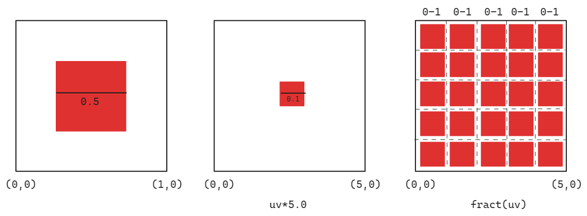
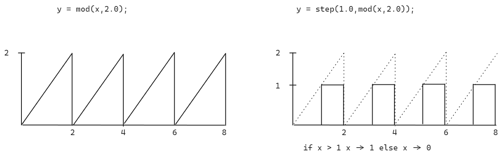

# Pattern

## Tiling

When we scale a coordinate system by a value > 1.0, e.g. 3.0, the value range of the canvas gets scaled from 0.0-1.0 to 0.0-3.0.

```
0.0-1.0
1.0-2.0
2.0-3.0
```

To create a tiling effect we first want to scale up our canvas and then return the same values for every decimal value
between 0.0 and 0.-x.0.

As we have seen before with the [fract](03_AlgorithmicDrawing.md#fract) function we always can return the same decimal value

```
fract(0.2) = 0.2
fract(3.2) = 0.2
fract(400.2) = 0.2
```



Because the function for our shape expects values from 0.0-1.0 and we create multiple times values
between 0.-1. the shape gets drawn multiple times on the canvas because the values for 0-1 are multiple times true for
the shape function.

```glsl
//By multiplying a pixel position with the amount of tiles and then returning just the `fract()` part of it we get 4 times 0-1 values.

float tileCount = 4.0;
uv = fract(uv*tilecount);
float sh = shape(uv)
```

<iframe height="300" style="width: 100%;" scrolling="no" title="25-03-21-RescaleMadness" src="https://codepen.io/levoxtrip/embed/MYWGoOW?default-tab=html%2Cresult" frameborder="no" loading="lazy" allowtransparency="true" allowfullscreen="true">
  See the Pen <a href="https://codepen.io/levoxtrip/pen/MYWGoOW">
  25-03-21-RescaleMadness</a> by levoxtrip (<a href="https://codepen.io/levoxtrip">@levoxtrip</a>)
  on <a href="https://codepen.io">CodePen</a>.
</iframe>

### Applying Matrices inside of Patterns and Tiles

To apply the transformations on the elements in the tile we first can type the canvas
and the simply apply the transformations

### Displaced Tiles

If you want different behavior in different columns and rows of your grid we have to find out if the
current pixel lies in an even or uneven column/row number.

For that we can use `y=mod(x,2.0)` and see if the result of it is smaller than 1.0;
To define which value we gonna return if the value is bigger we can use a ternary operator
`y = mod(x,2.0)< 1.0 ? 0.0 : 1.0;`
"If number <1.0 then return 0.0 else 1.0"
In GLSL it is more performant when we use a `step()`function for that.
`y = step(1.0,mod(x,2.0));`

For even column/row numbers this function returns 0 and for uneven it returns 1.0. We can use these values to multiply them with a displacement value.

```glsl
//multiply uvs with scaling value
uv *= 4.0
//displace pixels which are on uneven rows
uv.x+= step(1.0,mod(st.y,2.0))*0.5;
```

```glsl
float brickTile(vec2 _uv, float num){
  _st*=num;
  _st.x += step(1.0,mod(st.y,2.0))*0.5;
  return fract(_st);
}
```

We can create the same effect of `mod()` with a `fract()` function.

```glsl
//Displace uvs according to row
if(fract(uv.y)<0.5){
  uv.x += 0.25;
} else {
  uv.x -= 0.25;
}
```

or we can move them left or right depending on the row.

```glsl

if(fract(uv.y)<0.5){
  uv.x += fract(u_time);
} else {
  uv.x += fract(u_time);
}
```

```glsl
float myTime = u_time*speed;

if(fract(myTime)> 0.5)//If half of the time is passed
{
if(fract(_st.y*0.5)>0.5){//Check if even or uneven row
	_st.x += fract(time)*2.0;
	}else {
	_st.x -= fract(time)*2.0;
	}
} else {
	if(fract(_st.x*0.5)>0.5){
	_st.y += fract(time)*2.0;
	} else {
	_st.y -= fract(time)*2.0;
	}
}
return fract(_st);

```

<iframe height="300" style="width: 100%;" scrolling="no" title="GLSL - MovingTiles" src="https://codepen.io/levoxtrip/embed/ByaOZyL?default-tab=html%2Cresult" frameborder="no" loading="lazy" allowtransparency="true" allowfullscreen="true">
  See the Pen <a href="https://codepen.io/levoxtrip/pen/ByaOZyL">
  GLSL - MovingTiles</a> by levoxtrip (<a href="https://codepen.io/levoxtrip">@levoxtrip</a>)
  on <a href="https://codepen.io">CodePen</a>.
</iframe>

#### Truchet Tiles

We can create _Truchet Tiles_ by splitting up the space into four tiles and then rotate a shape depending on in which tile it lies.
To determine in which quadrant of a 2x2 grid the currently calculated pixel lies we create an index value 0-3 based on the cells position.

```glsl
st *= 2.0;
//return 1.0 if x-coord is in the right half and 0.0 if in the left
index +=step(1.0,mod(_st.x,2.0));
//returns 1.0 if the y-coordinate is in the top-half and 0.0 in the bottom half
index +=step(1.0,mod(_st.y,2.0))*2.0;
```

The `y-component` is multiplied by 2.0 so it contributes ether 0 or 2 to the index.

```
     |
 2   |   3
     |
--------------
     |
 0   |   1
     |
Index 0: bottom-left cell (x < 1.0, y < 1.0)
Index 1: bottom-right cell (x >= 1.0, y < 1.0)
Index 2: top-left cell (x < 1.0, y >= 1.0)
Index 3: top-right cell (x >= 1.0, y >= 1.0)
```

```glsl
vec2 rotateTilePattern(vec2 _st){
  //Scale coord system to 2x2
  _st * 2.0;

  // create index
  float index = 0.0;
  //return 1.0 if x-coord is in the right half and 0.0 if in the left
  index += step(1.0,mod(st.x,2.0));
  //returns 1.0 if the y-coordinate is in the top-half and 0.0 in the bottom half
  index += step(1.0,mod(st.y,2.0))*2.0;

  //scale every cell to 0-1
  _st = fract(_st);

  //rotations depending on the index

  if(index == 1.0){
    _st = rotate2D(_st,PI*0.5);
  } else if (index ==2.0){
    _st = rotate2D(_st,PI*-0.5);
    } else if(index == 3.0){
      _st = rotate2D(_st,PI);
    }

  return _st;
}
```

<iframe height="300" style="width: 100%;" scrolling="no" title="Tiling Canvas" src="https://codepen.io/levoxtrip/embed/MYWZXNy?default-tab=html%2Cresult" frameborder="no" loading="lazy" allowtransparency="true" allowfullscreen="true">
  See the Pen <a href="https://codepen.io/levoxtrip/pen/MYWZXNy">
  Tiling Canvas</a> by levoxtrip (<a href="https://codepen.io/levoxtrip">@levoxtrip</a>)
  on <a href="https://codepen.io">CodePen</a>.
</iframe>

Another way to create repeating pattern is to split the coordinates into integer and fractional parts
`vec2 fpos = fract(st)` // position within the cell (always between 0.0 - 1.0)
`vec2 ipos = floor(st)` // whole number part of coordinate telling you which cell you are in
This allows us to gread grid based patters while maintaining local coordinates within each grid cell.

<iframe height="300" style="width: 100%;" scrolling="no" title="GridCanvas - Ipos fpos" src="https://codepen.io/levoxtrip/embed/GgRzEzb?default-tab=html%2Cresult" frameborder="no" loading="lazy" allowtransparency="true" allowfullscreen="true">
  See the Pen <a href="https://codepen.io/levoxtrip/pen/GgRzEzb">
  GridCanvas - Ipos fpos</a> by levoxtrip (<a href="https://codepen.io/levoxtrip">@levoxtrip</a>)
  on <a href="https://codepen.io">CodePen</a>.
</iframe>
