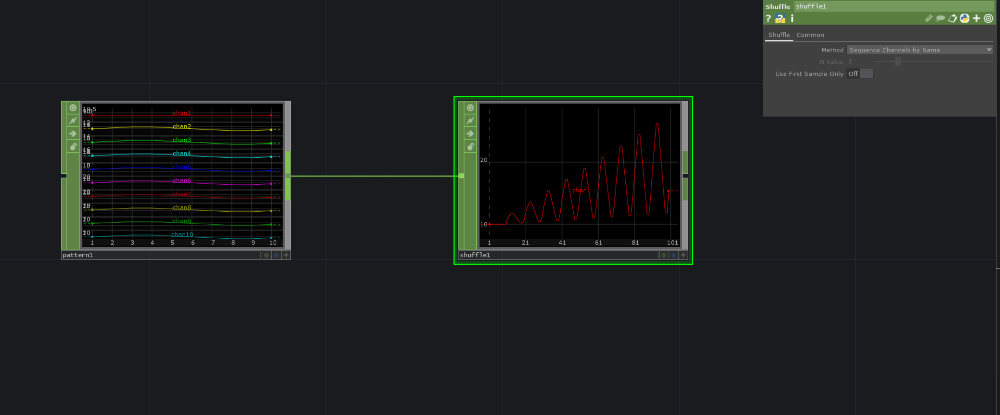

# Add Channels after each other into a Sequenz
If you have multiple channels that you want to line up after each other into on Sequenz we can use the `ShuffleCHOP` where we set the *Method* to `Sequence Channels by Name` which will combine the channels into `chan1-chan2-chan3-chan4-chan5...`.

[Download](./files/SequenzChannelsAfterEachOther.tox)

