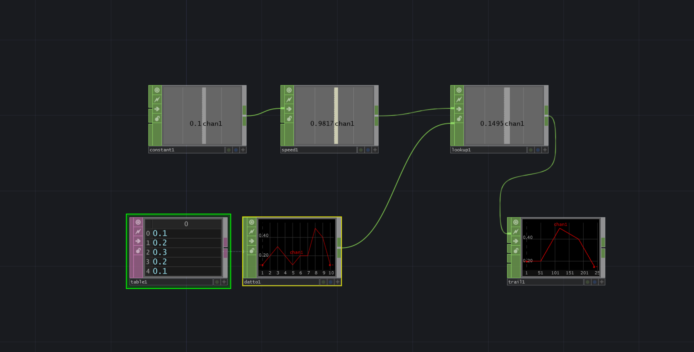
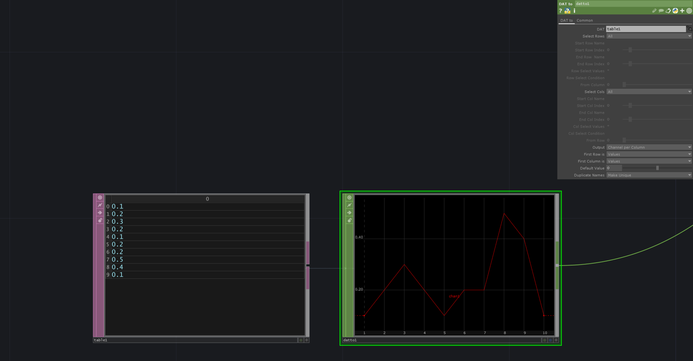
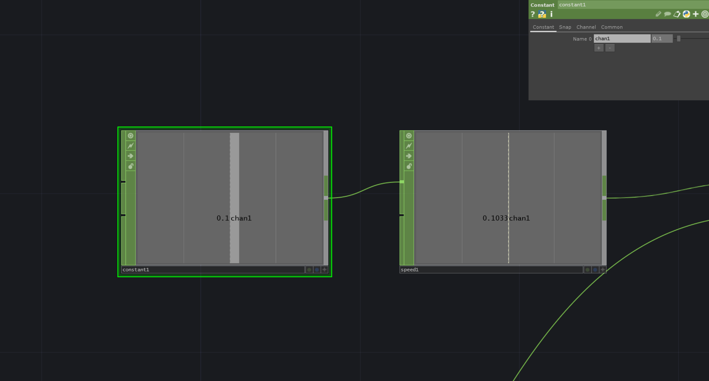

# Animate through graph of datapoints

Animating through graphs of datapoints in TouchDesigner allows us to visualize complex data in a dynamic and interactive way, helping to uncover patterns, trends, and insights that static representations may not reveal.
Steps to do:
Add Table data and convert to CHOP Data:

Add Constant and Speed to control how was to go through Data

Connect speed to Lookup and limit speed to loop through data

[DownloadFile](./files/animateThroughData.tox)