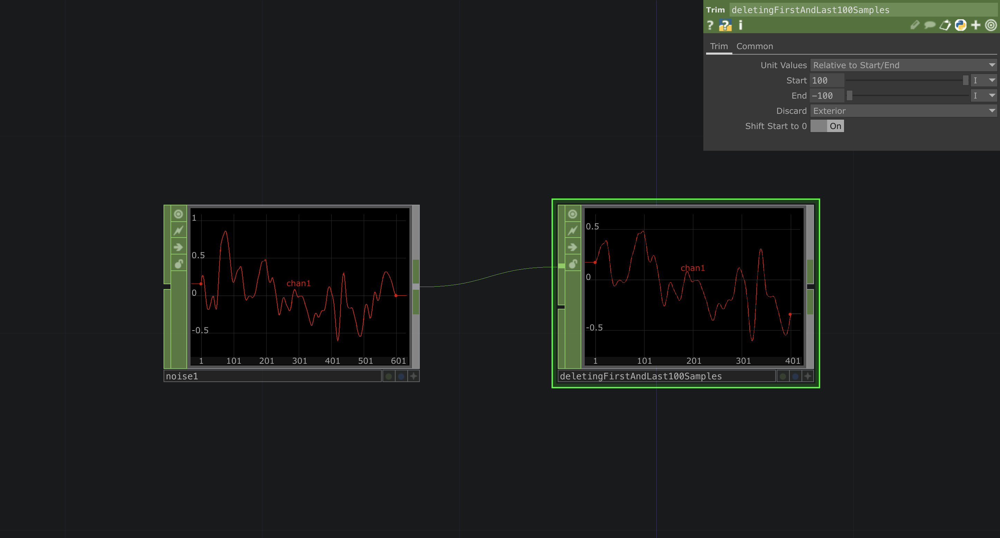

# Deleting samples at the beginning or end of chop

Sometimes you want to delete certain parts of a chop. For example when you have an audiospectrum that doesn't really provide usefull data at the edges we can use a `trimCHOP` to delete certain numbers of samples at the outer edges. For that we set *unit values* to `Relative Start/End` and *discard* `Exterior`. From there you can set the amount of samples you want delete in *Start* and *End*.

[DownloadFile](./files/DeleteSamplesStartEnd.tox)