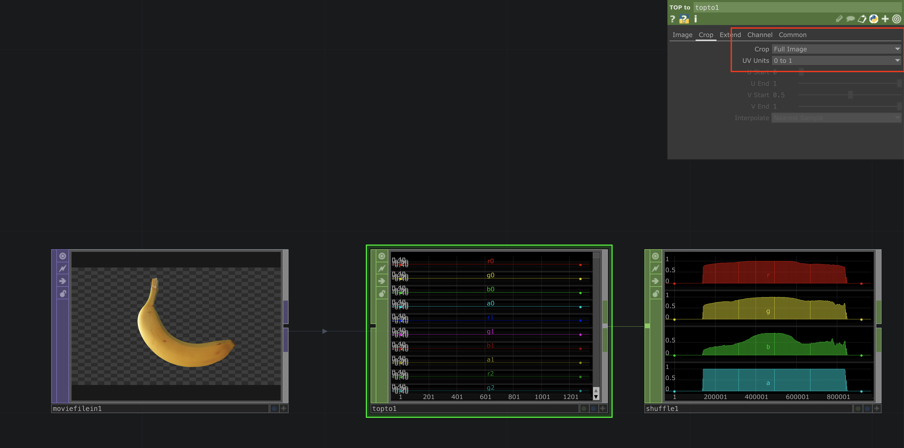
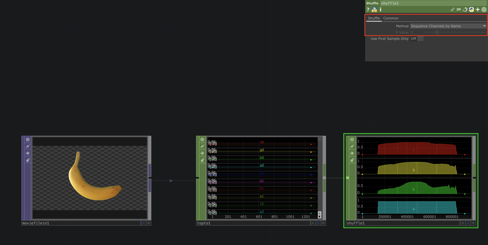

# Full TOP image to CHOP values
When you want to convert the full image of a TOP into CHOP values under *crop* you select `Full Image` and then combine all the channels with a `ShuffleCHOP` where you select `Sequence Channels by Name`. 

To have performance in mind it can make sense to reduce the resolution of the top before.

[Download](./files/FullImageTOPToCHOP.tox)    

