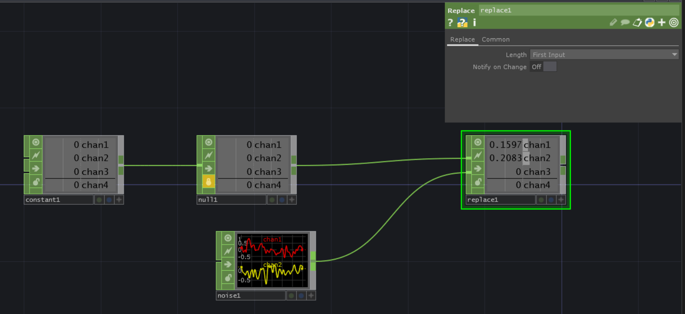

---
tags:
 - TD/CHOPS
 - TD/Performance
 - TouchDesigner

comments: true
---

# Keep Channel Count Stable with ReplaceCHOP

 If the channel count changes unexpectedly, this can break dependencies, cause errors, or produce unintended visual effects. A fixed channel count makes it easier to manage downstream processing.

 Save the state with the maximimum amount of channels that you expect to have with a `locked NullCHOP`. Then plug this into the `ReplaceCHOP`. For the second input you set the varying data.

 [Download](./files/KeepConstantChanNum.tox)

