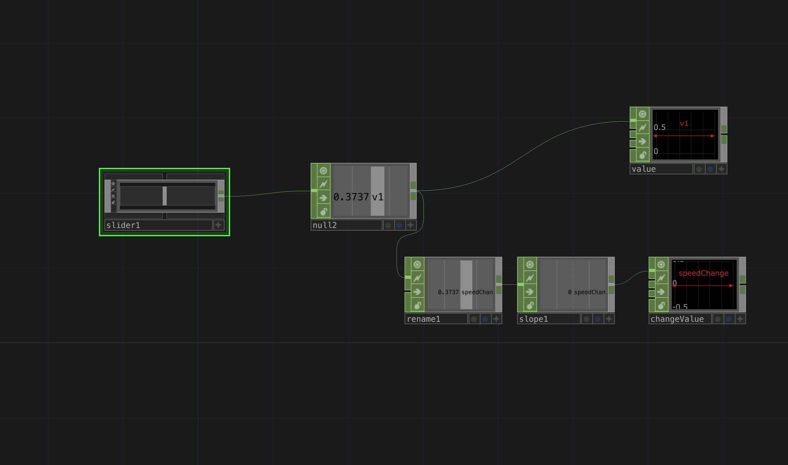

---
tags:
 - CHOPS
 - Measuring
---

# Measure how fast the CHOP value changes
When you want to track how fast for example something moves or somebody interacts you can use the slope to define for example the background alpha of a TOP.

[DownloadFile](./files/measureSpeedOfValueChange.tox)