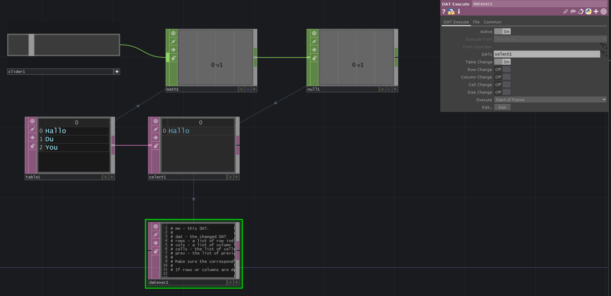
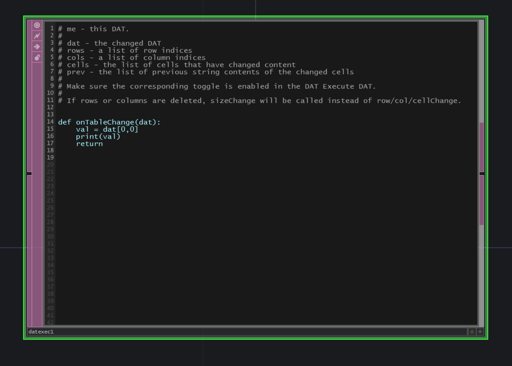

# ExecuteDAT when new selection from table

To execute something when your selection has changed we can just hook an `ExecuteDAT` and run the code on `TableChange` Method.

[Download](./files/executeNewSelectionTable.tox)    