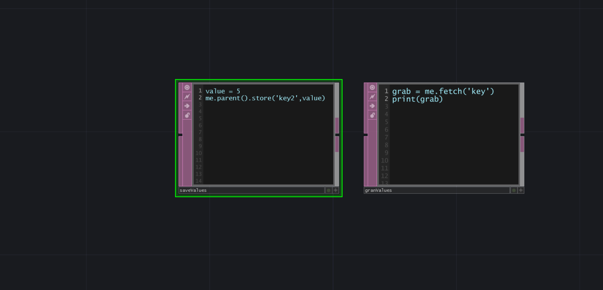

# Storing Values

We can store values in TouchDesigner so we can retrieve them when we need them. We can use Python for that.

``` py
//Storing values
value = 5
me.parent().store('valName',value)

//To retrieve Value
grab = me.fetch('valName')
print(grab)
```
