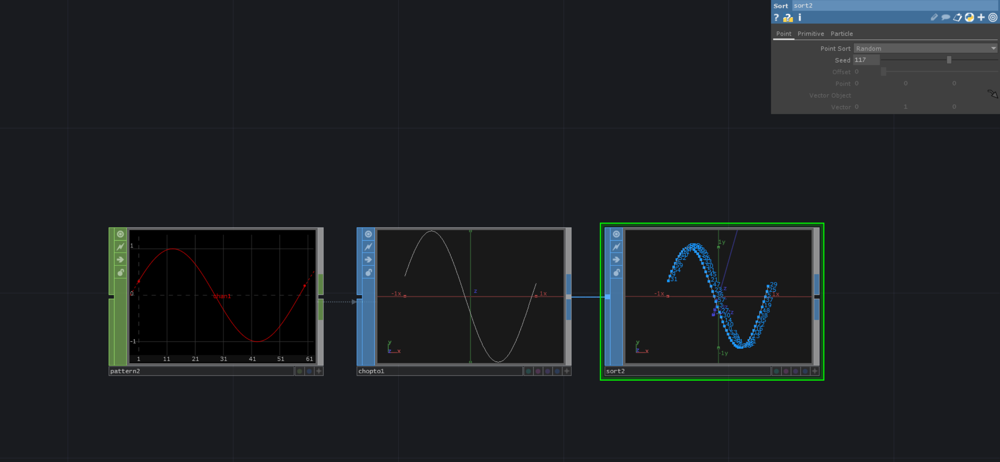

# Changing the Order of Points with SortSOP

We can change the order of the points of a Shape by resorting the points with a `sortSOP`. This operator often gets used for particle systems so the particles appear more randomly
and less predictable. 

[Download](./files/ChangeOrderPointsSop.tox)    

