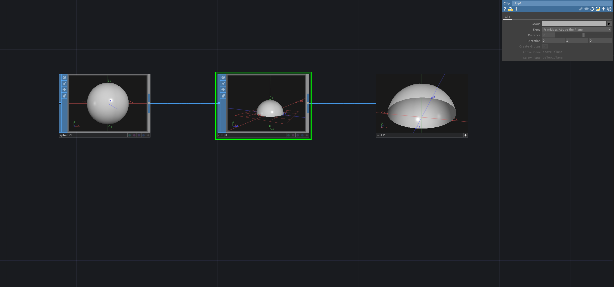

# Cut parts of Shape with Clip SOP
The `ClipSOP` cuts of parts of the input geometry. It uses a plane to define the surface where to cut of the geometry.
The input shape for the `ClipSOP` needs to be polygon.

[Download](./files/CutShapeClipSOP.tox)    

