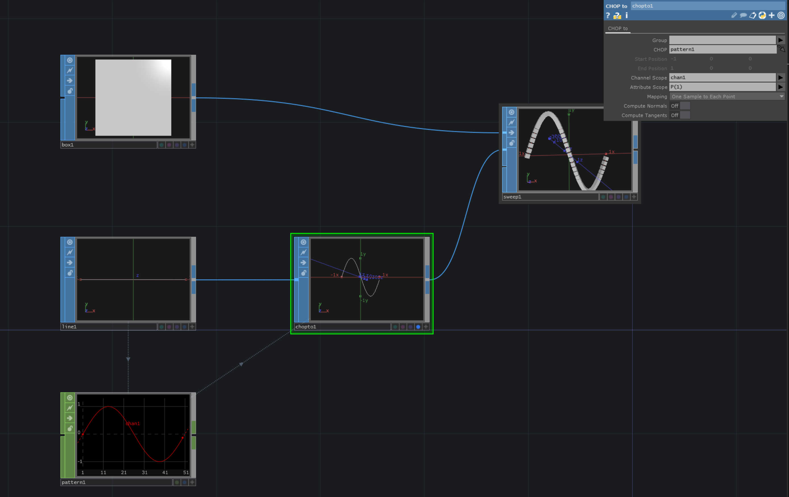

# Distribute Shapes Along Path with SweepSOP

We can use a `SweepSOP` to distribute shapes along a path.
The first input for the `SweepSOP` is the shape that you want to instantiate on the path.
The seconds input defines the path.

[Download](./files/DistributeShapeAlongPathSweepSOP.tox)    