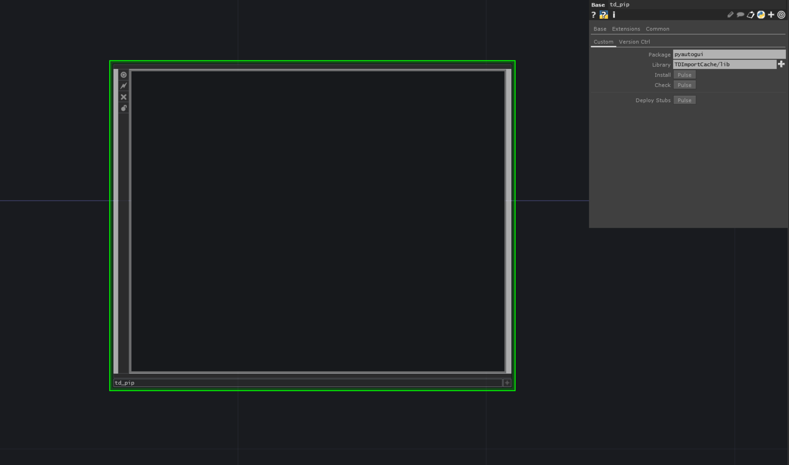

# Working with Python Libraries in TouchDesigner


## Installation

Get TD-pip package from alphaMoonbase
https://olib.amb-service.net/component/td-pip

Drop it into your project.

Execute Dat - reference operator
`svg = op('td_pip').Import_Module('packageName)` 
will install library directly into the project folder

Now let's install the pyautogui package in the parameter window. Type in the name of the package and then click Install `Pulse`. Afterwards you can check if everything got installed by pulsing *Check*.


After we installed it we can execute some pyautogui code to simulate interactions with the computer.

We can use a `chopexecuteDAT` and trigger the pyautogui code when we get a true input. 

We probably want to store the current position of the cursor to bring the cursor back the original psoition after the execution
`currentPos = pyautogui.position`

we then can move the cursor to a new position with `pyautogui.moveTo(newPosX,newPosY)`

To execute a click action we can call `pyautogui.click()` method.

If we want to do multiple actions after each other it makes sense to add a small sleep timer
For that we need to import `time` module.

We then can write after the *click` write
`time.sleep(0.01)`

If we then for example want to press a button we can use `pyautogui.press('s')`

If you want to hold down a key for longer time you also can use `.keyDown` and `.keyUp` with a `time.sleep(timeToHold)`

```py
pyautogui.keyDown('s')
time.sleep(2)
time.keyUp('s')
```