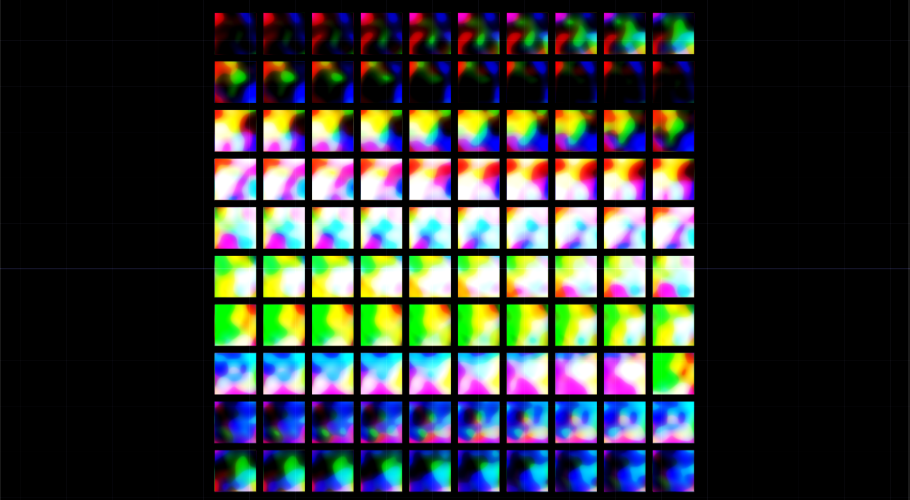
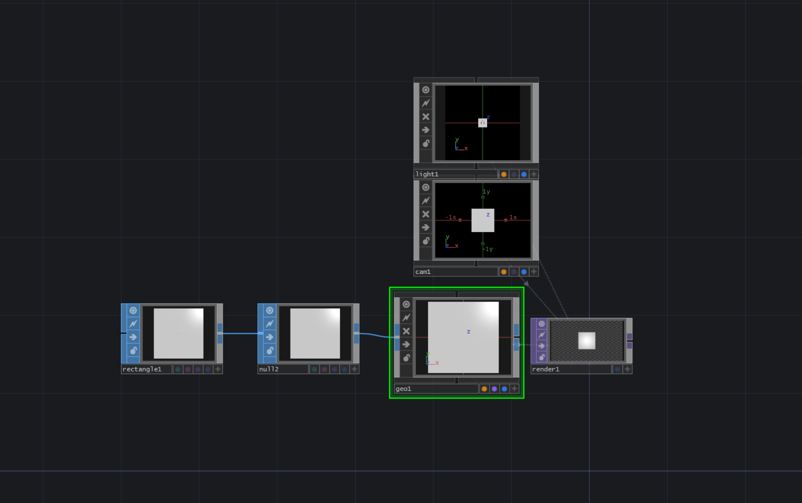
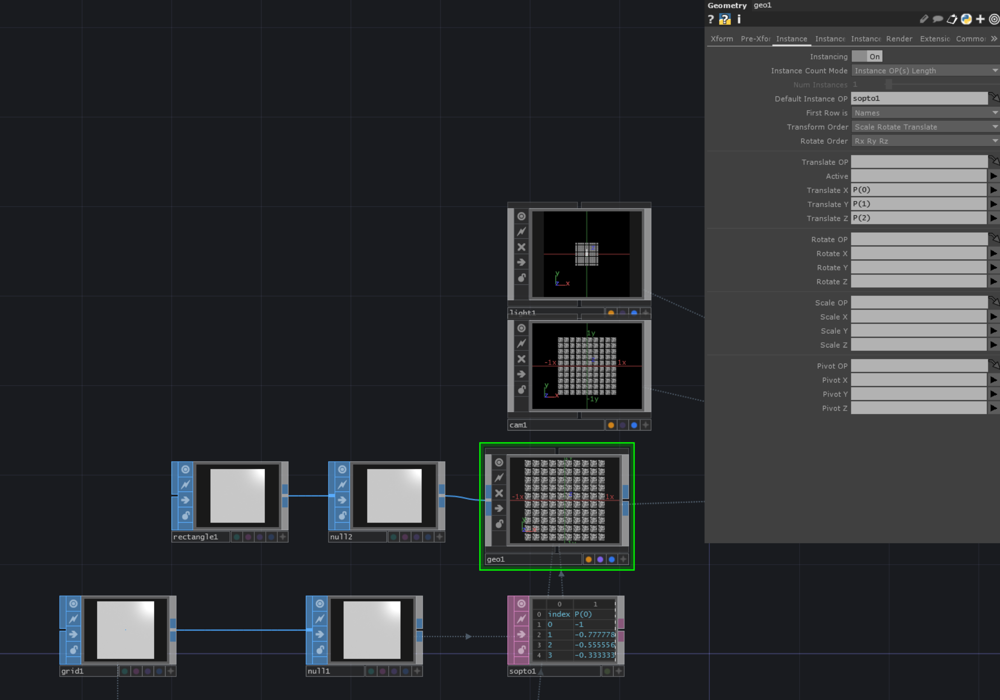
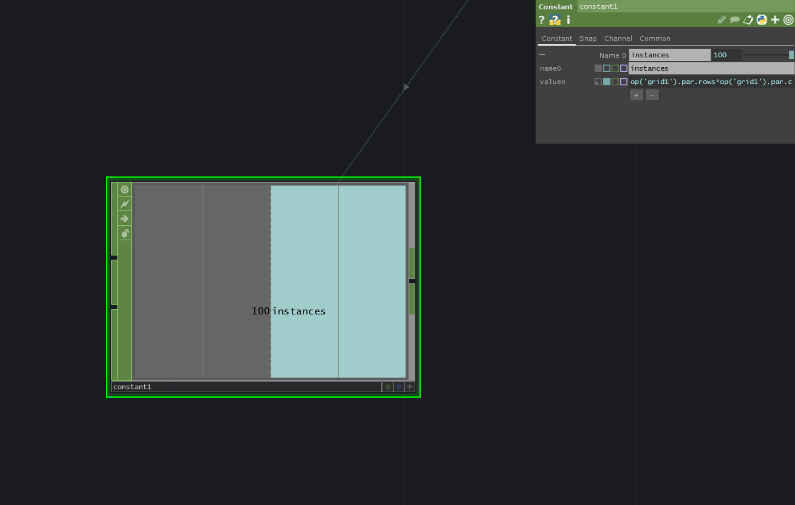
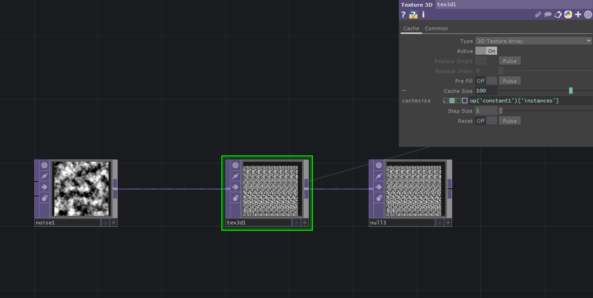
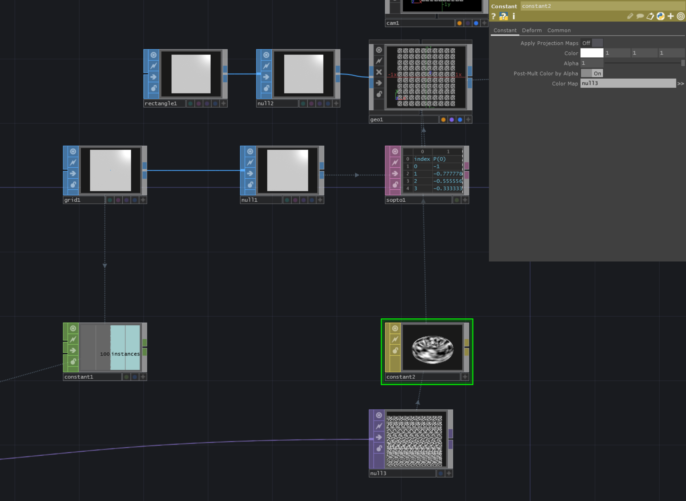

# Image Instancing On Grid

The steps we need to do to accomplish this are:
- Create shape where Texture gets instanced on

- Create Grid that position the shapes and setup instancing in Geo

- Store amount of instances

- Collect images that you want to instance

- Assign material to Geo

- Set Index in Geo

[DownloadFile](./files/basicTextureInstancing.tox)

