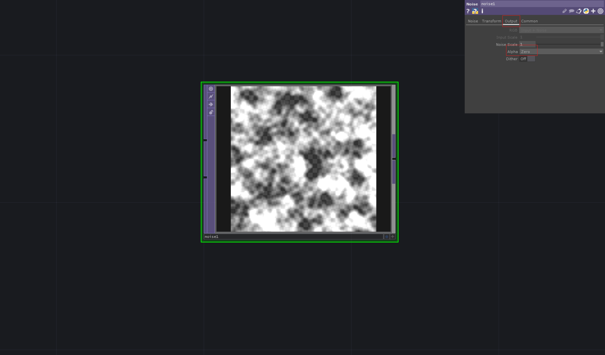

# Output NoiseTOP with Transparency

To create a transparent background for a `NoiseTOP` texture instead of a black one, navigate to the *Output* section of the TOP parameters and set the *Alpha value* to *zero*.

