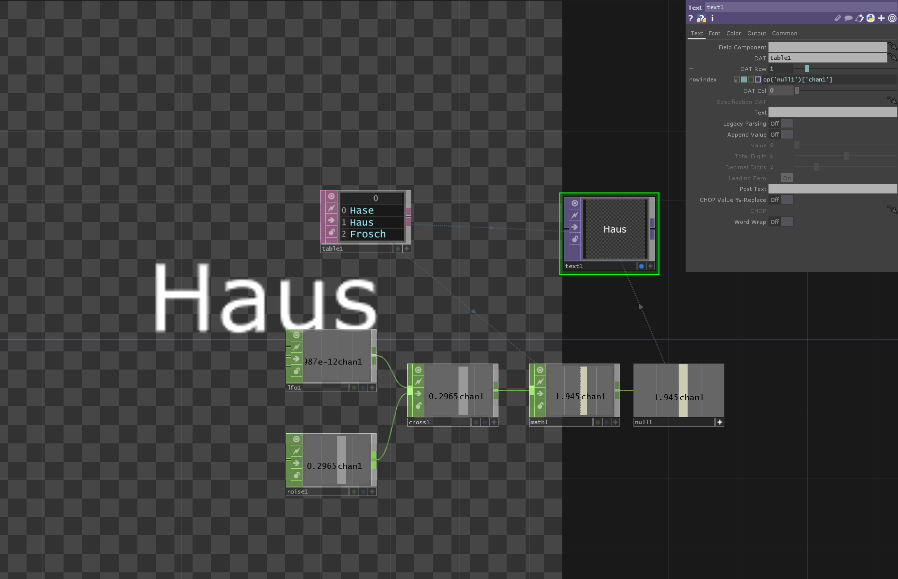

# Set Text from tableDAT

If you want to loop through text from a `tableDAT ` to show it in a `TextTOP` we can assign table to `textTOP` and set the text via different CHOP behaviour.

[DownloadFile](./files/SetTextTOPFromTableDAT.tox)
