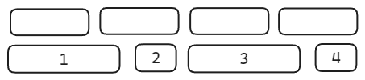

# Rhythm 
Most fundamental aspect in music

Rhythm is the placement of sound in time - every sound happens in a specific moment of time.

## Time signatures
In western music rhythms are arranged in *time signatures.*
A time signature defines how many beats are in each measure/bar. A *measure* is a segment of music that contains a set number of beats.
Time signatures are organised like a fraction. 1/4

4 <- How many beats in each measure of music
4 <- Type of note that counts as one beat.

3 <- 3 Beats per measure
4 <- quarter notes
Time signature for waltz music - 1-2-3 1-2-3

The lower note can be seen as a fraction
4 = 1/4 note -> quarter note
2 = 1/2 note -> half note
1 = 1/1 note -> full note 

## Tempo

The *tempo* is the speed of the beat in BPM (Beats per Minute)
120 BPM = 120 Beats per Minute - Clock has 60 Beats per Minute

## Note division

The beats in a time sequenz can get subdivided to broaden the rhythmic pattern.

e.g. in 4/4 time

/4 Quarter note per measure

/8 Eighth note per measure

/16 sixtenth note per measure

Instead of dividing by two we also can divide the beats into 3 parts creating triplets.

## Swing and shuffle
To create more dynamic into the rhythm and rhythmic variation we can use *swings* to change length of certain notes. This leads to a "groovy" or "bouncy" feel of the rhythm.
It means that instead of playing notes eavenly you delay second half of each beat.

E.g. In house music
16th note swing might stretch the first and the third note while shortening the sonc and forth. That creates a "push" and "pull" effect.

## Strong and weak beats

