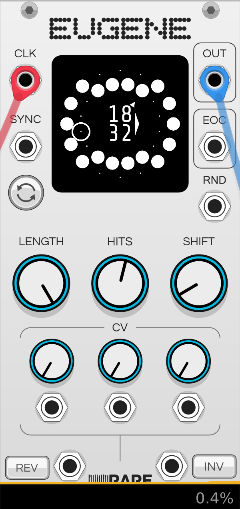

<!--  -->
# VCF
VCF stands for *Voltage controlled Filter*. With a filter we can cut out parts of the signal.
`High pass` lets the higher frequencies through and filters out the lower ones.
`Low Pass` lets the lower frequencies through and filters out the higher ones.

`Drive` Knob adds distortion the the signal.
