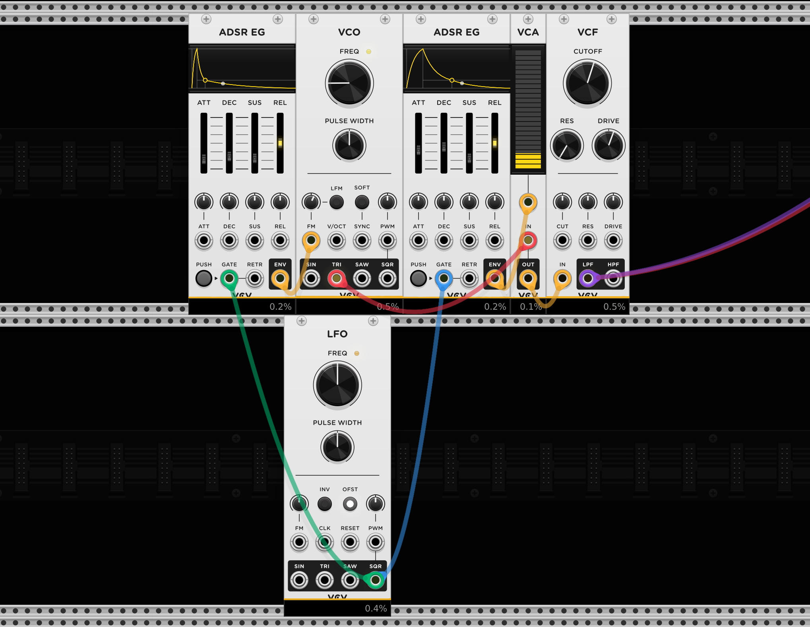

# Basic Kick Drum

To create a basic kick drum we connect a sine or triangle(more harmonics) output of a [VCO](../modules/VCO.md) module into the *IN* channel input of a [VCA](../modules/VCA.md).
To control the level of the VCA we wire a [ADSR](../basics/ADSR.md) as the *CV Input*. The ADSR needs a gate input to trigger when the envelope is started/triggered.
For that we can use a LFO module with a Square Output. This simulates gate signals that trigger the ADSR. With the Frequency of the LFO module we can define the speed of the beat.
With a short *attack* in the ADSR we can create that kick drum sound.

To add some more character we can add `Noise` module. To shape the noise signal we need again an ADSR that controls the level in an VCA module.

To enhance the Kickdrum further add another vco + adsr + vca with a lower frequency in the vco.