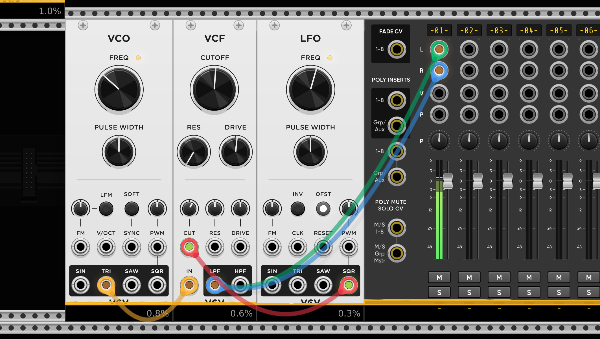
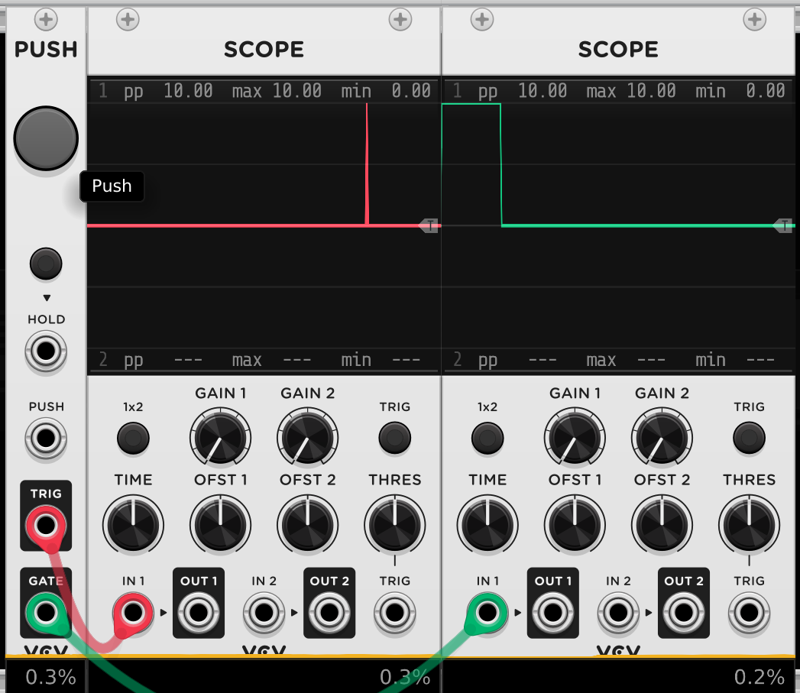
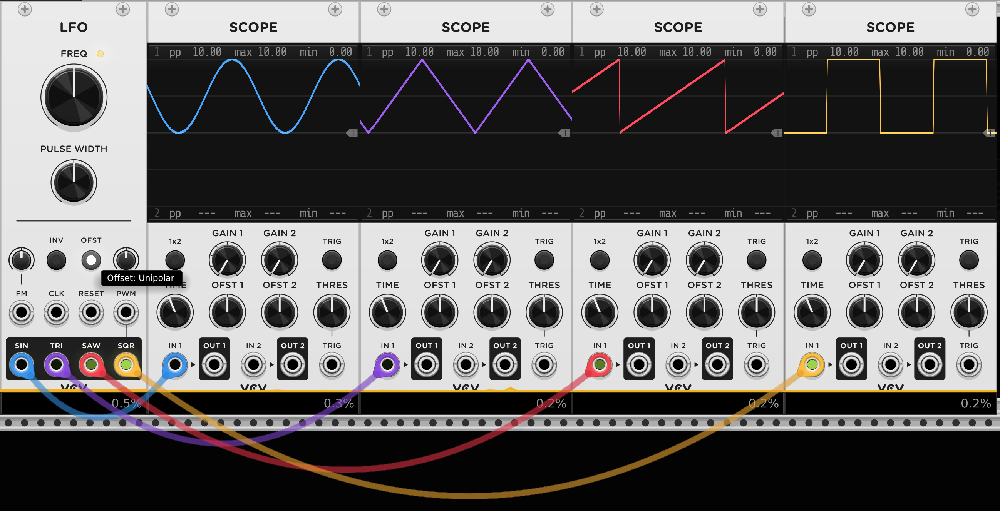
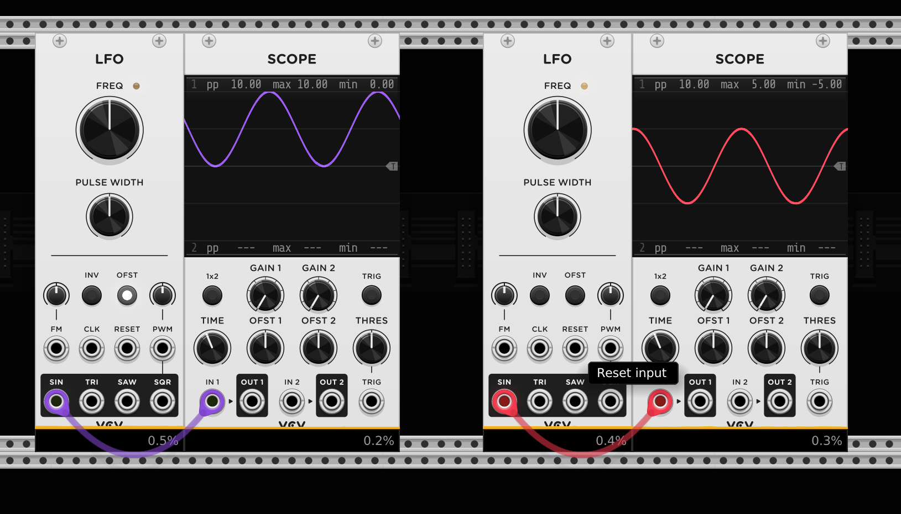
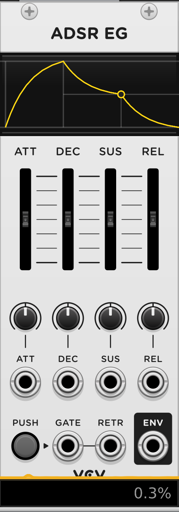
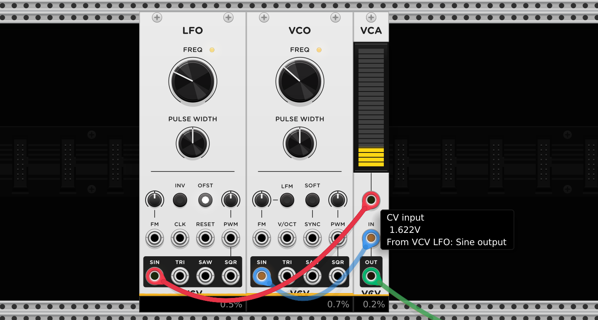
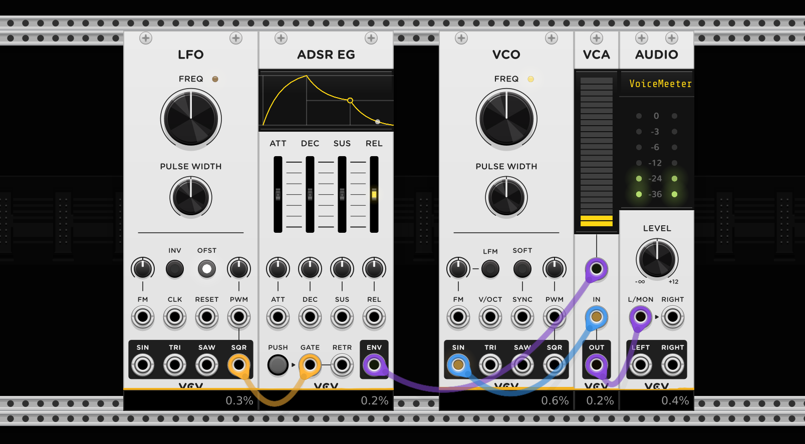

# Basics

Modulation is the process of changing parameters over time using a control signal. 

Modular synthesis uses a signal *modulator* to change different aspects of another *carrier* signal like amplitude, frequency or timbre/tone color.

Good question to ask is: which principle of modulation is used in this step?

# Basic terminology

## Modulation
Using a signal(the modulator) to affect/change another signal (the carrier).
Some types of modulation are:
- frequency modulation
- amplitude modulation
- phase modulation
- ring modulation
- pulse with modulation

## Voltage span
All Eurorack/VCVrack modules work with Voltage in a maximum value span of 10 Volt.
- -5V to 5V
- 0 to 10V
- 0 to 1V

## Amplitude
Level/strength of an audio or control voltage(CV) signal.
For audio the amplitude controls the loudness of a sound.

For control voltage signal(CV) the amplitude controls the intensity of modulation that gets applied to a signal.

## Frequency
The rate a signal oscillates. Measured in Hertz(hz).
Mainly used to control the pitch of a tone although it can control many aspect of a module. E.g. can be used to control the cutoff frequency of a filter.

## Clock
The *clock* signal is a steady stream of triggers/pulses which are used to synchronize other modules. The synchronizing is essential to produce precise and complex rhythms and patterns that align with tempo.

To create a clock signal there are a lot of clock modules available.

## Trigger
Short burst signal of voltage that goes `HIGH` and directly goes back to `LOW` state.

Triggers get used for example for envelopes that control percussive sounds which lack sustain phase.

## Gate
Voltage signal that is used to control the duration of an event. Unlike *triggers* gates are longer, sustained signals that remain high for the duration of the event - could be a note being played.

## LFO
A *Low Frequency Oscillator* generates a low frequency waveform that is typically used to modulate other modules. The typical waveforms available in an LFO are sine, triangle, sawtooth and square. The output of a LFO is a control voltage that we can use for modulation. 

## VCO
*Voltage Controlled Oscillator* generate audio-frequency signal that can create wide range of sounds. It creates a continously running tone. To shape a single sound we can create a [substractive synthesizer voice](#substractive-synthesizer-voice)

## Bipolar
A control voltage signal that can have positive and negative values. For example a LFO signal with its center at 0V and its peaks and trophs at 5. and -5V.

## Unipolar
Control voltage signal that is only positive. Usually in between 0 and max 10V.

## Envelope Generator
Envelope generator can shape the amplitude or the timbre of a sound over time. Most commonly used is ADSR.
ADSR stands for *Attack*,*Decay*,*Sustain* and *Release*. Other envelopes are AR, ADR or AD which have less stages as the ADSR.

## V/OCT
*Volt per Octave* is a standard way of controlling musical pitch with voltage where:
- one octave equals 1 volt difference. 
  Going from C4 to c5 requires 1 volt increase.
- one semitone equals 1/12 volt(approximately 0.0833 volts).
  A semitone is the smallest step between notes in Western music. Each semitone requires adding or subtracting 0.0833 Volts.

## VCA
A *Voltage Controlled Amplifier* allows a CV signal to control the amplitude of an audio signal. This works similar to a volume control which can be modified by for example a LFO signal.

## VCF
*Voltage Controlled Filter* allows a CV signal to control the frequency response of an audio signal that passes through module.

The typical filter are:
- low-pass
- band-pass
- high-pass

We use filter for emphasis or reduction of certain frequencies in a sound/signal.

# Substractive Synthesizer Voice
To create a substractive synth voice patch we substract with modules parts of the source signal. For example we can use `Envelope` or `Filter` modules to modulate the output signal of a `VCO`.

The first thing you want to substract from a continuous sound is volume information with a `VCA` to control the amplitude and an `ADSR` envelope([Envelope Generator](#envelope-generator)) to control the shape of the signal that controls the amplitude.

In the VCA we have to plug in a *control voltage* signal that shapes our volume.

The ADSR need to be triggered so the Envelope gets executed. For ADSR we use a gate signal.

With filter modules we can further manipulate our signal. For that we can use a [VCF](#vcf) with a lowpass or highpass filter. Often filter have their own envelopes to control the cutoff.

