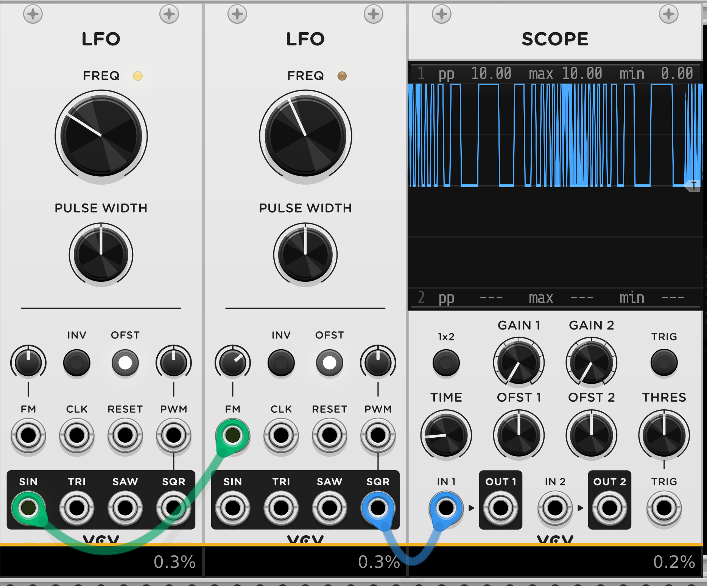
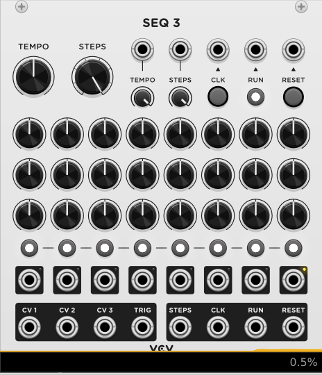
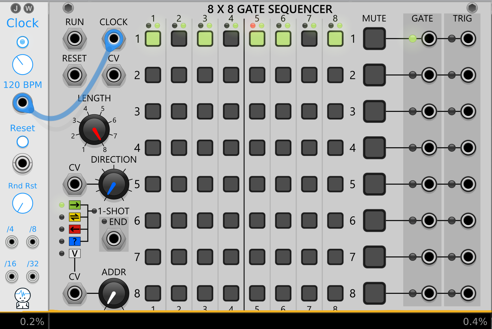
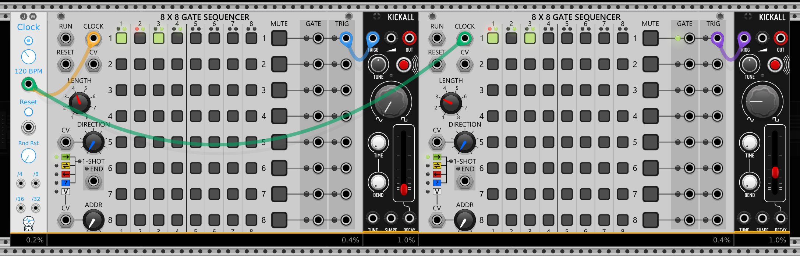

# Basics

Modulation is the process of changing parameters over time using a control signal. 

Modular synthesis uses a signal *modulator* to change different aspects of another *carrier* signal like amplitude, frequency or timbre/tone color.

Good question to ask is: which principle of modulation is used in this step?

# Basic terminology

## Audio-Rate
Audio Rate are frequencies that lie within the range of human hearing. This range get's used in synthesizer to create notes and sounds.
The range lies between 20Hz and 20kHz.
Note A4 -> 440Hz

## Modulation
Using a signal(the modulator) to affect/change another signal (the carrier).
Some types of modulation are:
- frequency modulation
- amplitude modulation
- phase modulation
- ring modulation
- pulse with modulation

## Voltage span
All Eurorack/VCVrack modules work with Voltage in a maximum value span of 10 Volt.
- -5V to 5V
- 0 to 10V
- 0 to 1V

## Amplitude
Level/strength of an audio or control voltage(CV) signal.
For audio the amplitude controls the loudness of a sound.

For control voltage signal(CV) the amplitude controls the intensity of modulation that gets applied to a signal.

## Frequency
`Frequency` is the rate a signal oscillates. Measured in Hertz(hz).
Mainly used to control the pitch of a tone although it can control many aspect of a module. E.g. can be used to control the cutoff frequency of a filter.

## Control Voltage(CV)
*Control Voltage* is one of the fundamentals of modular synthesis. It allows the communication between the modules. With the `CV` signal we can control and manipulate parameters of the modular like *pitch, frequency, filter cutoff, amplitude, etc*. 

All patch cables carry the same type of signal — a floating-point audio-rate signal(44.1 kHz or 48.kHz) — regardless of whether it’s being used for audio or “control voltage” duties. Conceptually, this represents a continuous voltage(a smooth signal without steps) that can vary over time, measured (in the virtual domain) in volts.

The modification of parameters by the control voltage is called *modulation*.

The CV signal can be [unipolar](#unipolar) or [bipolar](#bipolar).

## Clock
The *clock* signal is a steady stream of triggers/pulses which are used to synchronize other modules. The synchronizing is essential to produce precise and complex rhythms and patterns that align with tempo.

To create a clock signal there are a lot of clock modules available.

The clock signal doesn't have to mean the speed of something in your patch. In sequencers often a clock signal means go one step further/next order of operation.

Instead of using a clock module we also can create clock signals with for example an `LFO` with a *SQRT* wave.

### Variable clock
To create a variable clock we can manipulate the frequency of an `LFO` with another `LFO`

## Triggers and Gates
`Trigger` and `Gate` signals get used to control the timing of events like:
- Turning modules active/inactive
- Initiating envelopes
- Synchronizing modules

Both have `HIGH` and `LOW` voltage states.

### Trigger
Short burst signal of voltage that goes `HIGH` and directly goes back to `LOW` state - so no real `ON` phase.

Triggers get used for example for envelopes that control percussive sounds which lack sustain phase.

### Gate
Gates are longer, sustained signals that stay `HIGH` for a period of time before returning to `LOW`. This could be a note playing for example.
Voltage signal that is used to control the duration of an event. 

Gate signals are used to control the on/off state of modules and voices that require long note lengths.

## LFO
A *Low Frequency Oscillator* generates a low frequency waveform that is typically used to modulate other modules. 
We can think of them like the invisible hands that manipulate certain values.
The typical waveforms available in an LFO are the [four fundamental wave-forms](#four-fundamental-waveforms) sine, triangle, sawtooth and square. The output of a LFO is a control voltage that we can use for modulation. 

With a `Square` signal of a LFO we also can create a Gate signal behavior. 

The `pulse width` defines how long the `HIGH/ON` signal of the gate is.

So `LFO` can work like analog Clock/Gate/Trigger signals.

## Four fundamental waveforms
*Sine, triangle, sawtooth and square* are the four fundamental waves that are commonly used in modular.

The shape of the wave decides what harmonics the wave creates.j
- The smoother the wave the less or no harmonics.
- The sharper the wave the more harmonics.

The sharper corners or jumps of the signals create extra vibrations at multiples of the base frequency -> these are the harmonics.

### Sine
Sine wave is smooth and creates a mellow and clean tone. It can be used to create subbass sounds or soft melodies. 

Because the values of the sine-waves are smooth there are no additional harmonics.

### Triangle
A triangle wave moves linear on rise and fall. It creates the fundamental frequency plus odd harmonics which diminish quickly.

Triangle waves create a brighter sound.

### Square
Square waves move between `HIGH` and `LOW` values with a sharp edge/transition between them.

Square waves contain their fundamental frequency and all odd harmonics.

Square waves are good for aggressive voices.

### Sawtooth
The sawtooth wave rises linearly and falls abruptly. It contains even and odd harmonics which creates a buzzy sounds.

They are great to create string and brass sounds.

## VCO
*Voltage Controlled Oscillator* generate audio-frequency signal that can create wide range of sounds. It creates a continuously running tone. To shape it into a single sound we can create a [substractive synthesizer voice](#subtractive-synthesizer-voice)

## Bipolar
A control voltage signal that can have positive and negative values. For example a LFO signal with its center at 0V and its peaks and troths at 5. and -5V.

## Unipolar
Control voltage signal that is only positive. Usually in between 0 and max 10V.

## Envelope Generator
Envelope generator can shape the amplitude or the timbre of a sound over time. Most commonly used is ADSR.
ADSR stands for *Attack*,*Decay*,*Sustain* and *Release*. Other envelopes are AR, ADR or AD which have less stages as the ADSR.

A [gate](#gate) signal triggers the envelope to start and it stays in the sustain phase as long as the signal is `HIGH`.

## V/OCT
*Volt per Octave* is a standard way of controlling musical pitch with voltage where:
- one octave equals 1 volt difference. 
  Going from C4 to c5 requires 1 volt increase.
- one semitone equals 1/12 volt(approximately 0.0833 volts).
  A semitone is the smallest step between notes in Western music. Each semitone requires adding or subtracting 0.0833 Volts.

## VCA
A *Voltage Controlled Amplifier* allows a CV signal to control the amplitude of an audio signal. This works similar to a volume control which can be modified by for example a LFO signal.

## VCF
*Voltage Controlled Filter* allows a CV signal to control the frequency response of an audio signal that passes through module.

The typical filter are:
- low-pass
- band-pass
- high-pass

We use filter for emphasis or reduction of certain frequencies in a sound/signal.

# Subtractive Synthesizer Voice
To create a subtractive synth voice patch we use other modules to subtract parts of the source signal. For example we can use `Envelope` or `Filter` modules to effect the output signal of a `VCO`.

The first thing you want to subtract from a continuous sound is volume information with a `VCA` to control the amplitude and an `ADSR` envelope([Envelope Generator](#envelope-generator)) to control the shape of the signal that controls the amplitude.

In the VCA we have to plug in a *control voltage* signal that shapes our volume. For that we use the `ADSR`. It needs to be triggered so the envelope gets executed. For `ADSR` we use most of the time a gate signal.

With filter we can further manipulate our signal. For that we can use a [VCF](#vcf) with a low-pass or high-pass filter. Often filter have their own envelopes to control the cutoff.

Most of the modules have knobs to manipulate different parameters of the module itself. They are called `Attenuverter`. They control how much modulation/how strong the effect of the `CV` should affect the parameter of the module.

# Sequencer
A sequencer generates a sequence of voltages or events like triggers that allow to control pitches or modulation.

Something happens over time and that create events.

With a `CLK` input we can let the sequencer go one step further per input signal.

## Gate Sequencer
With a `Gate Sequencer` we can create rhythmic patterns where on each `CLK` input signal there will be outputted a signal or not.

## Polymeter
A polymeter is the use of different rhythmic cycles that run independently and that doesn't repeat at the same time. We can create a `polymeter` by giving two sequencers the same `CLK` input and give each sequencer a different amount of steps.

For example the left sequencer goes over 4 steps (4/4) and the right goes over 3 (3/4).

