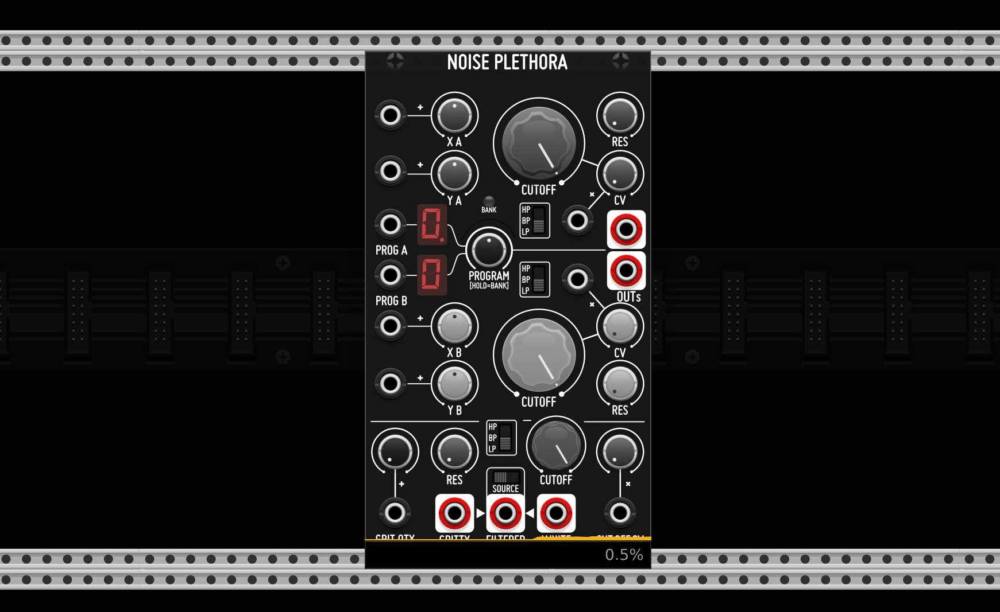
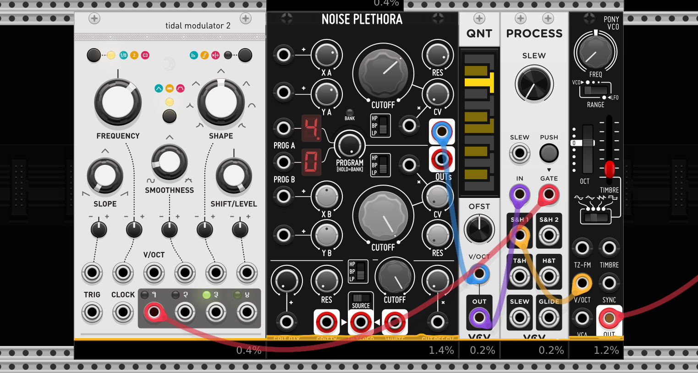

# Noise Plethora by Befaco
Module has three different digital noise generators. 
Each with it's own analog multimode filter.

The noise generators at the top and in the middle are the same. They both have a filter with *CV* control and a *resonance* knob.
We can choose from three different banks with each 10 noise algorithms. 
- Bank A: Textures
- Bank B: High Hat Clusters
- Bank C: Harsh & Wild
Hovering over the algorithm number shows the name of the algorithm.
To switch banks hold down the programm btn and then you can switch between a,b,c.
The small dot behind the letters shows for which generator we are changing the bank. With a click we can alternate the selection.
You also can right click the module and then change the programm in the popup menu.

The third noise generator has three seperate outputs.
*gritty* - clocked grain generator - We can increase the grain intensity with the left knob.
*white*  - plain white noise
*filtered* - has a filter and we can set the source with the switch above it to gritty or white

Play with the `XA`,`YA`,`XB`,`YB` knobs and the different algorithms.
So we can use the `Noise Plethora` as a sound source. 

## Random 
Another option is to use it as a random node generator by plugging the output into a quantisizer. You set the filter to low pass and then the higher the *cutoff* the more nodes and randomness you introduce.

Information from
[Noise Plethora Tutorial](https://www.youtube.com/watch?v=MxuxSqTF0SY) from Optoproductions.