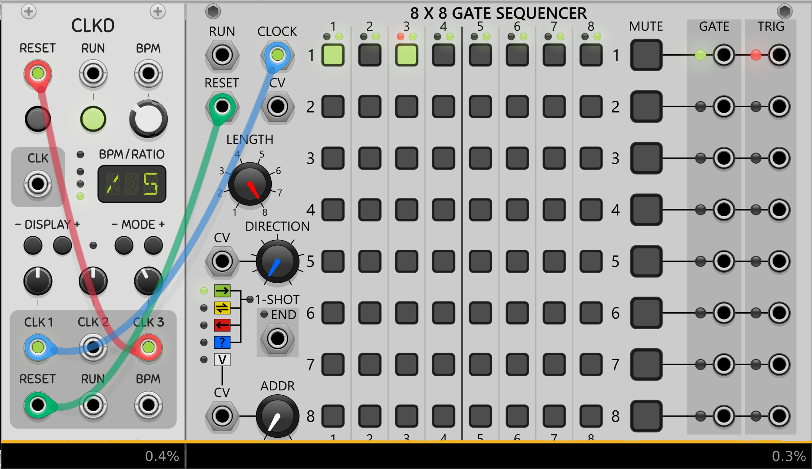

# Recurring Beat Pattern
To create a recurring beat pattern we can syncronise the sequencer with the reset signal from our clock module. 
For that we need to trigger the reset input of the clock module by a another slower clk signal. You can use for example a fraction of your current clock to set the reset input of the same clock module. 
Then you can set the reset output into the reset input of your sequencer.