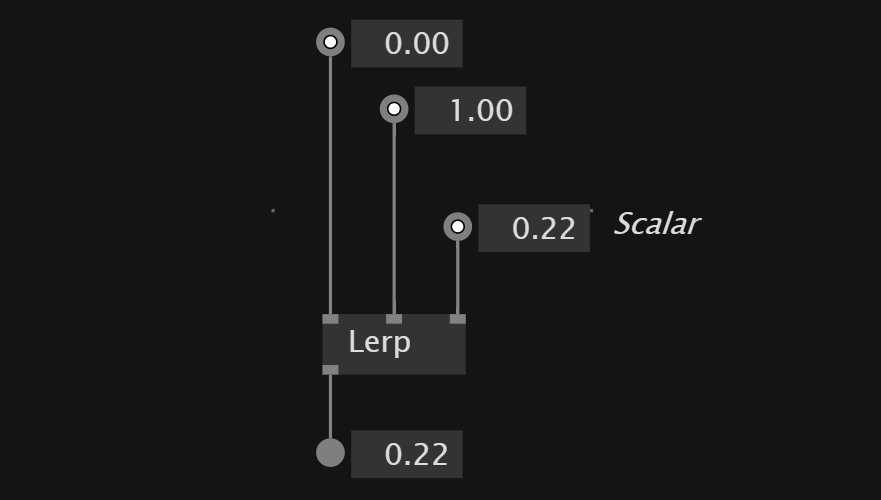
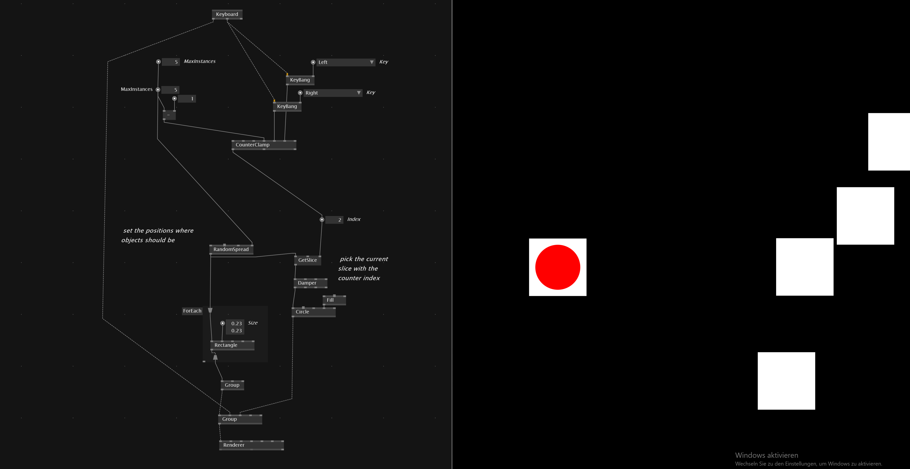
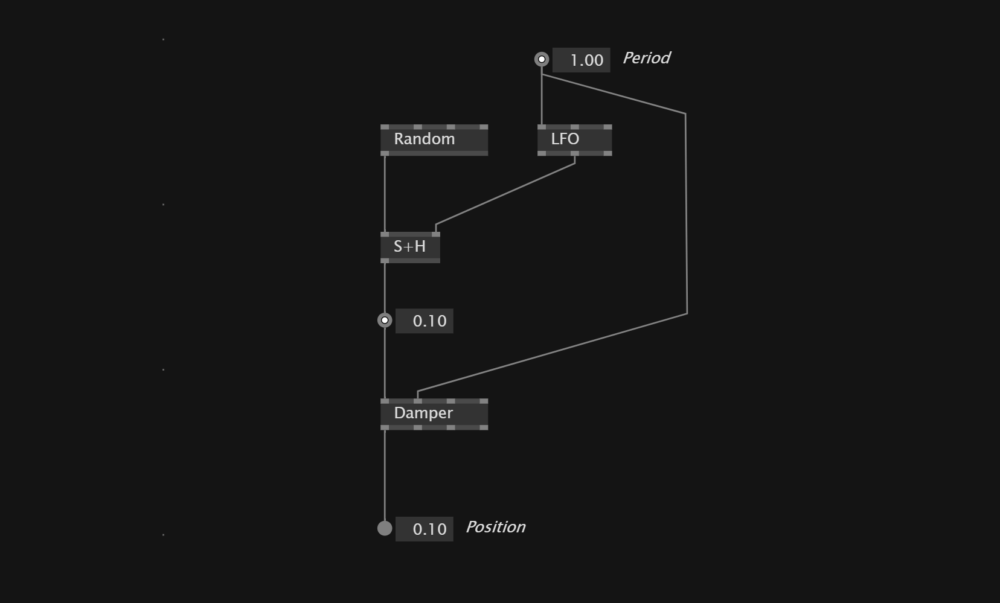

# Animation

## Waveshapes
VVVV contains different *Waveshape nodes* which convert an 0 - 1 signal into a certain wave form. 
- `SineWave` 
- `CosineWave`
- `TriangleWave`
- `SawToothWave`
- `RectangleWave`

To create moving values these nodes expect a *Phase* input like `LFO`.

## Transition from one value to another
To control the transition from one value to another with a `Lerp` node and set the *Scalar* parameter.

## On input move object to new position

## Smoothed Random Position
If you want to move an object to random positions on every time interval we can set the interval with an `LFO` and connect it to a `S + H` node which holds a random value. Adding a damper creates a smooth transition between these random values.

## Simplex Noise
A simplex noise is a type of gradient noise algorithm designed to be more efficient and less prone to visual artifacts compared to Perlin noise.

In comparison to `Random` the values of `SimplexNoise` are related to the values next to them.

## Voronoi and Delaunay
To use voronoi value patterns we can import the `VL.2D.Voronoi` package with `nuget install VL.2D.Voronoi -pre`

## Wanderer
The `Wanderer` nodes create a smooth transition movement. It has many settings to create different kind of movements effects.

*Size* and *Width* define the constrains in which the wanderer values can move.

*Range mode* allows us to define how the values that are out of range get clamped. 
- *None* - No limitation of the values
- *Clamp* - If values reach the *width* value gets clamped at *width*
- *Mirror* - Values gets mirrored so the object moves in the opposite direction
- *Wrap* - Values get inversed - object jumps back to opposite side / beginning of the width value.

*Main Direction* sets the angle(range 0-1 and starting from 3 o'clock) of the movement. *Main Direction* will only be considered if *Main Direction Tendency* is bigger than zero.

*Direction Deviation* defines the *angle deviation* per step.
0 -> straight walk
1 -> nervous jittery walk