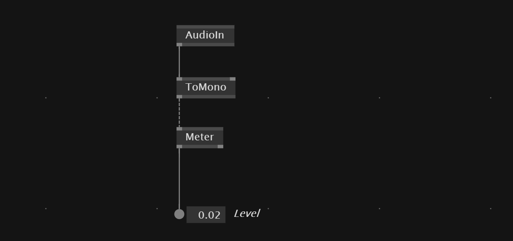

# Audio

## Set audio settings
You can set the audio settings with `alt+c`

## Audio input signal to value

With `AudioIn` we get the microphone as an input. When convert it `ToMono` and use `Meter` node to convert it into a single *level* value.

## Play Audio file
With `AudioPlayer` we can input an audio file.

