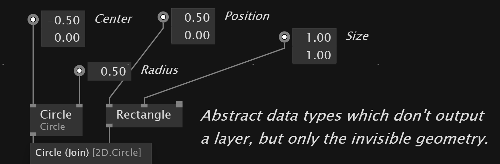
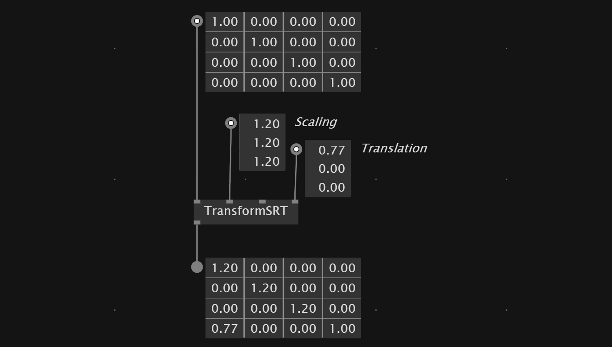
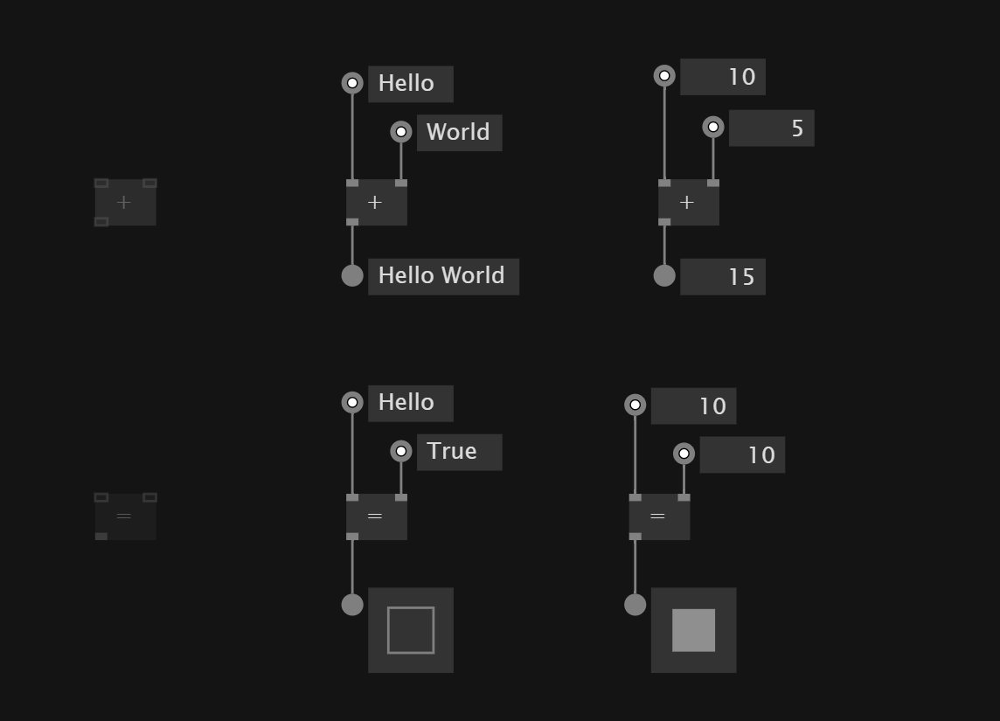
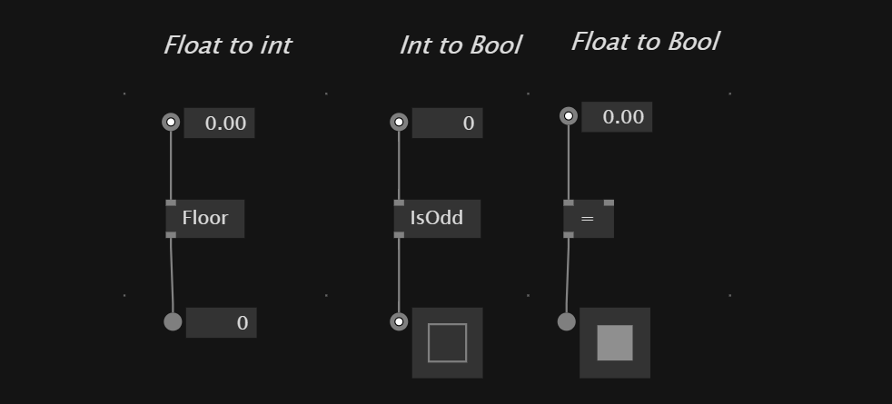

# Basics

# Navigation
Move view in sketch - `middle mouse`
Move node -`left mouse`
Zoom in/out - `mousewheel` or `ctrl +/-`

## Windows
Datatypes/IOBoxes - `dbl right click`
Nodebrowser - `dble left click`
Pop-up menu - `right click`

## Nodes
Insert node - `dbl click wire`
Delete a wire - `middle click` or `left click` wire and `delete`
To align multiple nodes - mark multiple lines + `ctrl + L`
Expose IOBox from input/output - `click in-/output + middle click`
Show value of a wire as pad - `dbl right click` on wire
Reset node - `alt + right click` node

### Create Own Node
To create own node we write the name of the node in the *nodebrowser* and then `node`.

To go inside the node `middle click`

#### Assign input
To assign a type for the input/output of the node we ether can `right click` and *configure* a type or we plug the desired data type into the *input/output*

## Values
Changing values - `right mouse drag`
More precise changes - `shift + right mouse drag`
Type in Values - `right click`
Reset values pin - `alt + right + click` pin

Write a comment - open node browser, start with space and then just write in search field

# Data types
In the *nodebrowser*  under `IOBox` you can find all the basic data types you can use in vvvv.
Another way to reach the window is `double right click`

You can drag the nodes with the left mouse button and you can change and set the *values* with the `right mouse click` and/or `drag`

## Booleans
Booleans are `true`(1) and `false`(0) values.
There are three IOBoxes
- `Bang` - Triggers only one frame - like a one on impulse
- `Toggle` - Toggles the boolean value like a light switch
- `Press` - Outputs true as long as it is hold down

### Invert Boolean value
With `NOT` node we can invert the value of a *Boolean*

## Integer
For a single `Integer` value you can use the `Integer32` IOBox.

## Vector 2/3
Datatype that consists of two/three `float` values like x,y,z

## RGBA
Color datatype that consits *Hue,Saturation,Value,Alpha*
Changing value - `right click drag up/down`
Changing hue - `right click drag left/right`
Changing saturation - `ctrl right click drag up/down` 
Changing alpha - `shift drag up/down`

We also can set color by typing in color name or hex code 
 `ffff00` 

## String
`String` datatype to hold text

## Path
`Path` points to a data folder on your computer.

Look also [here](https://thegraybook.vvvv.org/reference/language/ioboxes)

## Circle & Rectangle
VVVV has `Circle` and `Rectangle` as a special data type build in natively. We can use them to create abstract shapes which allow us for example to detect if shapes intersect with each other. 

## Matrix
For the transformation of objects in 3D and 2D vvvv has the data type `Matrix`

# Nodes and Pins
To see how you can connect nodes in vvvv you can hover the mouse over the in-/outputs of the node. They show you the datatype necessary.

If a value has been changed and is different from the default value it's pin extends to a square.

With the `middle mouse click` we can expose IOBoxes of the parameters of the nodes.

VVVV has notes that can be used for multiple data types. They are called *Adaptive Nodes*.
These nodes expect the data type `T`.
*Adaptive nodes* need to be connected to `IOBoxes` get get activated.

Some nodes that are `pin groups` so there inputs can be extended with `ctrl +/-`

### Reset values of IOBox
To reset the value of an `IOBox` we can hold down `alt + right click`

## Switch between values
With the `switch` node we can use a control `integer` value to switch between different values.

# Math
For math operations VVVV has multiple node for the classic math operations.

## Rounding
With `Floor`,`Ceil` and `Round` node's we can route values to our liking.

## Comparison
VVVV has nodes for the comparison of values
`=` `!=` `<` `>` `<=` `>=` 

We also can use `IsOdd` and `IsEven` nodes
to check if value is odd or even.

## Random
The random node allows to output a random value from inside a range.

# Conversion Nodes
In vvvv the conversion of types happens automatically when no information get's lost through the conversion.

The other way around - from data types with more information to data type with less information can't be connected that easily

## Convert vectors 
For creating and manipulating vectors there are two important nodes which are `Vector(Split)` and `Vector(Join)`

`Vector(Join)` - bring values together into a vector
`Vector(Split)` - split vector into single values

To convert a *vector2*  into *vector3* we first can split up the `vector2` in its elements and then plug them into `vector3` inputs.

`XYz`,`XyZ`,`xYZ` allow to combine a *vector2* and *float*  into a `Vector3`

## Convert colors
We can use a `FromHSV` node to convert from float to color values or `RGBA` if you want to set the single color channels.

The `ToHSV` allows the inverse conversion.

To convert from *string* to *color* we can use a `fromHex` node and use a *color hex code string* as input. Same inversion of conversion is possible with `toHex`

## Convert string
To convert a data type into a string we need the `toString` node. It deletes leading and following 0s. If you want to keep use `toString(Format)` node.

To go from string to number we can use the `TryParse` node and set the output format.

To convert from a *Path* to a *string* we also can use the `toString` node.

# Manipulate Strings

With the `+` we can *concatenate* multiple strings together into one string

To *replace* a string inside another string we can use the `Replace(String)` node

The `Insert(String)` node lets us *insert* string information at a specific index.

To *remove* a specific amount of characters at a position we can use the `Remove(String)`

`ToLower` and `ToUpper` allow us to set the text in upper or lowercase

To check if a string contains another string we can use the `Contains(String)`

With `IndexOf(String)` we can evaluate the position of a string inside another string.

To get the *Length* or the amount of characters inside a string `Length(String)`

# Manipulate Colors
To create a color from floats we can use `FromHSV`,`FromHSL` or `RGBA(Join)` nodes.

To split colors up we can use `ToHSV`,`ToHSL` or `RGBA(Split)`

To just change the *alpha* of a color values we can use `SetAlpha` node.

With the `Random` node we also can set a random color.

# Errors
VVVV shows errors with a read outline.

If you find an error check also if the file contains custom *definitions* that need to get copied to the document.
# C#
VVVV ulitzies C# libraries under the hood. This allows also the implementation of other c# libraries into vvvv.

# Process Nodes
To avoid duplicate code we can use and create *Process Nodes*, which are sub patches in vvvv.
The idea is to bundle nodes together to avoid redundant nodes.

We can create *Process Nodes* by typing a Name in the Node browser and click on `Process`.
This creates a *definition of a process* and allows us to pick the *Process Node* in the node browser.

To pass information in and out of the node we can add `Inputs` and `Outputs` by starting a link from a node inside the *Process* and `click while holding CTRL`

## Applications vs. Definitions
VVVV patches have a *front* and a *backside* of the patch. 
The *application* is the patch itself and the *backside* contains 
- custom data types
- processes
- operations

We can go to the definitions page by click on *Definitions* in the document menu.
This is where we should keep our *Process nodes*
