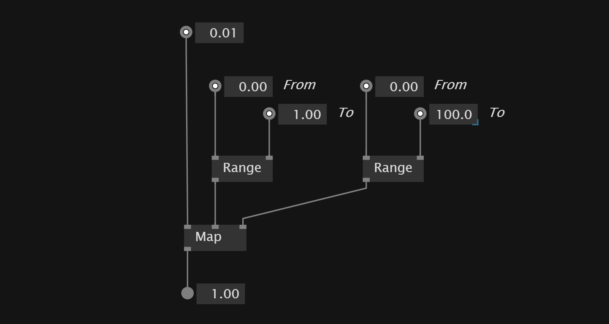
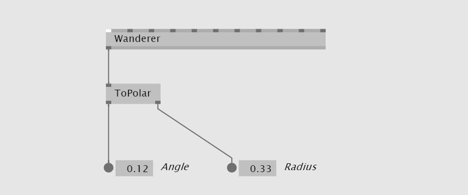

# Channel Data
Here is a collection of information about channel data

## Create value always ascending value
`Stopwatch` creates a global runtime value of the passed time.

We also can use `Playhead` which also allows to loop to value at a certain range.

The `Integrator` node let's us create something similar but we can decide how much we want to add every frame.

## Create ascending values from 1 to one
`LFO` node lets us create ascending values from zero to one. *Period* defines how much time it takes to go from zero to one.

## Create Sin Wave values
To create a value that moves along a sine wave we use the `SinWave` node and plug a `LFO` node into it.

## Create SawTooth values
 `SawToothWave` node

## Mirror negative values to positive
The `abs` node allows us to map negative values to the *absolute* of the value.

## Calculate Distance between Points
If you want to calculate the *distance* of for example two Vector2 values you can use a `Distance` node.

## Smooth interpolation between random values

## Filter Data

### Smother Values with Filter
The `Filter` node allows us to create smoother values.

### OneEuroFilter
A good filter is `OneEuroFilter`

### Filter Values
We can use a `Pow` To filter the values.

## Count
VVVV has multiple counter to count a value up and down. They are different in the way how they behave if the *Minimum* and *Maximum* values got reached.

`Counter` - Counts endless up and down

`CounterWrap` - Jumps back to *Minimum* value when *Maximimum* reched and other way around.
`CounterMirror` - When Edges reached the count direction get's inversed - Endless counting between edges.
`CounterClamp` - Stops counting at edge values. 
`CounterFlop` - Returns true if specified number of bangs is detected in time interval.

`Counter` often can create something similar to a `Pad` where on every event the value gets added or subtracted. Here the counter holds the position of the rectangle similar to a `Pad`

## Limit ascending value with modulo 
We can use a `MOD` to create *modulo* behavior and limiting an increasing value into a range.

## Delaying data stream by frame
The `FrameDelay` allows to give the input a delay of one frame.

## Map Data

### Convert one range into another

The `Map(Range)` nodes allows us to convert from one range into another.

`Map(Change)` doesn't limit or adapt values when the input reaches a certain minimum or maximum. 
For that we can use `MapClamp`,`MapMirror` and `MapWrap` nodes.
### Define range by center and width
The `Range(Join Center Width)` allows us to *create a range* by a *center* and *width* values.

## Evaluate value difference between frames
The `FrameDifference` node allows us to see how much the data has changed between this and the last frame.

## Range
VL has nodes to keep values in a specific range.

`Mirror` - If values are bigger or smaller than the minimum and maximum, the value continues in the inverse direction.

`Wrap` - If values are bigger or smaller than the minimum and maximum, the value continues at the opposite edge.

`Clamp` - If values are bigger or smaller than the minimum and maximum, the node holds their value.

We can use these nodes to define how the values should behave when an input device is outside of *minimum* and *maximum* of a range.

## Smooth transition between two inputs
The `Lerp` node allows us to create a smooth transition between the two inputs of the node. The *skalar* input defines the position of the transition between the two inputs.

## Working with Angles

### 2D Vector from angle and radius
To move an element on a circumference we can transform *radius* and *angle* values into a two dimensional vector to position the object. For that we can use the `FromPolar` node.

### 2D Vector to angle and radius
The other way around we can convert a 2D vector into an *angle* and *radius* value with the `ToPolar` node. The angle lies between the 2D vector and the x-axis.

Similar to `ToPolar`, there is also the `Angle` node, which also takes a *Vector2* as input but returns just the angle without the radius.

To calculate the angle between two points that not lie on the x-axis we can use `AngleBetween`.

### Calculate angle between two vector
`Slope` node allows us to calculate which angle lies between two points in 2D or 3D space.

`Slope(3D)` returns also the *length* of the vector between the two points in 3D space.