---
- VVVV
comments: true
---

# Collections
Watch this
https://www.youtube.com/watch?v=sg4469iiao8

## Spreads
Look [here](https://thegraybook.vvvv.org/introduction/lo_9_2_Spreads) for deeper information 
### Make own spread manually
To create a spread from only one value we can use the `FromValue(Spread)` node.
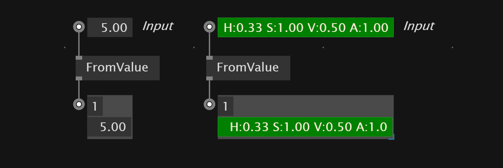

With the `Repeat(Spread)` node we can create a spread with multiple times the same value.

With `Cons` node we can collect multiple values in a spread. With *CTRL +/-* we can add and delete inputs.

We also can create a spread via the IOBox menu. You first select `Spread` and then the data type of the elements of the spread.

### Make iteration spread
With `I` as *Integer* we can create a spread of integers in a given range.
*Start* defines first value and *Count* how many elements in the spread you want to have.

You need to activate the *advanced* nodes to see the `I` node.
### Queue Slices into a Spread
`Queue` allows us to add slices into spread when a *trigger input* is true.

*Frame Count* imput defines how many values the `Queue` can contain.
If *Frame Count* input is *-1* the `Queue` can contain endless values. 

### Automatic Spread generators
VL contains nodes that automatically generate spreads with values that are in a specific relation to each other.
#### One dimensional spreads

`LinearSpread` creates linear values within a range specified by the *width* and *center* input.

`RandomSpread` generates random values within a range, specified by *width* and *center*.

#### Two dimensional spreads

`RectangleSpread` - Generate rectangle position values.

`CircleSpread` - Generate circle position values.
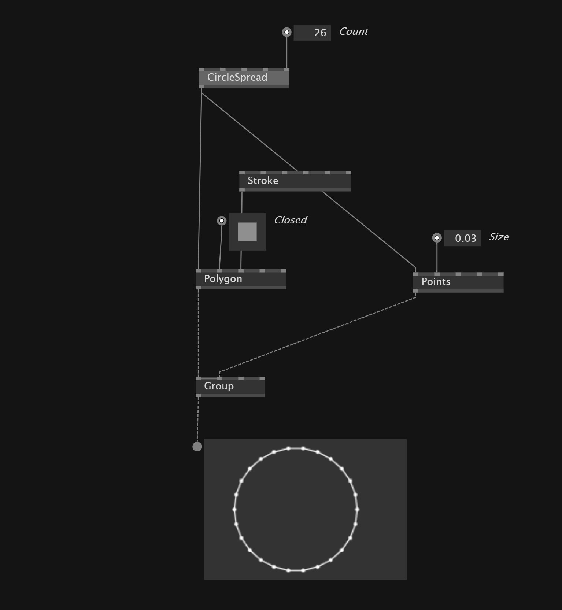
`GridSpread` - Generate 2D grid position values.

`SpiralSpread` - Generate spiral position values.
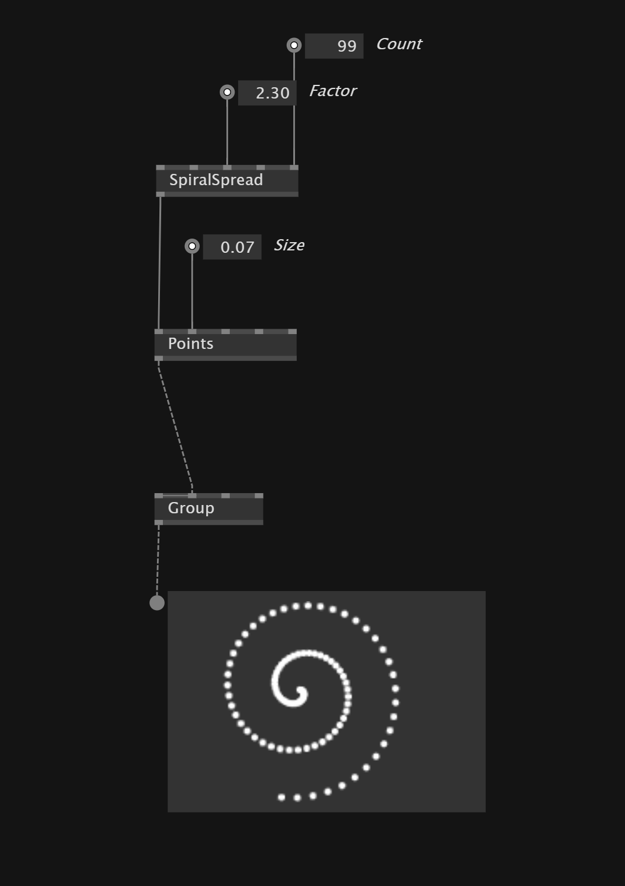

`RandomSpread(2D)` - Generate random position values.

##### Random morph between spread values
With a `Randomizer` node after a switch and then *dampining* the values in the `ForEach` we can create a *morphing* behaviour between the spread values.

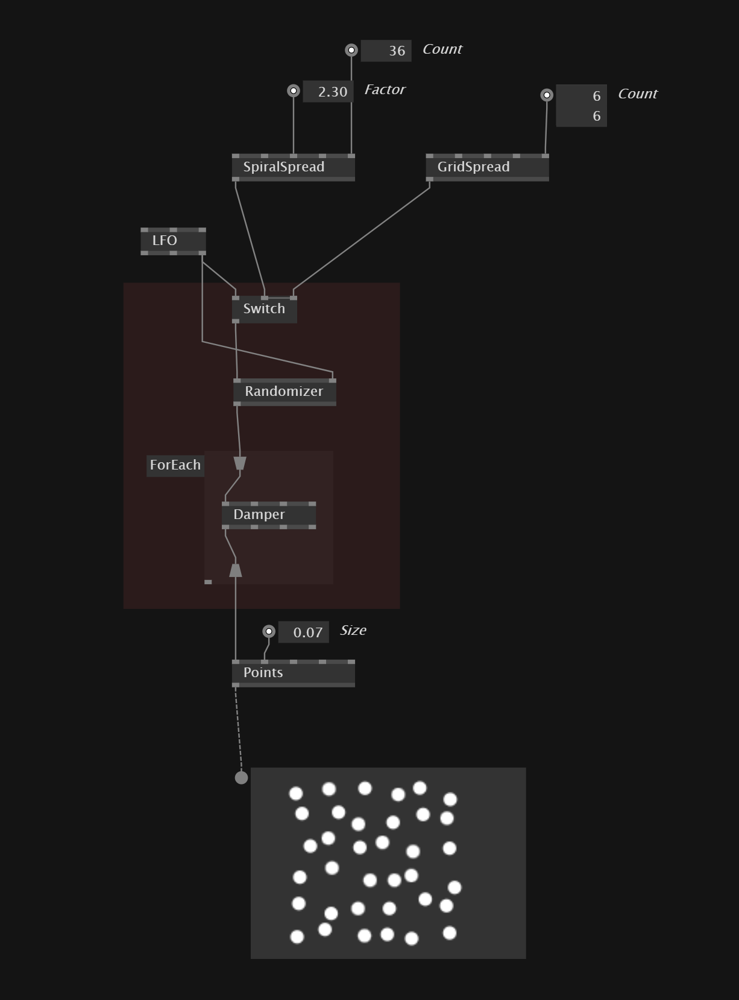

#### Three dimensional spreads

`RandomSpread(3D)` - Generate random position values in 3D space

`GridSpread(3D)` - Generate 3D grid position values.

To use 2D spreads in 3D space we need to add `ForEach` slice in the spread another dimension in the vector. So from *2D* we need to go into a *3D* vector. We can use a 3D `Vector(Join)` node and plug the values from the *2D* in there.

### Pick element of spread
To pick an element out of a spread we can use `GetSlice` and then set the *index* of the data point we want.

### Get spread out of spread
To grab multiple consecutive elements from a spread we can use `GetSpread`.

### Get multiple slices of spread
To extract multiple elements from a *Spread* we can use `Decons` node and expand the amount of values with *+/-*.

### Get first/last slice of spread
With `SplitFirst` and `SplitLast` we can get the first or last slice in the spread.

### Change values in Spread
To add a value at the end of the spread we can use `Add(Spread)` node.

To *add* a value at a specific position we use `InsertSlice(Spread)`.

To *change* a value at a specific position use the `SetSlice(Spread)`.

We can *remove* a slice at a specific position with `RemoveSliceAt(Spread)`.

With `Clear(Spread)` we can remove all slices.

### Split Spread into two spreads
With the `SplitAt(Spread)`node we can create two spreads out of one. *Index* defines where they get split. 

### Analyze spreads

To *count* the amount of slices in a spread we can use the `Count(Spread)` node.

To *check if spread contains specific value* we can use `Contains(Spread)` node. This returns a boolean value.

For the *average* value of a spread we can use `Average` node.

### Change order of spreads

To change the order of a spread into a *random order* we can use the `Randomizer` node.

To *reverse the order* of the spread we use the `Reverse(Spread)`

### Convert any sequence into spread
Because any collection in VL is a sequence we can convert any collection into a spread with `FromSequence(Spread)`

### Combining Spreads with Pads
Storing our spreads in to `Pads` allow us to manipulate it's data over the runtime of our program.

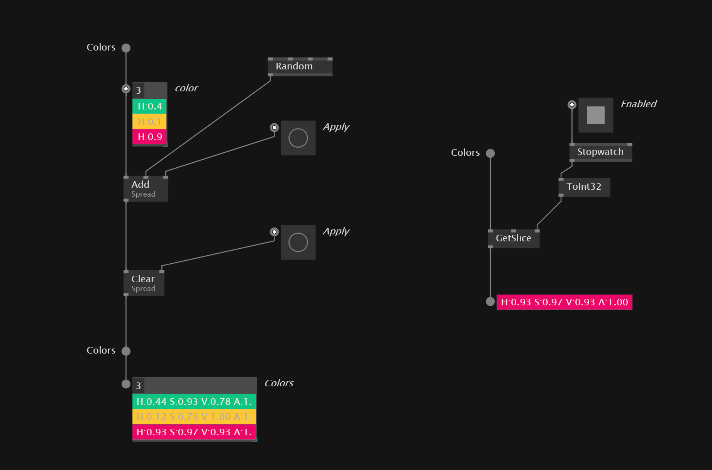

### Deconstruct Spread into it's values
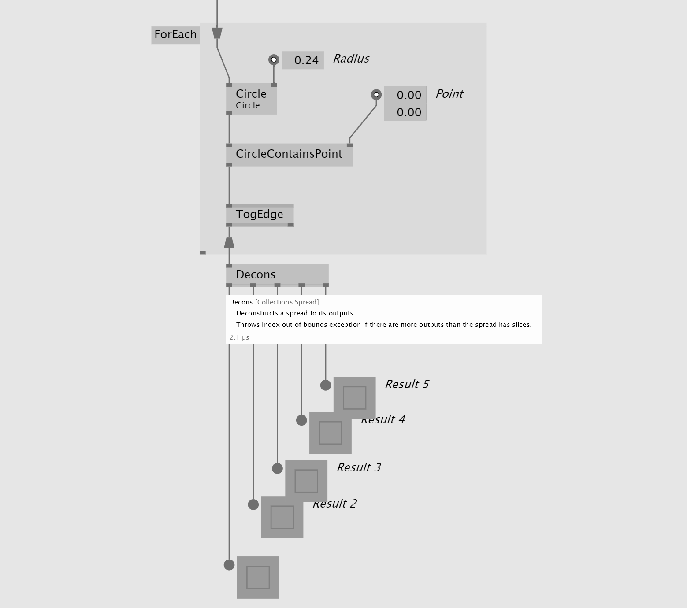

### Resample Spread Values
We can resample a spread and make the transition between the values of the initial collection smoother. We can apply this if we for example want to create smoother path between points.[How to draw path from spread](Skia.md#draw-a-path-from-spread)

With `ResampleBSpline` we can define how many Resample steps we want.

## Dictionaries

In Dictionaries the *values are saved by a key*.
The *key* is most of a time a *string* and can only exist one time in the dictionary.

Similar to spreads we ether can define the *adaptively* by setting the data type in the `Add(Dictionary)` node or we strictly define the data type in the `Pad` that stores the `Dictionary` data.

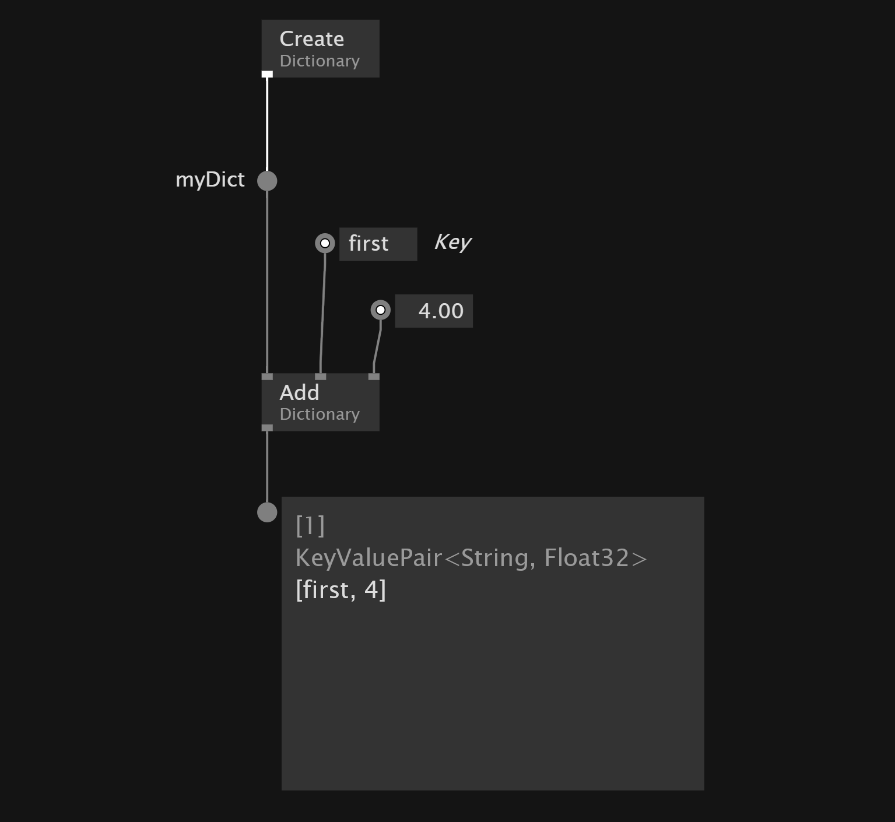

With `Clear(Dictionary)` we can delete all entries from the Dictionary.

To manipulate an already existing key-value pair we can use `SetItem(Dictionary)` node.

With `Remove(Dictionary)` we can delete a specific element by the *key*.

We also have `Keys(Dictionary)` and `Values(Dictionary)` nodes to only get the *keys* or *values* from a dictionary.

To check if a `Dictionary` contains *keys* or *values* we can use
`ContainsKey`, `ContainsValue` or `Contains(Dictionary)`.

To get a value by it's get we can use the `TryGetValue(Dictionary)` node.

With `Count(Dictionary)` we can calculate the amount of entries in the `Dictionary`

## Sequence

## Iterations
[VL Explanation here](https://thegraybook.vvvv.org/reference/language/loops)
### For each
To iterate through all items in the spread, we need to use the *splicer* input into a `ForEach` region. It's icon looks like a filter. 
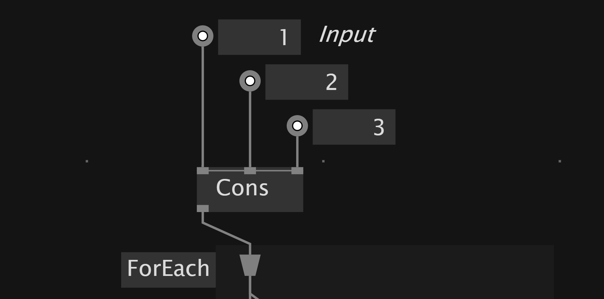

In the `ForEach` region we then can apply operations to each element individually.

If you pass in two spreads with different length in to the `ForEach` region it will only execute the amount of entries of the smaller spread.

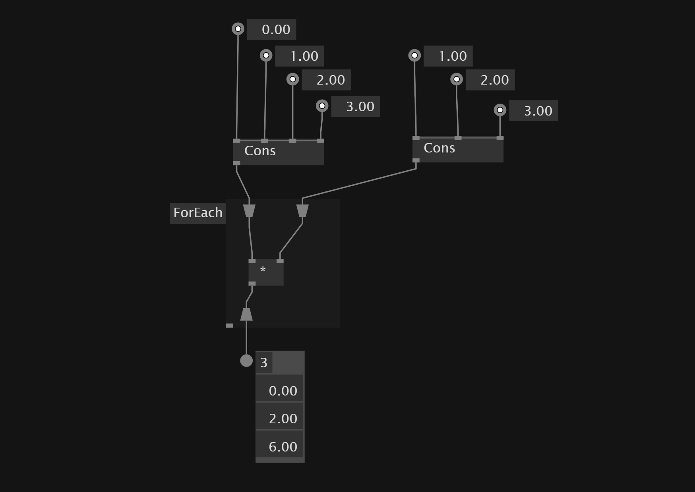

For also can create nested loops with multiple `ForEach` loops inside of each other.

To convert these *nested spreads* into a normal *spread* we have to use `Flatten` node.

### Repeat
The `Repeat` region repeats everything that is inside of the region for a specified amount of times.

#### Using Repeat with Process Node
We can use a `Repeat` with our own Process Node inside. If we want to create random start data for the content nn that Process Node we can take advantage of `Create` and `Update` operations to setup each Instance with different data.

### Looping

`ForEach` and `Repeat` regions give us `Index` pin which allows us to use the *Index* of the current iteration to change values.

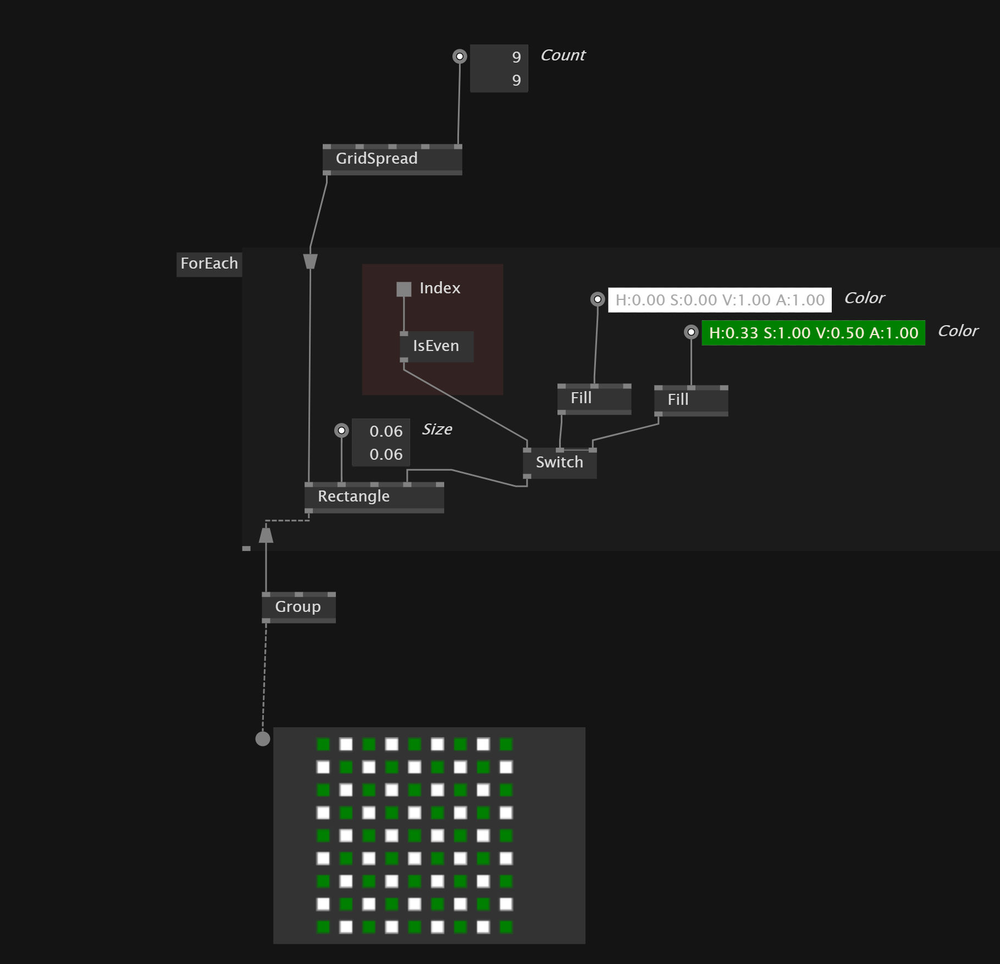

The `Keep` pin allows to only keep the elements that match a conditions with true value. So we can decide which elements should be included and which not. 

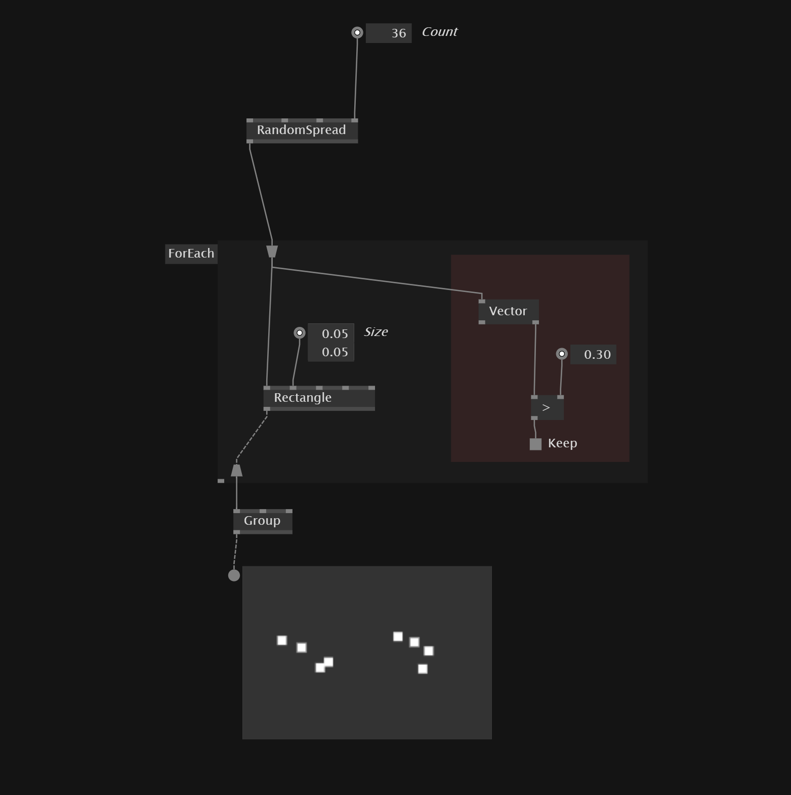

#### Accumulator
The *accumulator* allows you to to pass on the result from the first iteration to the next iteration and so on.
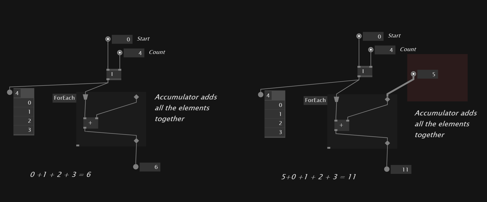
The link from the diamond shape is the value from the previous iteration and the link from splicer is the value in the current iteration.

We also can use an *initial* value for the first iteration. For that we need to plug a value from the outside into the accumulator icon.

#### Define what elements are kept in For-Each
We can use the `Keep` node *inside* the *for-each* to define which information we want to output from a spread.
