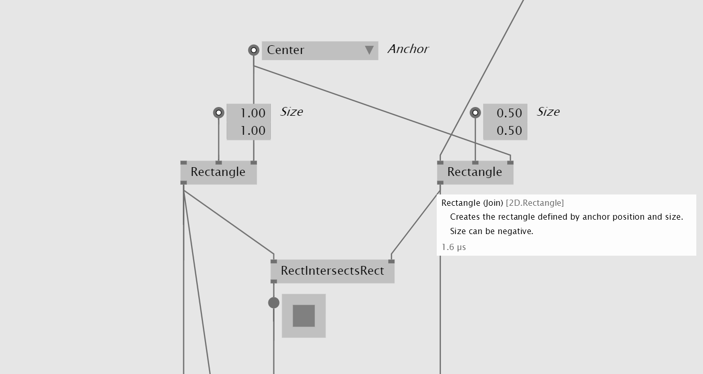
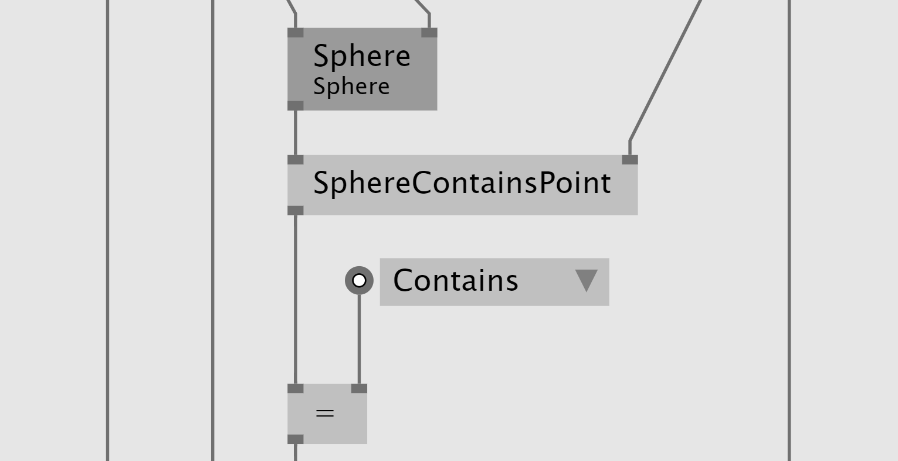

# Collisions

VVVV has multiple nodes that can detect if shapes intersect or contain each other. We use for that abstract 2D/3D data types. 

## RectContainsPoint
To check if a 2D vector is *inside* a rectangle or *intersects* with it we can use the `RectContainsPoint` node.
It expects a rectangle as an input and the point. 
For the *rectangle* we can use `Rectangle(Join)` from the 2D class which creates a *rectangle* defined by anchor points and size.
If we wan't to draw the rectangle we use a different one. We use `Rectangle(Bounds)`.

## Circle Contains Point
To check if a 2d vector *intersects* with a *Circle* we can use `CircleContainsPoints`.
Similar to *rectangle* we us `Circle(Join)`from the 2D class. To draw the circle in the renderer we use `Circle(Circle)`.

## Rect intersects with rect
We also can check the intersection of two rectangles with `RectIntersectsRect`.

## Circle intersects with circle
Similar to rect vvvv has also a node for `CircleIntersectsCircle`

## Sphere contains point/box
For 3D and *Stride* VVVV has the `SphereContainsPoint` node which we can use with 3D `Sphere(Join)`. This node returns the type of containment that the two nodes have. It also provides the relates `BoxContainsPoints`.

## Sphere contains sphere
Similar to `SphereContainsPoint` VVVV has `SphereContainsSphere`.
