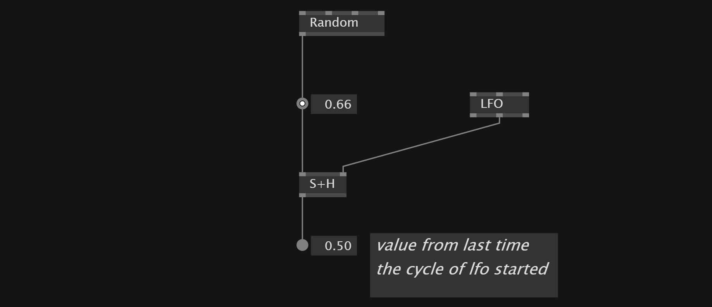

# Controlling Patches

# LFO
A LFO generates a continuos value which is rising from 0 to 1. 
It also outputs a *Bang* signal every time a new cycle starts and the amount of cycles it ran since it got reseted last time.

# Toggle
We can use a `LFO` and a `Toggle` node to toggle a value every time the LFO starts a new circle. The *Reset* input also allows to hold the value *false*

# Sample and Hold
`S+H` node keeps the input node as long as *Sample* input is true. It ignores the input values as long as the *Sample* input is false.

It is useful to hold the output of a `random` node at a specific moment.

# Switch
`Switch` node allows us to decide which of the inputs of the node we want to show. In the first pin we can set the *index* of the element that we want.

If the index is bigger than the amount of inputs, it starts again at the beginning. Add more inputs with *+/-*

# If