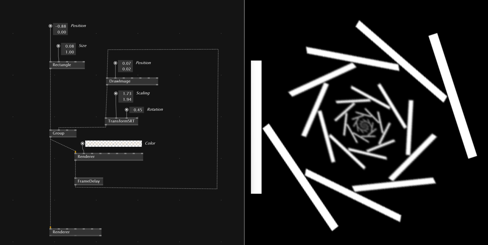

# Creating Feedback effect
The idea of a feedback in effect is VVVV is that you render the output but you also create a second `Renderer(Offscreen)` that you feedback with a `FrameDelay` into a group.