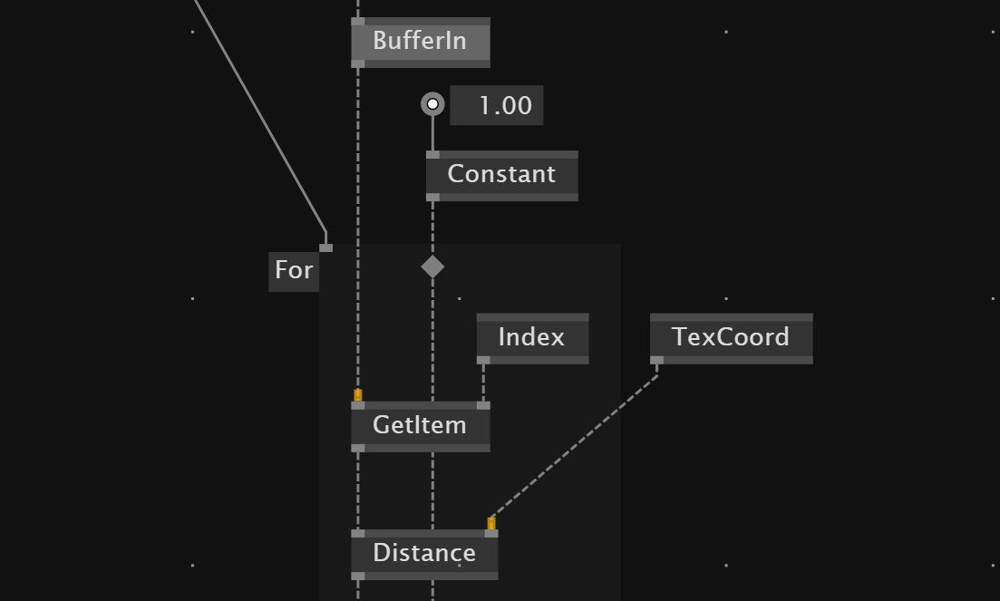
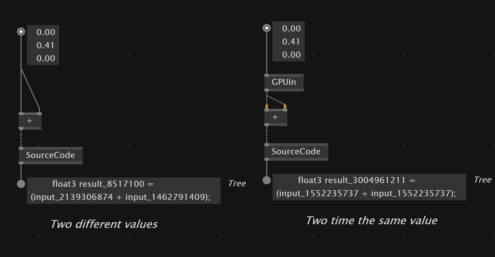
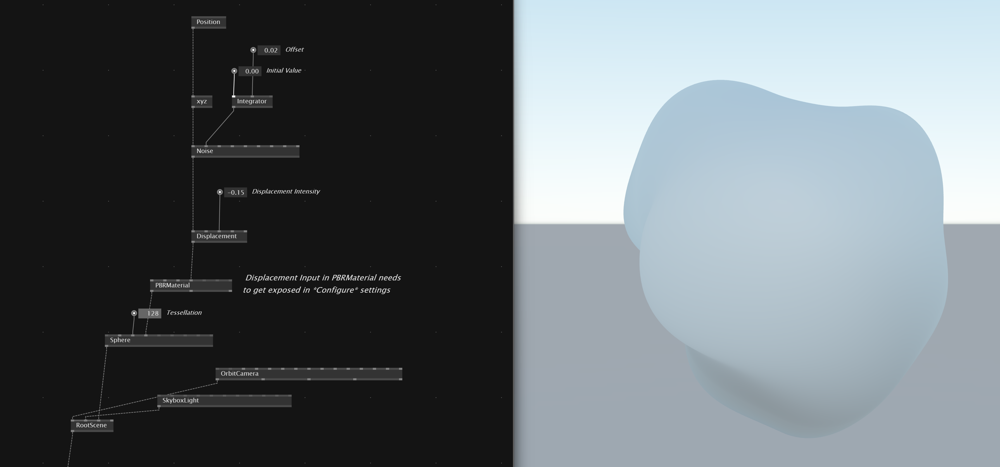
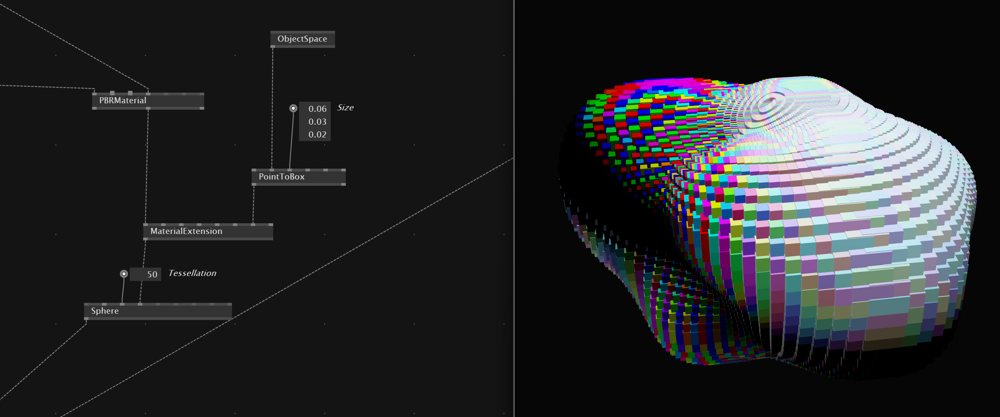
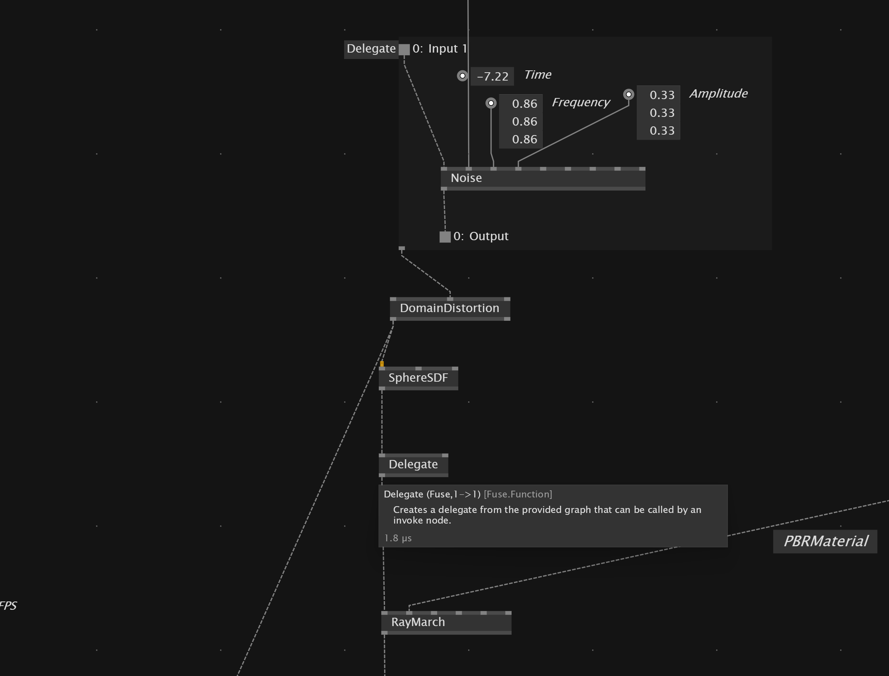

# Fuse

Most of the time we go from CPU world over into GPU world. So we have I/O Boxes in VVVV which lie in CPU world and when they get feet into a FUSE then it becomes a ShaderNode value.

To only get the fuse nodes it can be handy to navigate to the fuse folder in the node browser and then look for the operator.

## Buffer
A buffer is the fuse version of a spread.

## Position
The `Position` node allows us to get the local position of the currently processed vertex/pixel.
There are also `ObjectSpace`, which does the same as `Position` but is a *vector3* instead of *vector4*, and `WorldSpace` which stores the *world space positions* 

## Noise

`Noise(3D Scalar)` acts in the 3D space. For example if you want to apply some noise to a particle field in 3D you would use that.

## Delegates
*Delegate* regions are like functions in Fuse. They allow us to take an input like a SDF and use it in different ways. So it is using the same functionality that is inside the *Delegate* but how this function is used depends on where the delegate gets fed into. The output goes from the *region* not the output pin.

Type *f11* to get the `Delegate(Region)` with one input and output. *f21* for two inputs and one outputs

## if
Fuse has it's own if region that runs on GPU instead of CPU(like the if region in normal VL)

## for region
The *fuse* for region is a little bit different to the *foreach* of VL. We can use both but when we use the fuse version it actually shows up in our shader code. Also there are used a little bit different.
The `for` input defines how many times you want to run the loop.

With the `index` node we can get the current iteration index.

Here we are calculating for each value from the buffer the distance.

## See the generated source code
We can use the `SourceCode` node to see which shader code got generated.

## Convert into GPU value
With `GPUIn` we can convert a given input value into a GPU value.

## Convert Float to Vector4
With the `toVector4` we can convert one single float value to a vector4 with four times the same value.

## Convert Stride Position Data to readable data in fuse
To convert for example the position data from a model into data that we can process in our compute system we feed the position data from our mesh into `DynamicBuffer` connect that with a `BufferIn`

Helpfull patch to understand how it works is also *How to use external buffer data*

## Mix two colors
We can use the `Lerp` node from fuse to mix two colors depending on a black/white input. 
We also can use a `Fresnel` node to define how the colors get mixed.

## Convert RGB to HSL
If want to change the HSL values in our shader instead of RGB we can convert from RGB to HSL with `RGBtoHSL` set the changes and then convert back with `HSLtoRGB`

## Performance
Fuse doesn't know that you maybe put in the same value twice. It would create two variables for that. To just have one value in the source code we can use a `GPUIn`.

If you have values that you know never change during the lifetime of your sketch you can use a `Constant` node. 

## Displacing Stride Shape with PBRMaterial

## Extended Material Settings from Fuse
*Fuse* has a `MaterialExtension` node which allows us to extend the functionality of a `PBRMaterial`

### Convert Vertices to Box
The `PointToBox` node allows us to convert the vertices of our source sphere into boxes.

## Signed Distance Field
For general information about *signed distance fields* see [here](../Algorithms/SignedDistanceField.md).

In Fuse we have nodes for the basic sdfs like `RectangleSDF`, `HexagonSDF`,`BezierSDF`,`SphereSDF`,`TorusSDF` or `MandelbulbSDF`

By combining different SDF's with the `CombineSDF` we can create a lot of shapes.
There is also a `CombineSDF(Spectral)` that allows you to combine SDFs out of a for each loop.

You don't want to make thousands of sdfs because it would be to heavy on the performance

## Debug 3D SDFs
If you have a "dirty"/ distorted distance function you can try to fix it by multiplying with a value < 1. This reduces the size of jumps the raymarcher does. But it makes it also more heavy on the performance.

## Distort SDF
To distort a basic sdf shape we use a `DomainDistortion` and connect it with the *Domain* input of the SDF. The source for the distortion should be wrapped into a `Delegate(Region,Fuse 1->1)`.

## Compute Shader
Compute is using GPU and shaders but it is using aspects of the graphics api that is designed for general computation. We create a compute system and draw something with it. You also can create compute systems that are not really drawing something themselves but doing calculations.

Compute Shader can run on buffers but also on textures.

So the compute system is filling a big buffer for us with all the data of how forces got applied etc and then afterwards we can decide how to render and what materials etc.

Save yourself some blueprint patches so you don't have to repatch the whole system from scratch every time.

### Readback
Readback node allows us to take information back of the gpu on the cpu. Useful for debugging but not got for scale.

### Particle System

*Emmision Stage* how are you creating you particles. How and where particles is born. Attributes you want to set at birth. Like settings the lifetime of particles.

*Simulation Stage* what you want to do with the created particles.
*Integration(one step of the simulation)* is where we place everything that affects the particles like forces, collisions

*PostIntregation* more deterministic things that maybe aren't part of the integration stuff.
