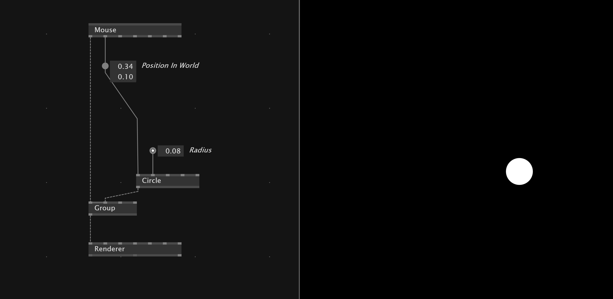
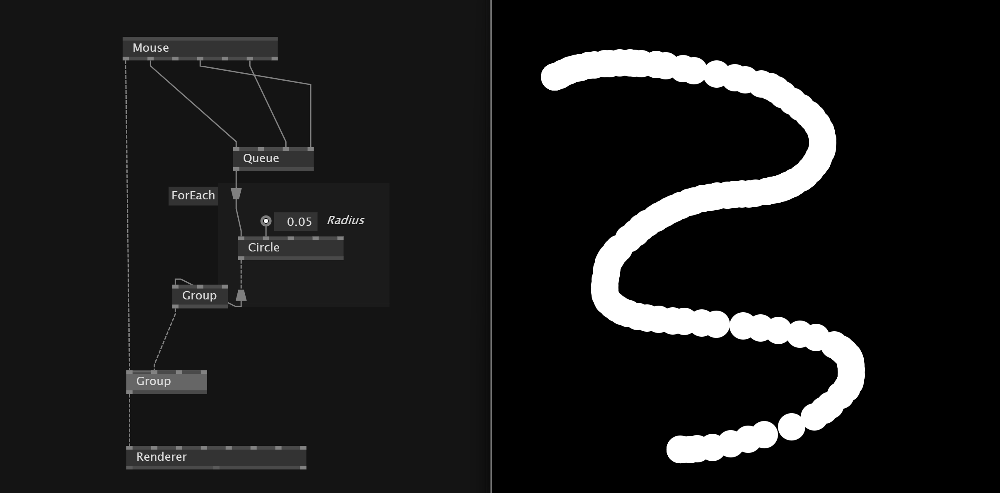
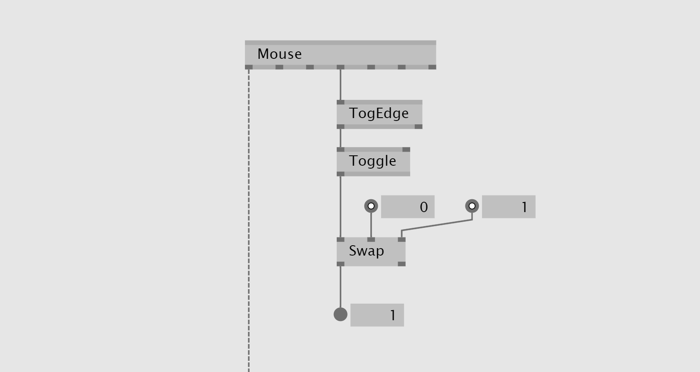
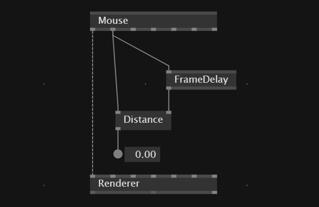
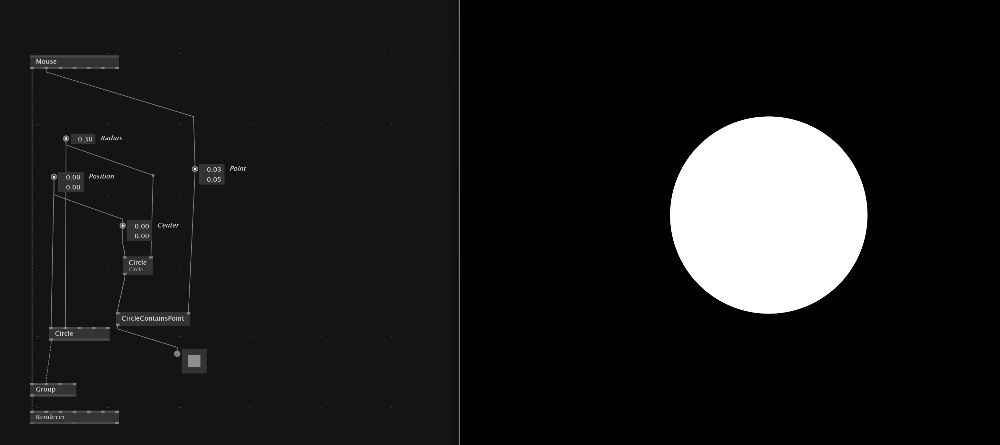
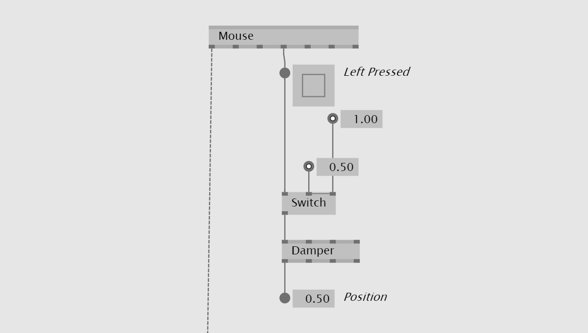
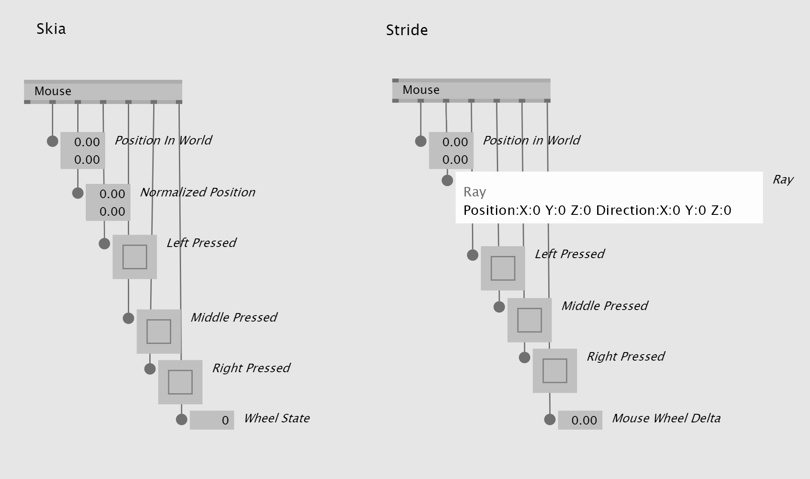
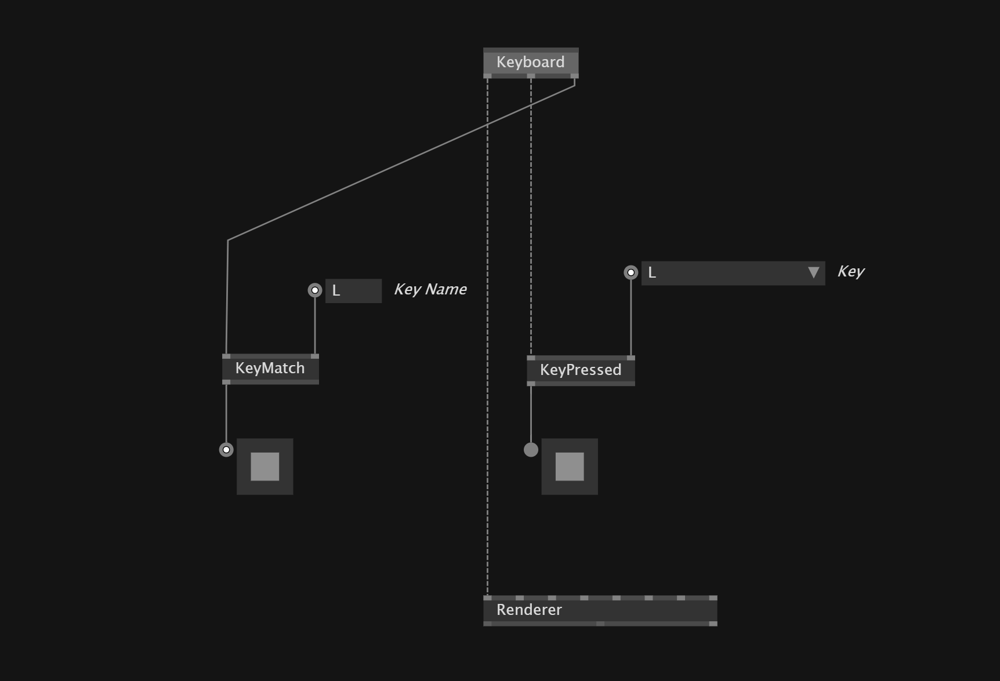
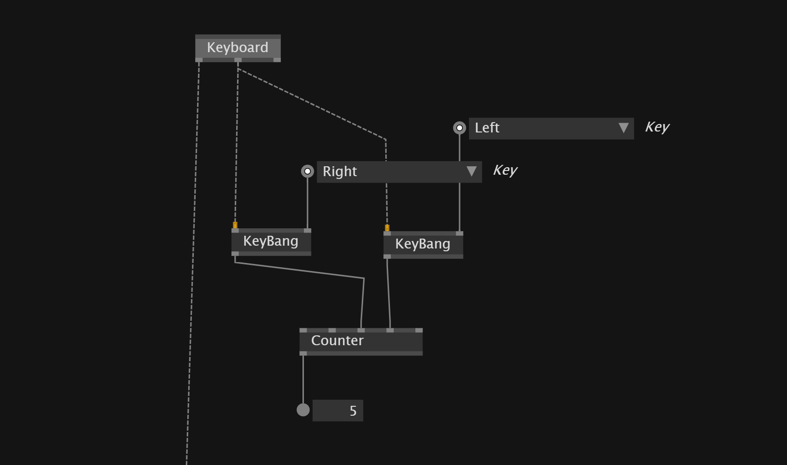
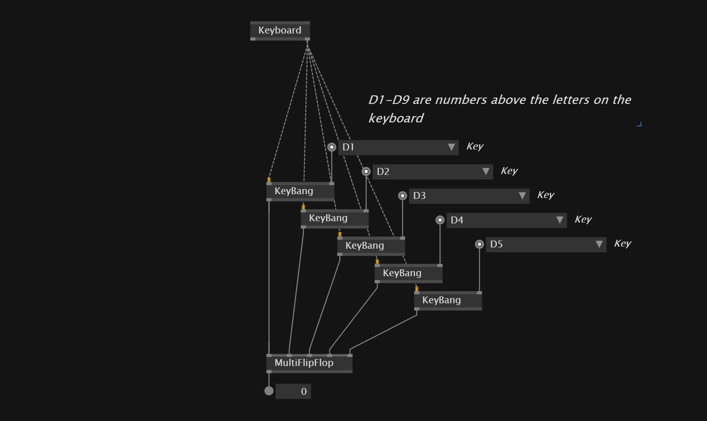

# Interactions

## Mouse
If you want to use the mouse in your patch the *context* output of the `Mouse` node need to be provided to the `Renderer` by adding it in a `Group`

The *Wheel Data* is the value of the *mouse wheel*.

### Store value in Spread when mouse is clicked

With a `Queue` and binding its *Insert* input with a mouse click we can store the values of the mouse every time the mouse is clicked similar to a drawing app.

### Toggle swap values on every mouse click

### Calculate delta mouse movement

### Detect if mouse is in circle in skia

==
### Detect if mouse is hit
spread of elements
If mouse hit the object do not keep it
togedge -> if -> for each -> hittest -> not keep
==

### Smooth transition of value when something is clicked

### Stride
The `Mouse` node in *Stride* is not 100% the same like in Skia

## Keyboard

To check if a certain key got pushed we need to connect a `Keyboard` with `KeyMatch` and set the *KeyName(String)* input for the key we want to track. We also need to connect the `Keyboard` Node to a `Renderer`. Don't forget to set `Skia` or `Stride` dependency.

Another way is to connect `KeyPressed` node with the `Keyboard` and select the *key* in the IOBox.

With a `KeyBang` we get a boolean `Bang` signal when a specific key gut pushed. This can be useful for *Counter*

`KeyToggle` toggles between *true and false* every time the assigned key gets pressed.

### Get Typed Text from keyboard

The `TypeWriter` node from *Skia* allows to get the typed text from the keyboard, when the renderer is focused.

### Index Value From Keys

`MultiFlop` node allows us to convert a certain key into an index value.