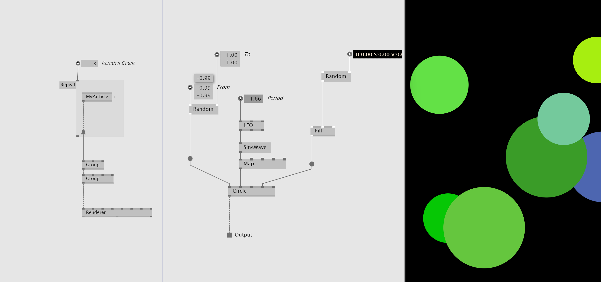
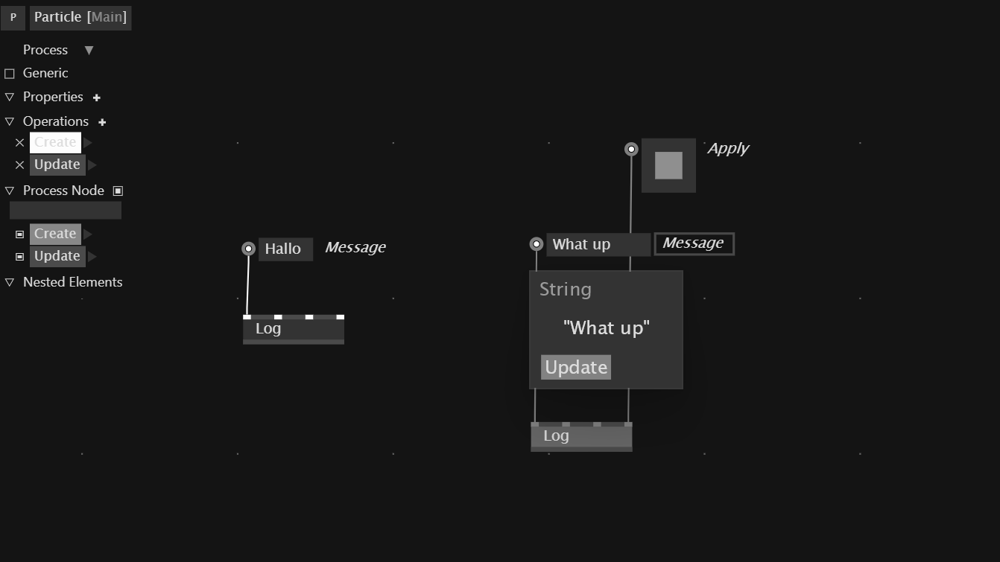

# Object oriented programming
A patch in VVVV has two parts:
- Application side (front)
- Definition side (back)

*Definitions* allow us to store our own *custom data types, nodes and operations* to manipulate data in the patch. We can ether have all the *definitions* in our one patch or keep them in another file. See [Set Dependency in other File](SetDependencyInOtherFile.md)

In VL *Process,Record and Class* are similar to a blueprint or template. They define:
- What properties(data) something can have
- What operations(behaviors) can be performed.

When you make an instance of them you create a real, usable object based on that blueprint. 

When you create your own data type you are using *Reference Types*. *Value Types* are like *integer,boolean,string etc.* that only contain the value.

Every data type is not just a *VL.object* but also an `IVL.object`. We can check of the identity of that object with the advanced node `Identity(IVLObject)`

# Shortcuts
`shift+ctrl+k` - Create all getter and setter operations in Data type

## Process Node
When we create our own `Node` in the *Node browser* we generate a so called `Process Node`.
The `Process Node` is taking care of *creating* and *updating* the *thing*. It is incapsulating a living thing with a state.

The `Process Node` has an *Update* function/Operation that get's called when the Node is in your patch. 

It also has a *Create* Operation that get's called one time when the Node is created.

In the repeat every time we change the iteration count a new instance of the object is created or an old one is deleted.

So the `Process Node` first executes `Create` when it is created and then keeps on running `Update` of the lifetime of the node.

The `Process` comes to life when it is placed in the patch or when the patch is loaded / re-started.

The `Process Node` is stored on the *Definition Side* of the patch.

Generally a `Process` is a wrapper when you want to group functionality in a subpatch together. We use it to structure the patch. In the background a `Process` is ether a *Record* or a *Class*.

In some cases you also can execute the `Update` function of an object on the `Create` operation. For example you want to `Update` the state of object on the creation of the the patch.

### Operations in Process Node
Create your own operation

we have to call the operation with the node of the name of

`Update` word is reserved - it gets executed every frame

The `Pad` is there to hold the information of data between the operations.

Use our custom operations in the patch

### Process as a data type
A `Process` represents on instance/object of a data type and works independently. 

### Create Process node on definition side
*Go to Defintion side by: click file name -> Definitions* or *ALT-shift-a*
Node browser -> *Process* -> Pick name

### Patch Explorer
Every Process Node has it's own Patch Explorer where *Properties, Operations, etc* of the Node get shown.
You can show these by clicking the `P` button on the top left corner.

### Assign Operations to Logic 
When we have logic or program flow that we only want to execute on *Create* or *Update* we can assign these operations to the flows by *right click link -> Assign -> create/update*.

When you hover over the *I/O Box* you can see which operation is assigned.

Now when you want a separation of the nodes that execute on `Create` and on `Update`, so that the update flow continues running we create a *Boundary* with a `Pad`.

So every time the patch starts, `Create` is called -> a random value for the `Circle` position.

## Have Operations available but not exposing them
By clicking the squared next to the process node operations we can say which operations are available on the node outside.

## Record data type
`Record` is a datatype that can get created and destroyed dynamically during runtime. This makes them ideal for example for using them for `Particles` that get created dynamically.

They are like a [Process Node](#process-node). But *Records* are not offering a node, they give you the operations of the data type. 

Using the `Create` Operation of the *Record* in the *Application* side of the patch actually creates the object.
If you use `Create` every frame a new object get's created every frame and nothing a actually get's stored, because the object gets overwritten every frame.

Records have to be stored into a pad.

## Parameters in a Record
To store information/properties in a `Record` we have to store it in a `Pad` Node. These *properties* need a type assigned. We can do it with `r click` *configure*

With *CTRL + L-Click* we can expose an Input/Output for the `Pad`.  

### Record as a data type
`Record` is an unchangeable(immutable) data type. When you modify it, a new copy with the changes get's created. Like making photocopies with edits. Or like a vinyl that can't be changed after it is pressed.

### Expose Inputs and outputs of Pads in Record
*ctrl +k*

*ctrl + left click* to expose only input or output

## Class
A `Class` is a changeable data type. When you modify an instance of a class you changing the original object itself. Like editing the original document. So we use a class when we only want one instance that is not getting created multiple times in runtime.

Classes are mutable so they can be changed, like a cassette tape that you can overwrite.

### Create a class
There are multiple ways to create classes. 
We can type in the *class name* in the node browser and then click on `Class`.
Another way is to create a `Node` with the Classname then go inside of the node and on the left top assign `Class` instead of `Process`

# Objects
We also can assign the data type `Object` then it is not specified but something is there. Because everything is an object.

If we have our custom data types inside another custom data type it doesn't really mean that one data type only lives in there. It is just referenced in there.