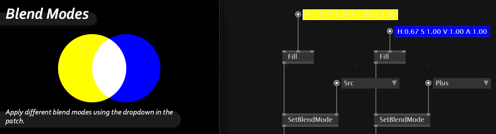
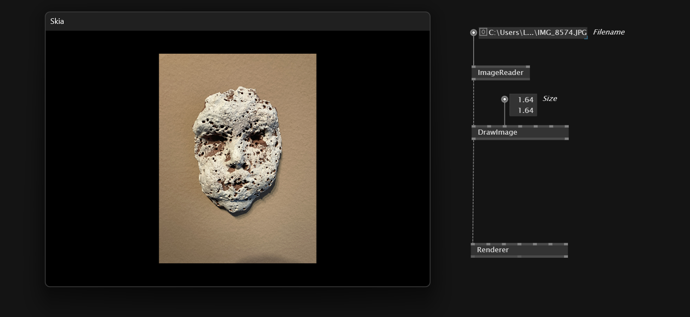
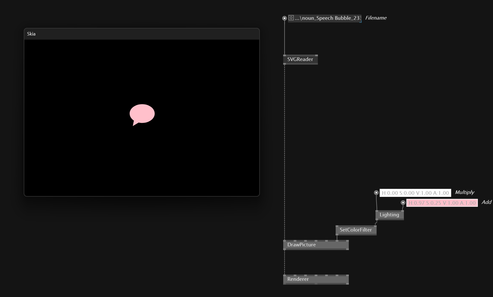
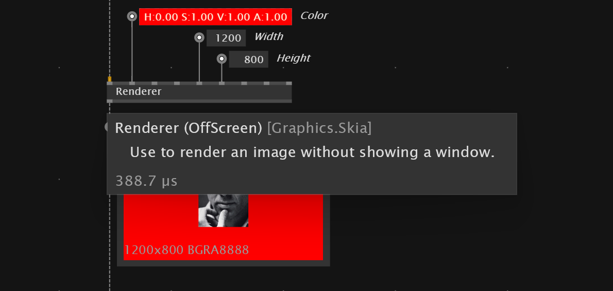
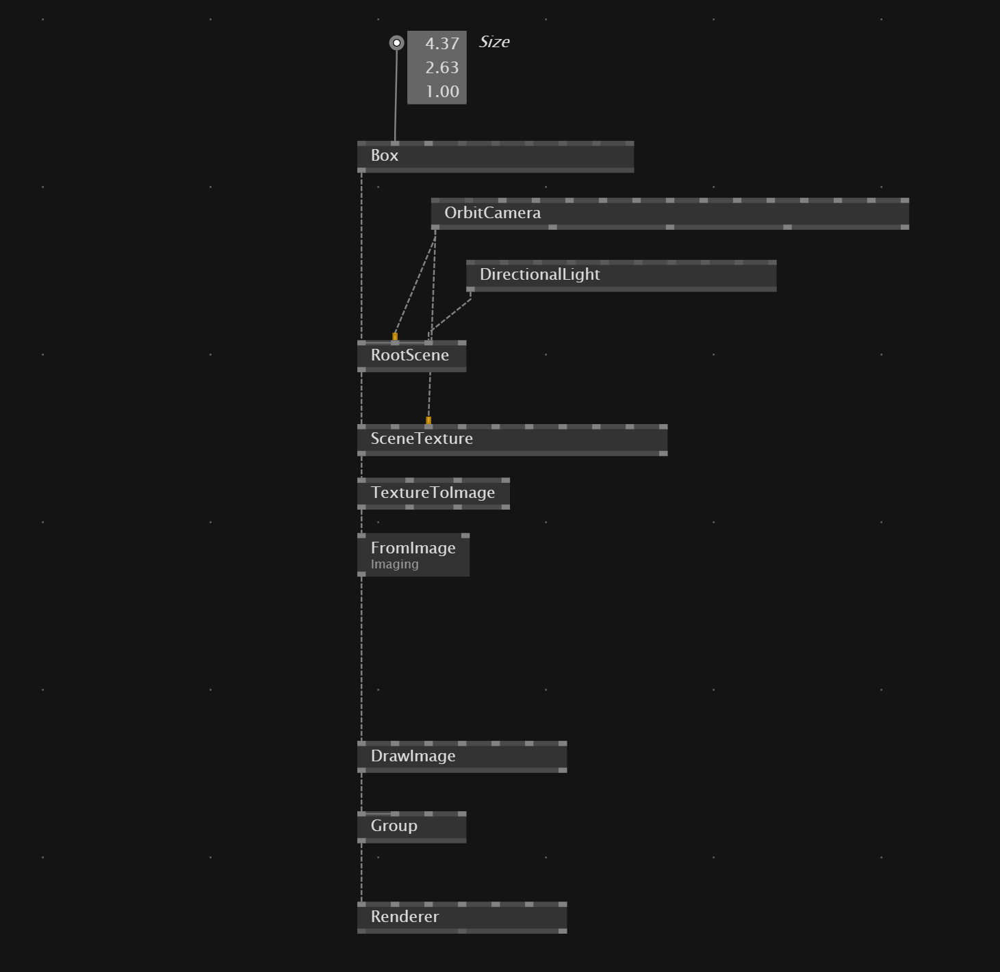
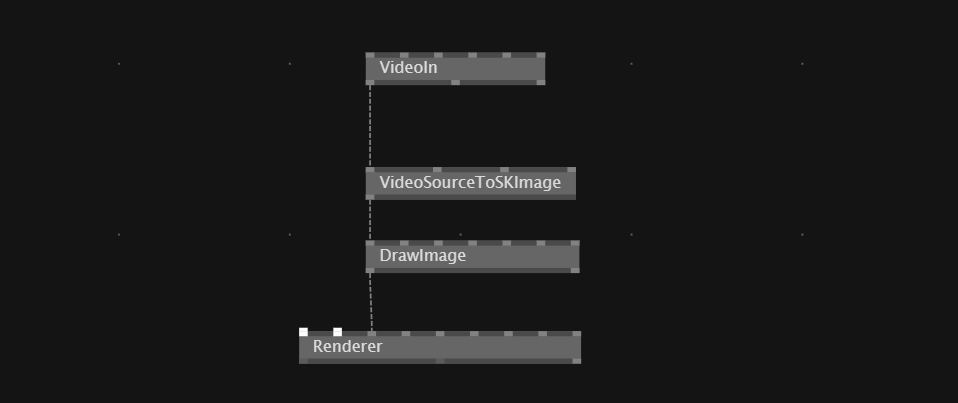
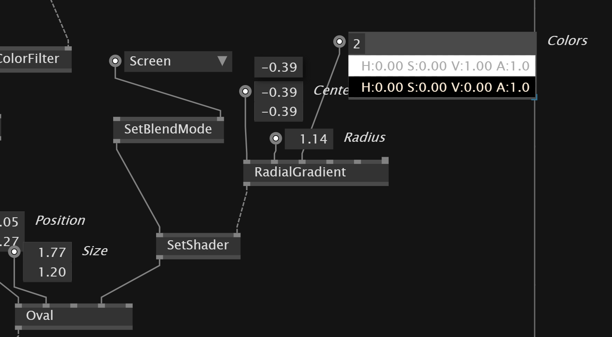

# Skia
In VVVV *Skia* is the build-in 2D rendering library. *Skia* pack needs to be activated in the node browser on start.

We output our final composition with the `Renderer` node. It takes a layer input of all 2D content.

# 2D Primitives
Skia provides some basic *2D primitives* to draw
- Rectangle
- RoundRectangle
- Circle
- Polygon
- Spiral
- DrawImage
- Segment

## Segment
`Segment` node is versatile node that for example allow to draw half circles and more.

# Data types
- *Layer* - Layer to be rendered
- *SkiaPaint* - change the look
- *SKImage/SKPicture* - Image formats

# Paint/Style
The *SkiaPaint* property defines how a 2D primitive gets drawn

With `Stroke` we draw an outline and with `Fill` we can fill the primitive.

# Transform
With the `TransformSRT(Skia)` node we can apply *Rotation,Scale,Translation* transformation.

# Group
To join multiple layers we use the `Group` node to bring them together. First input is the layer most in the back.

With `CTRL +/-` we can create more or less inputs in to the node.

# Blend modes
We can set `SetBlendMode` node between the *primitive* and *Paint* nodes to define how layers get blended.

# Images
To draw images and svgs in Skia it uses the data types `SKImage` and `SkPicture`.

To get the image from a path we use a `ImageReader` and plug it into `DrawImage` node.

To load *SVGS* we need the `SVGReader` and to draw the `DrawPicture`

Adding a `ColorFilter` with `Lighting` allows us to fill the svg with another color. 

`Lighting` multiplies RGB Channels by one color and then adds second color.

Skia allows us to also Render compositions off screen and allow us then to use the render as a data type `SKImage`. The render is then not shown in a window.

We then can also save the render into a file with `ImageWriter` node.
It allows us to set the path, file format quality and has a boolean to set to `write`

More infos [here](https://vimeo.com/467726561)

# Mixing Skia & Stride
To convert *Stride* into *Skia* we need to connect `RootScene` into a `SceneTexture` node and then connect the `SceneTexture` with `TextureToImage` and `FromImage(Imaging)`

# Videos
To draw videos in vvvv we need to reference the `VL.Video` package in the help browser.

We then can use the `VideoIn` or the `VideoPlayer`.Both return `IVideoSource` data type that needs to be converted with `VideoSourceToSKImage`

To draw your camera input we need to connect `VideoIn` node into a `VideoSourceToSKImage` and then connect it with the `DrawImage` node.

With `CameraControls` we can set values like *Pan*,*Exposure*,*Zoom* etc.

To show a video we can use `VideoPlayer` node, ether to show video from a `url` or to show a video from our computer.

# Draw a drop shadow
To draw a drop shadow we can add `Image Filter` with `DropShadow` node to the primitive.

# Create Shiny effect
For shiny effects we add a `SetShader` and a `Radial Gradient`node. To make the it only apply the bright colors we can set a `SetBlendMode`

# Show Performance meter
With `F2` we can show the performance of our sketch