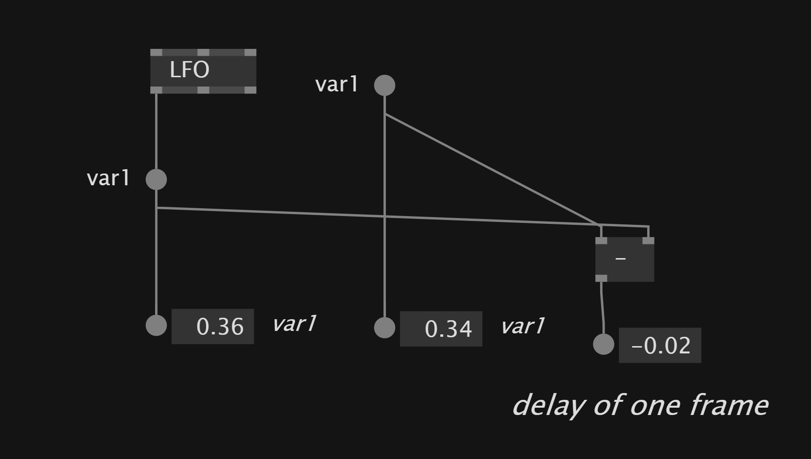
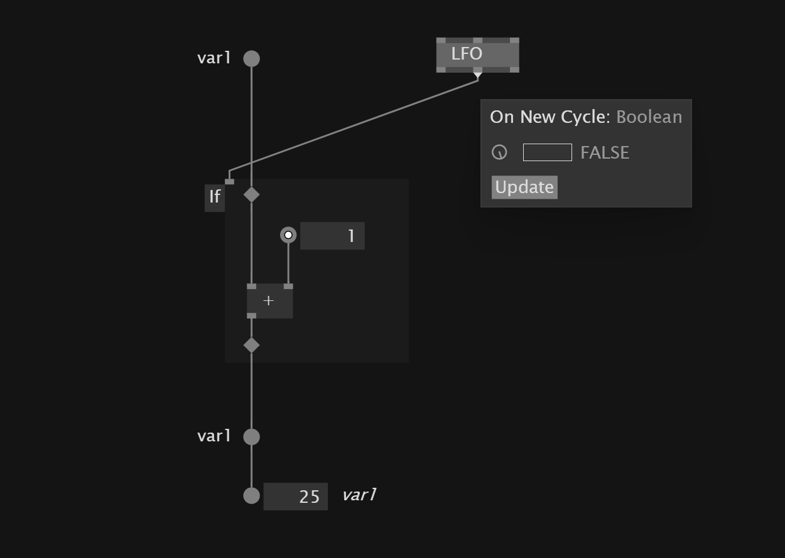
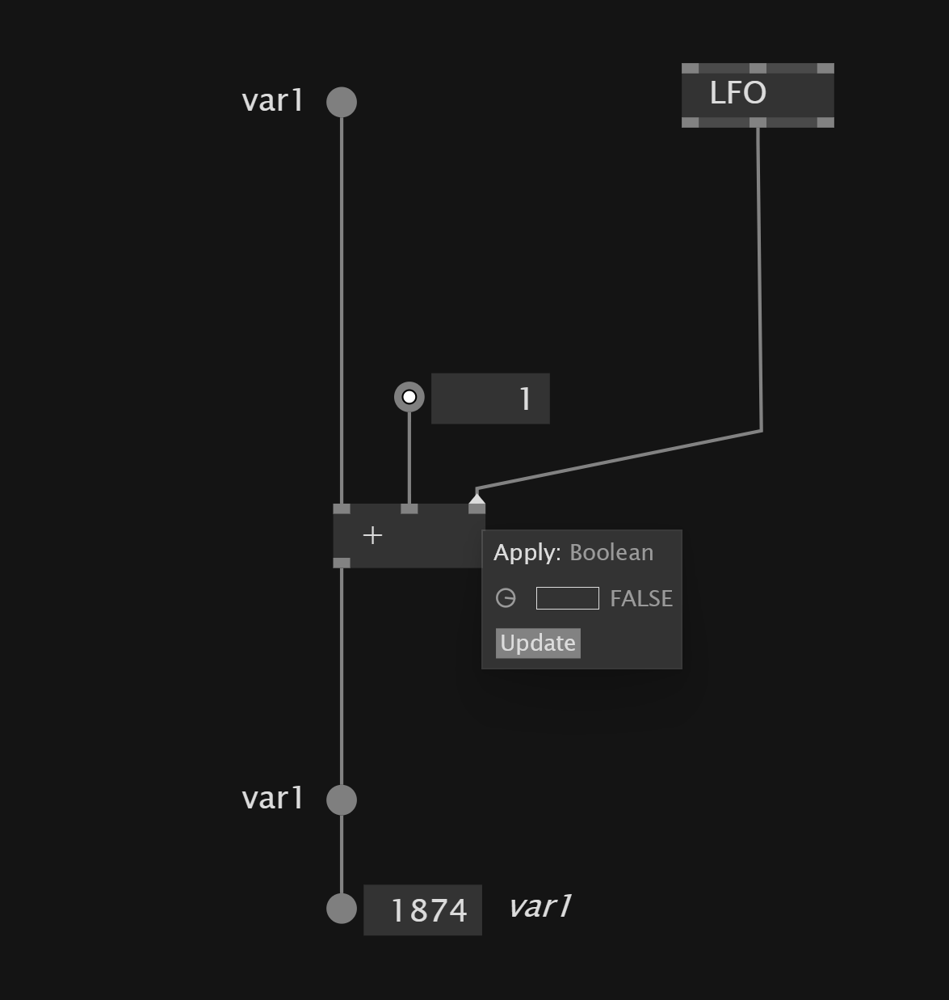
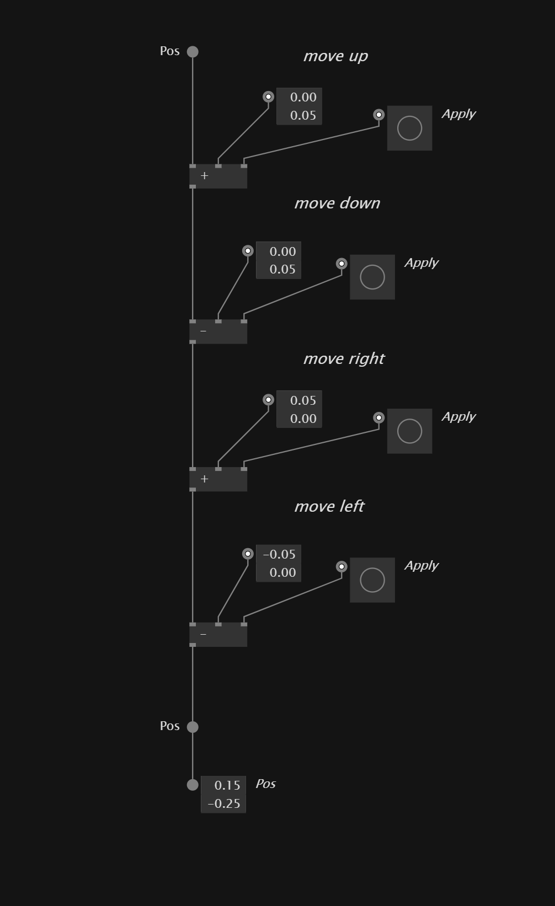

# Storing Data

## Pads
We can use `Pad` to store data and then to use or manipulate this data in the next frame. 
When you create a `Pad` consider a distinctive name - you then can find the `Pad` in the node-browser.

A `Pad` is like a variable in other programming environments - we can store any data type in them. We you create it the `Pad` is undefined. To define it we ether need to connect the desired data type with the pad or *right click -> configure*

For real-time applications it is important to consider that the data from the `Pad` will be available in the *next frame*.

When you modify data from a `Pad` you always need to store the new data back into the `Pad`.

`If Regions` are a good way to change the data when a condition is met.

Another cleaner way to get the same effect but without the region we can make use of the *Apply* Pin that most of the nodes have. This input is hidden so we need to set it in the nodes *Configure menu*.

So we for example can create a `Pad` for the *position* of an object and then manipulate the position if a condition is true.

### Adaptive vs Predefined

We can use pads in two ways. We ether define a `Pad` in the *Configure Menu*. This means everything in the links is predefined. 

Another way is to define the data type of the `Pad` adaptively so by the nodes in between the pads. This is a more flexible approach.  

## Record
When you want that the `Record` is not recreated every frame but lives inside the patch for a longer time we store the `Record` in a Pad. 
Pad is where things live in for a longer time.
