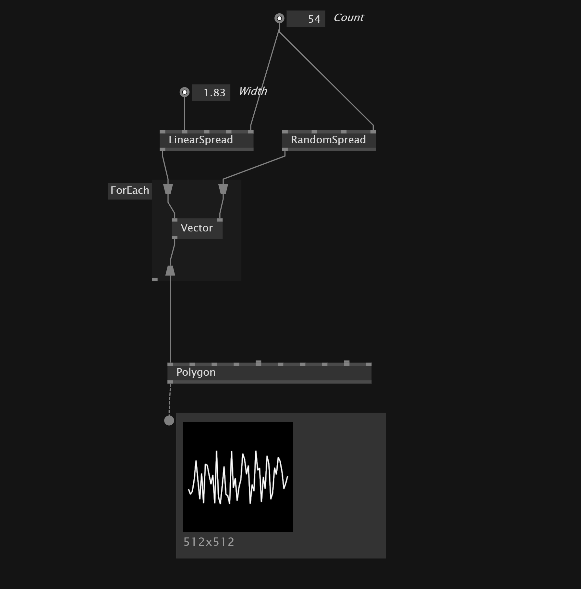

# Stride
`Stride` is the build-in 3D render engine of vvvv. 
Stride contains primitives, shaders, lights and more. We output our stride composition into a `SceneWindow`.

## Shortcuts
Reset camera in `RenderWindow` - `R`

# Transformations
For basic information about transformations [see here](Skia.md#transform).

## Transform between
The `TransformBetween` node allows to transform a shape so it is positioned between the two input positions.

## Child Transformations
To have shape being transformed relative to a parent shape we can set them as a *Child* entity to the parent.

## Scale shape uniformly
The `UniformScale` allows us to scale a shape on all three axis with one scalar value.

# Materials
With the `ColorMaterial` node we can set a material for the meshes of the primitives. Stride also has `TextureMaterial`, `PBRMaterials`.

## Color Material
When using `Color Material` shading is disabled and lights won'T have any effect on the volume.

## PBR Material
`PBRMaterials` enable shadows and the define how lights will be reflected on the volume.

To set the transparency on a `PBRMaterial` we can use a `Blend` node and set alpha value.

### Texture as Diffuse Color of PBR
With a `ColorMap` node we can translate a texture into a diffuse color input for pbr materials

## TextureMaterial
If we want to apply textures to our model we can load the texture with `FileTexture`plug that into a `TextureMaterial`.

# Primitives
*Stride* brings build-in primitives:
- Box
- BoxSphere 
- Capsule
- Cone
- Cylinder
- Disc
- Plane 
- Sphere
- Teapot 
- Torus

# Data types
*Entity* - models, lights, cameras
*Material* - change look of entities when rendered
*Texture* - image format

# Group
We can combine multiple primitives in a `Group` node.

## Group spread of elements
After a Loop we get a spread of entities. With a `Group(Spectral)` node we can convert the spread into a single entity.

# Light
To see something in our scene we should add a light source. 
Stride has multiple lights:
- AmbientLight
- DirectionalLight
- SkyboxLight
- PointLight

## SkyboxLight
Allows you to add your own cubemap as the *light* source.

## Shadows
In the primitive node we can define if it is a `ShadowCaster` or not.

# Camera
When there is no Camera connected to the scene VVVV assumes the default orbit camera, which allows you to navigate through the scene.

When you put your own camera they need to be connected to the `root scene` and the `SceneWindow`

# Render
To render our scene we need to join the `primitives`, `groups`,`lights` in a `RootScene`. This then get's plugged into 
the `SceneWindow`

In the `SceneWindow we can set also the background color of our render.

## Render out image
When we want to just render our scene as an image we can plug `RootScene`and `Camera` into a `SceneTexture` and then connect this to a `TextureWindow` node.

### FullScreenQuadRenderer
We can use `FullScreenQuadRenderer` to show a texture or image full screen in the `RenderWindow`.

# PostFX
We can apply `PostFX` by plugging the node into the `SceneWindow` PostFX input.

Or we render into `RenderTexture`

## Fog
The `Fog` node enables fog in the scene.

## Outline
`Outline` creates a cartoon style effect.

## Grain
We can apply grain by plugging `FilmGrain` in to a `Cons(Collection.Spread)` and then into Color Transforms input.

## LightStreak
Shining effect along bright areas direction.
# Shortcuts
Reset view - `long press r`

# Convert 3D into 2D texture
Instead of outputting `RootScene` into `SceneWindow` we connect it to `SceneTexture`. Also plugin a `FlatCamera` mode into the `SceneTexture`. We then can use *Stride.TextureFX* to further manipulate the texture.

# Texture
Stride offers static and dynamic texture sources
-`BubbleNoise`
-`Checkerboard`
-`Color`
-`ColorPalette`
-`Gradient`
-`Halo`
-`Halo(Gradient)`
-`Liquish`
-`Mandelbrot`
-`Neurons`
-`Noise`
-`Circle`
-`Electricity`
-`Polygon` - allows to draw shapes from a multi point input - good to draw a data line with polygon
-`Rectangle`
-`SkiaTexture`

## Specific drawing techniques

### Draw a line with Polygon Node

## Filters
Stride also offers a lot of *Filter* Shaders to manipulate the textures.

- `ShiftRGB`
- `Threshold`
- `Quantize` - reduce colors of input to stepped color output
- `HSCB`- hue,saturation,contrast,brightness color correction

## Mixers
We can combine multiple texture with *mixer* nodes.
- `Blend` - Blend between two textures using different blending options.
- `Pixelate` - Blend between two textures using pixelate effect
- `Dissolve` - Blend between texture using rough pixely effect

# Video 
In Stride we have to convert a `VideoIn` or `VideoPlayer` with a `VideoSourceToTexture` node and then we can use it as an input for `TextureMaterial` or when *Stride.TextureFX* enabled into a `TextureWindow`

# Mixing Skia and Stride
`SkiaTexture` transforms skia drawing into a texture. This allows us to use it for 3D objects material or apply texture effects to it.

# Convert Vector3 to Vector2
`XY` Node lets you quickly pick first to values of `Vector3` and outputs `Vector2` data type.

## Shaders

# Further infos
A whole tutorial is [here](https://vimeo.com/467434033)