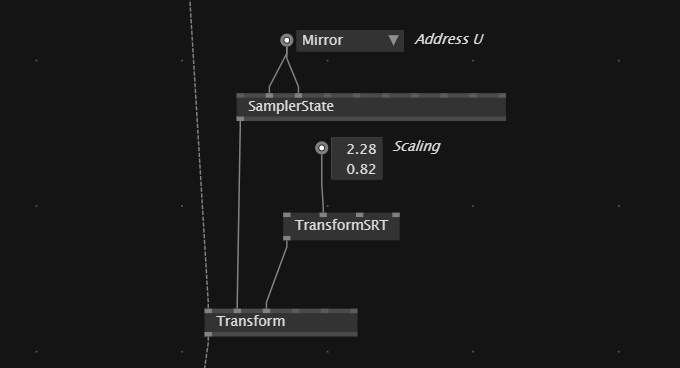

# StrideFX

## Change mapping of transformed texture
If we want to change how a transformed texture gets scalled we can add `SamplerState` node to the *custom sampler* input of the `Transform(Filter)`.

