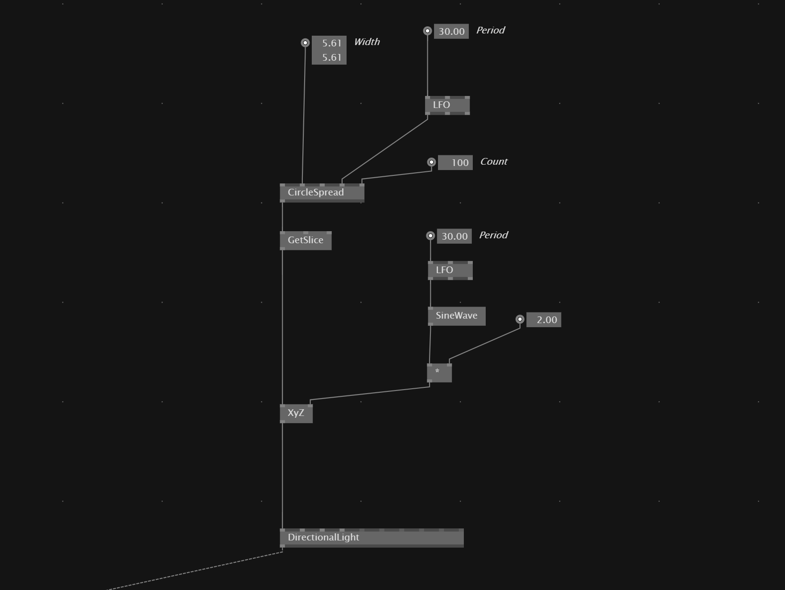

# Move 3D Element on CircularPath
We can take a `CircleSpread`, animate the *Phase* with for example an `LFO` and then take afterwards the first slice of the spread with `GetSlice`. This gives us then a *current* position on the path.

